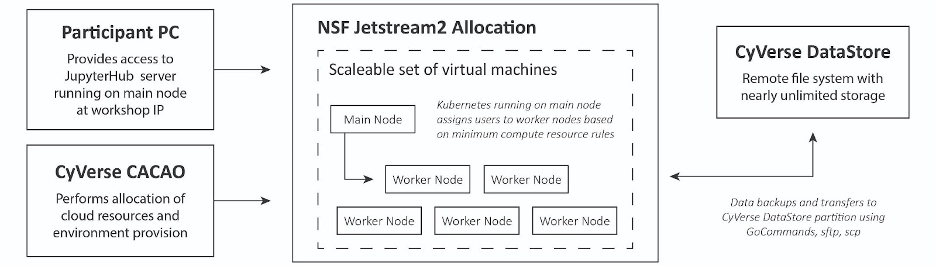
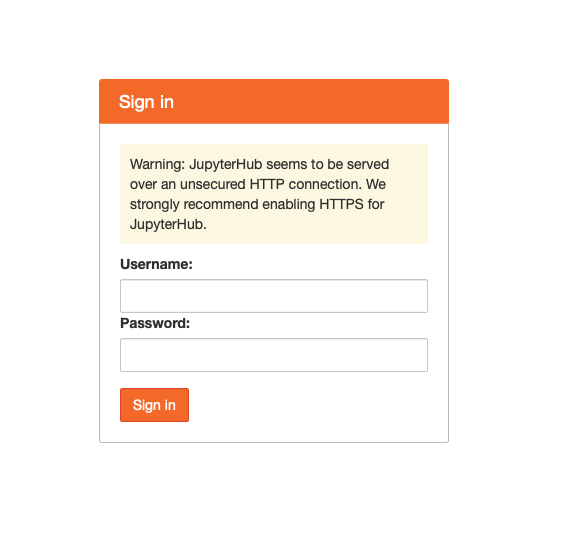
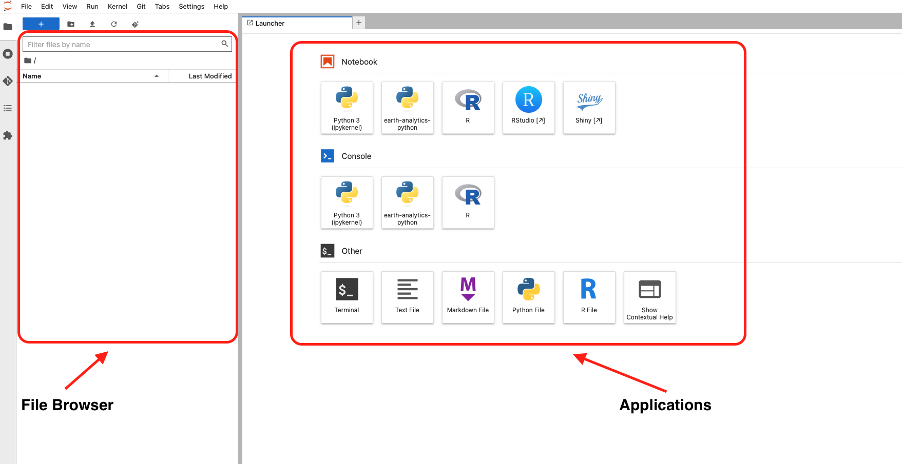
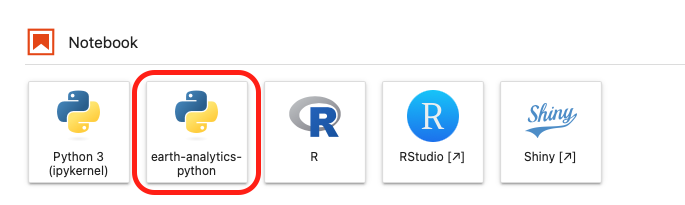

Jetstream2
================

## I. Introduction (2 minutes)

### A. Brief Overview of Jetstream2:
Jetstream2 is a cloud-based high performace computing service funded by the NSF. It is designed to simplify data analysis, boost discovery, and increase availability of AI resources. The primary system for Jetstream2 is hosted at Indiana University, with four regional centers at Arizona State University, Cornell University, University of Hawaii, and the Texas Advanced Computing Center. 

Allocations for accessing Jetstream2 resources are available through the Advanced Cyberinfrastructure Coordination Ecosystem: Services and Suppport (ACCESS).

## II. How We Use Jetstream2 for Collaboration:

### A. JupyterHub
JupyterHub is a service which provides the infrastructure for multi-user interactive computing. Each user on the JupyterHub server has their own Jupyter Notebook interface which allows them to run Python and R code interactively. Users can also download their own datasets and manage file versioning with git  

### B. CACAO
JupyterHub is deployed on Jetstream2 resources using CyVerse's Cloud Automation & Continuous Analysis Orchestration (CACAO) service. CACAO allows us to create a cluster of virtual machines which host a JupyterHub server. A basic diagram of the deployment architecture can be seen below: 

A cluster consists of main node and at least one worker node. The main node is responsible for orchestrating the deployment on the cluster. When a user logs in, for example, the main node assigns them to a worker node based on the minimum computing resources required for each user.  

### III. Using JupyterHub

### A. Logging In
To log in to the JupyterHub, open your web browser and go to innovation-summit-training.esiil.org. Once there, you should see a login page asking for your username and password. Your username can be found on your KI Storm page, as mentioned in the KI Storm session. The password is "password".

### B. Dashboard
Once logged in you will be taken to your dashboard. In the center of the dashboard you will see all of the available applications. Here is where you create new R and Python notebooks, RStudio sessions, and terminals.

To the left is the file browser and toolbar. Here you can see, create, delete, and move files in your work space. The toolbar allows you to manage kernels, install new plugins, and access the git UI. Using the git UI will be covered in depth in the next GitHub learning session.

### C. Hello World
Let's go through an example of running code in both an R and a Python notebook. To begin, click on the earth-analytics-python application:

This should open up a new tab for the notebook called Untitled.ipynb. You will also see this new file in the file browser. Let's change the name of the file to "hello_world_python.ipynb" by right clicking on the file in the browser and then selecting "Rename".

Once the file is renamed, let's write one simple line of code into the first and only cell of the notebook: print("Hello world")
To execute code in a cell, you can either press the play button in the top toolbar, or press shift+enter on your keyboard. If all goes well, you should see the text "Hello world" output underneath the cell.

Let's repeat these steps for an R notebook. Press on the "+" button on your tabs view to create a new tab. You should see the application menu again. This time choose the "R" application. Another "Untitled.ipynb" file should now appear. Change the name of it if you would like. The R code is the same as the Python code for hello world. Type it into the first cell and execute it, you should see the same output.

### Other applications
For those familiar, feel free to use the terminal, rstudio, and shiny applications as you see fit. 