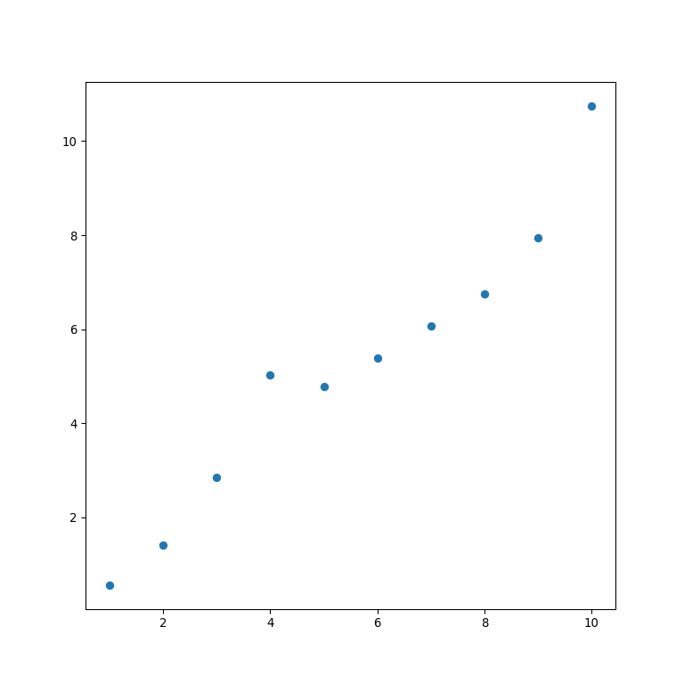
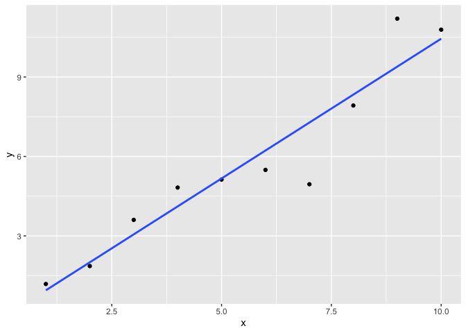
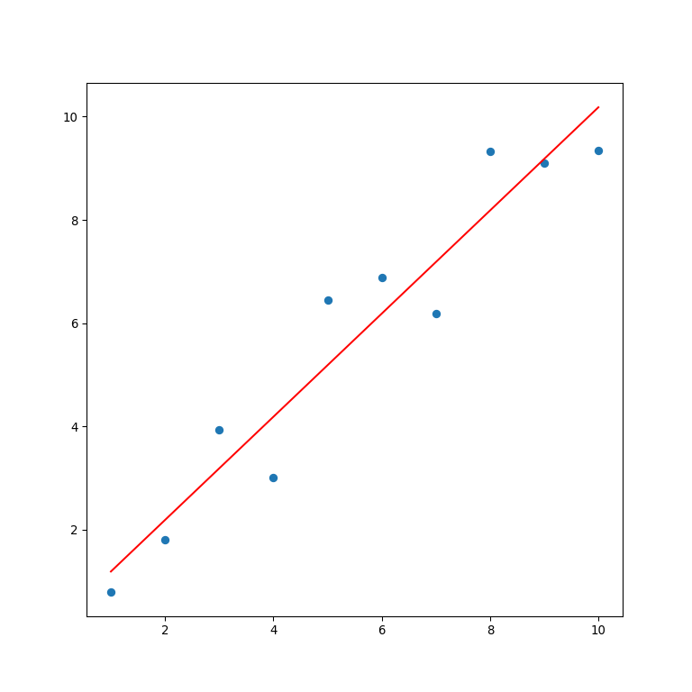
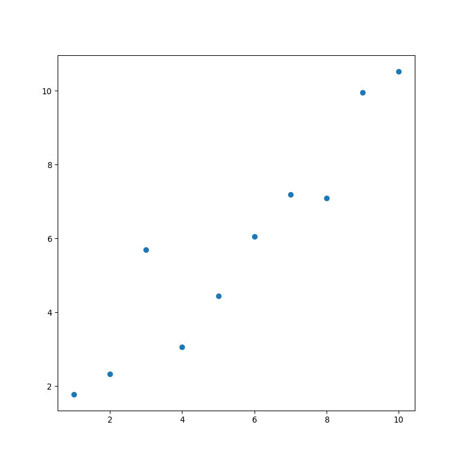
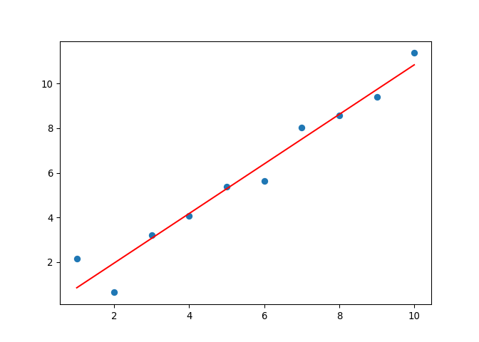

# R and Python bilingualism

Welcome to this lesson on R and Python bilingualism! In this lesson,
we’ll explore the similarities and differences between these two
powerful programming languages, and why it’s important to be comfortable
using both.

First, let’s talk about the similarities between R and Python. Both
languages are widely used in data science and are open-source, meaning
that they are free to use and constantly being improved by the
community. Additionally, they both have robust libraries for data
analysis, visualization, and machine learning.

However, there are also some key differences between R and Python that
make them better suited for different tasks. Python is generally
preferred for larger applications and projects due to its versatility,
scalability, and the ability to handle more complex projects. It has a
large and active developer community, which has contributed to the
development of many powerful tools and libraries, making it a popular
choice for web development, artificial intelligence, and more.

On the other hand, R is known for its exceptional statistical
capabilities and is often used in data analysis and modeling. Its syntax
and built-in functions are designed specifically for statistical
operations, making it a go-to language for many data scientists and
statisticians.

Despite these differences, there are many cases where it makes sense to
use both languages. For example, you may need to use Python to clean and
prepare data before analyzing it in R, or use R for statistical analysis
before deploying a machine learning model in Python.

Being bilingual in R and Python can give you a significant advantage in
the field of data science. You’ll be able to leverage the strengths of
each language to create more robust and efficient data analysis
workflows.

So, let’s dive in and explore the world of R and Python bilingualism!

## Install packages

In R, packages can be installed from CRAN repository by using the
install.packages() function:

R code:

``` r
# Install the dplyr package from CRAN
install.packages("dplyr")
```

In Python, packages can be installed from the Anaconda repository by
using the conda install command:

Python code:

``` python
# Install the pandas package from Anaconda
!conda install pandas
```

Loading libraries in R and Python

In R, libraries can be loaded in the same way as before, using the
library() function:

R code:

``` r
# Load the dplyr library
library(dplyr)
```

In Python, libraries can be loaded in the same way as before, using the
import statement. Here’s an example:

Python code:

``` python
# Load the pandas library
import pandas as pd
```

Note that the package or library must be installed from the respective
repository before it can be loaded. Also, make sure you have the correct
repository specified in your system before installing packages. By
default, R uses CRAN as its primary repository, whereas Anaconda uses
its own repository by default.

## reticulate package lets you run both R and Python together in the R environment.

R libraries are stored and managed in a repository called CRAN. You can
download R packages with the install.packages() function

``` r
install.packages("reticulate")
```

You only need to install packages once, but you need to mount those
packages with the library() function each time you open R.

``` r
library(reticulate)
```

Python libraries are stored and managed in a few different libraries and
their dependencies are not regulated as strictly as R libraries are in
CRAN. It’s easier to publish a python package but it can also be more
cumbersome for users because you need to manage dependencies yourself.
You can download python packages using both R and Python code

``` r
py_install("pandas")
```

    ## + '/Users/ty/opt/miniconda3/bin/conda' 'install' '--yes' '--prefix' '/Users/ty/opt/miniconda3/envs/earth-analytics-python' '-c' 'conda-forge' 'pandas'

## Load packages and change settings

``` r
options(java.parameters = "-Xmx5G")

library(r5r)
library(sf)
library(data.table)
library(ggplot2)
library(interp)
library(dplyr)
library(osmdata)
library(ggthemes)
library(sf)
library(data.table)
library(ggplot2)
library(akima)
library(dplyr)
library(raster)
library(osmdata)
library(mapview)
library(cowplot)
library(here)
library(testthat)
```

``` python
import sys
sys.argv.append(["--max-memory", "5G"])

import pandas as pd
import geopandas
import matplotlib.pyplot as plt
import numpy as np
import plotnine
import contextily as cx
import r5py
import seaborn as sns
```

R and Python are two popular programming languages used for data
analysis, statistics, and machine learning. Although they share some
similarities, there are some fundamental differences between them.
Here’s an example code snippet in R and Python to illustrate some of the
differences:

R Code:

``` r
# Create a vector of numbers from 1 to 10
x <- 1:10

# Compute the mean of the vector
mean_x <- mean(x)

# Print the result
print(mean_x)
```

    ## [1] 5.5

Python Code:

``` python
# Import the numpy library for numerical operations
import numpy as np

# Create a numpy array of numbers from 1 to 10
x = np.array([1, 2, 3, 4, 5, 6, 7, 8, 9, 10])

# Compute the mean of the array
mean_x = np.mean(x)

# Print the result
print(mean_x)
```

    ## 5.5

In this example, we can see that there are several differences between R
and Python:

Syntax: R uses the assignment operator \<- while Python uses the equals
sign = for variable assignment.

Libraries: Python relies heavily on external libraries such as numpy,
pandas, and matplotlib for data analysis, while R has built-in functions
for many data analysis tasks.

Data types: R is designed to work with vectors and matrices, while
Python uses lists and arrays. In the example above, we used the numpy
library to create a numerical array in Python.

Function names: Function names in R and Python can differ significantly.
In the example above, we used the mean() function in R and the np.mean()
function in Python to calculate the mean of the vector/array.

These are just a few of the many differences between R and Python.
Ultimately, the choice between the two languages will depend on your
specific needs and preferences.

## Load saved data

R Code:

``` r
data("iris")
here()
load(file=here("2_R_and_Py_bilingualism", "data", "iris_example_data.rdata"))
objects()
```

Python code:

## Save data

R Code:

``` r
save(iris, file=here("2_R_and_Py_bilingualism", "data", "iris_example_data.rdata"))

write.csv(iris, file=here("2_R_and_Py_bilingualism", "data", "iris_example_data.csv"))
```

Python code:

## functions

Both R and Python are powerful languages for writing functions that can
take input, perform a specific task, and return output. R Code:

``` r
# Define a function that takes two arguments and returns their sum
sum_r <- function(a, b) {
  return(a + b)
}

# Call the function with two arguments and print the result
result_r <- sum_r(3, 5)
print(result_r)
```

    ## [1] 8

Python code:

``` python
# Define a function that takes two arguments and returns their sum
def sum_py(a, b):
    return a + b

# Call the function with two arguments and print the result
result_py = sum_py(3, 5)
print(result_py)
```

    ## 8

In both cases, we define a function that takes two arguments and returns
their sum. In R, we use the function keyword to define a function, while
in Python, we use the def keyword. The function body in R is enclosed in
curly braces, while in Python it is indented.

There are a few differences in the syntax and functionality between the
two approaches:

Function arguments: In R, function arguments are separated by commas,
while in Python they are enclosed in parentheses. The syntax for
specifying default arguments and variable-length argument lists can also
differ between the two languages. Return statement: In R, we use the
return keyword to specify the return value of a function, while in
Python, we simply use the return statement. Function names: Function
names in R and Python can differ significantly. In the example above, we
used the sum_r() function in R and the sum_py() function in Python to
calculate the sum of two numbers.

## Data Plots

R Code:

``` r
# Load the "ggplot2" package for plotting
library(ggplot2)

# Generate some sample data
x <- seq(1, 10, 1)
y <- x + rnorm(10)

# Create a scatter plot
ggplot(data.frame(x, y), aes(x = x, y = y)) +
  geom_point()
```

<!-- -->
Python code:

``` python
# Load the "matplotlib" library
import matplotlib.pyplot as plt

# Generate some sample data
import numpy as np
x = np.arange(1, 11)
y = x + np.random.normal(0, 1, 10)

#clear last plot
plt.clf()

# Create a scatter plot
plt.scatter(x, y)
plt.show()
```



In both cases, we generate some sample data and create a scatter plot to
visualize the relationship between the variables.

There are a few differences in the syntax and functionality between the
two approaches:

Library and package names: In R, we use the ggplot2 package for
plotting, while in Python, we use the matplotlib library. Data format:
In R, we use a data frame to store the input data, while in Python, we
use numpy arrays. Plotting functions: In R, we use the ggplot() function
to create a new plot object, and then use the geom_point() function to
create a scatter plot layer. In Python, we use the scatter() function
from the matplotlib.pyplot module to create a scatter plot directly.

## Linear regression

R Code:

``` r
# Load the "ggplot2" package for plotting
library(ggplot2)

# Generate some sample data
x <- seq(1, 10, 1)
y <- x + rnorm(10)

# Perform linear regression
model_r <- lm(y ~ x)

# Print the model summary
summary(model_r)
```

    ## 
    ## Call:
    ## lm(formula = y ~ x)
    ## 
    ## Residuals:
    ##      Min       1Q   Median       3Q      Max 
    ## -2.32905 -0.34294  0.09855  0.49624  1.81314 
    ## 
    ## Coefficients:
    ##             Estimate Std. Error t value
    ## (Intercept)  -0.1107     0.7796  -0.142
    ## x             1.0557     0.1256   8.403
    ##             Pr(>|t|)    
    ## (Intercept)    0.891    
    ## x           3.06e-05 ***
    ## ---
    ## Signif. codes:  
    ## 0 '***' 0.001 '**' 0.01 '*' 0.05 '.' 0.1 ' ' 1
    ## 
    ## Residual standard error: 1.141 on 8 degrees of freedom
    ## Multiple R-squared:  0.8982, Adjusted R-squared:  0.8855 
    ## F-statistic:  70.6 on 1 and 8 DF,  p-value: 3.062e-05

``` r
# Plot the data and regression line
ggplot(data.frame(x, y), aes(x = x, y = y)) +
  geom_point() +
  geom_smooth(method = "lm", se = FALSE)
```

    ## `geom_smooth()` using formula = 'y ~ x'

<!-- -->

Python code:

``` python
# Load the "matplotlib" and "scikit-learn" libraries
import matplotlib.pyplot as plt
from sklearn.linear_model import LinearRegression

# Generate some sample data
import numpy as np
x = np.arange(1, 11)
y = x + np.random.normal(0, 1, 10)

# Perform linear regression
model_py = LinearRegression().fit(x.reshape(-1, 1), y)

# Print the model coefficients
print("Coefficients: ", model_py.coef_)
```

    ## Coefficients:  [0.99937549]

``` python
print("Intercept: ", model_py.intercept_)

#clear last plot
```

    ## Intercept:  0.18840113597645836

``` python
plt.clf()

# Plot the data and regression line
plt.scatter(x, y)
plt.plot(x, model_py.predict(x.reshape(-1, 1)), color='red')
plt.show()
```



In both cases, we generate some sample data with a linear relationship
between x and y, and then perform a simple linear regression to estimate
the slope and intercept of the line. We then plot the data and
regression line to visualize the fit.

There are a few differences in the syntax and functionality between the
two approaches:

Library and package names: In R, we use the lm() function from the base
package to perform linear regression, while in Python, we use the
LinearRegression() class from the scikit-learn library. Additionally, we
use the ggplot2 package in R for plotting, while we use the matplotlib
library in Python. Data format: In R, we can specify the dependent and
independent variables in the formula used for regression. In Python, we
need to reshape the input data to a two-dimensional array before fitting
the model. Model summary: In R, we can use the summary() function to
print a summary of the model, including the estimated coefficients,
standard errors, and p-values. In Python, we need to print the
coefficients and intercept separately.

## Random Forest

R Code:

``` r
# Load the "randomForest" package
library(randomForest)

# Load the "iris" dataset
data(iris)

# Split the data into training and testing sets
set.seed(123)
train_idx <- sample(1:nrow(iris), nrow(iris) * 0.7, replace = FALSE)
train_data <- iris[train_idx, ]
test_data <- iris[-train_idx, ]

# Build a random forest model
rf_model <- randomForest(Species ~ ., data = train_data, ntree = 500)

# Make predictions on the testing set
predictions <- predict(rf_model, test_data)

# Calculate accuracy of the model
accuracy <- sum(predictions == test_data$Species) / nrow(test_data)
print(paste("Accuracy:", accuracy))
```

    ## [1] "Accuracy: 0.977777777777778"

Python code:

``` python
# Load the "pandas", "numpy", and "sklearn" libraries
import pandas as pd
import numpy as np
from sklearn.ensemble import RandomForestClassifier
from sklearn.datasets import load_iris
from sklearn.model_selection import train_test_split

# Load the "iris" dataset
iris = load_iris()

# Split the data into training and testing sets
X_train, X_test, y_train, y_test = train_test_split(iris.data, iris.target, test_size=0.3, random_state=123)

# Build a random forest model
rf_model = RandomForestClassifier(n_estimators=500, random_state=123)
rf_model.fit(X_train, y_train)

# Make predictions on the testing set
```

    ## RandomForestClassifier(n_estimators=500, random_state=123)

``` python
predictions = rf_model.predict(X_test)

# Calculate accuracy of the model
accuracy = sum(predictions == y_test) / len(y_test)
print("Accuracy:", accuracy)
```

    ## Accuracy: 0.9555555555555556

In both cases, we load the iris dataset and split it into training and
testing sets. We then build a random forest model using the training
data and evaluate its accuracy on the testing data.

There are a few differences in the syntax and functionality between the
two approaches:

Library and package names: In R, we use the randomForest package to
build random forest models, while in Python, we use the
RandomForestClassifier class from the sklearn.ensemble module. We also
use different libraries for loading and manipulating data (pandas and
numpy in Python, and built-in datasets in R). Model parameters: The
syntax for setting model parameters is slightly different in R and
Python. For example, in R, we specify the number of trees using the
ntree parameter, while in Python, we use the n_estimators parameter.
Data format: In R, we use a data frame to store the input data, while in
Python, we use numpy arrays.

# Retrieve data from an API

## Basic streetmap from Open Street Map

R Code:

``` r
# Load the "osmdata" package for mapping
library(osmdata)
library(tmap)

# Define the map location and zoom level
bbox <- c(left = -0.16, bottom = 51.49, right = -0.13, top = 51.51)

# Get the OpenStreetMap data
osm_data <- opq(bbox) %>% 
  add_osm_feature(key = "highway") %>% 
  osmdata_sf()

# Plot the map using tmap
tm_shape(osm_data$osm_lines) + 
  tm_lines()
```

<!-- -->
Python code:

``` python
# Load the "osmnx" package for mapping
import osmnx as ox

# Define the map location and zoom level
bbox = (51.49, -0.16, 51.51, -0.13)

# Get the OpenStreetMap data
osm_data = ox.graph_from_bbox(north=bbox[2], south=bbox[0], east=bbox[3], west=bbox[1], network_type='all')

# Plot the map using osmnx
ox.plot_graph(osm_data)
```

    ## (<Figure size 800x800 with 0 Axes>, <AxesSubplot:>)



In both cases, we define the map location and zoom level, retrieve the
OpenStreetMap data using the specified bounding box, and plot the map.

The main differences between the two approaches are:

Package names and syntax: In R, we use the osmdata package and its
syntax to download and process the OpenStreetMap data, while in Python,
we use the osmnx package and its syntax. Mapping libraries: In R, we use
the tmap package to create a static map of the OpenStreetMap data, while
in Python, we use the built-in ox.plot_graph function from the osmnx
package to plot the map.

## CNN on Raster data

R Code:

``` r
# Load the "keras" package for building the CNN
library(tensorflow)
library(keras)

# Load the "raster" package for working with raster data
library(raster)

# Load the "magrittr" package for pipe operator
library(magrittr)

# Load the data as a raster brick
raster_data <- brick("raster_data.tif")

# Split the data into training and testing sets
split_data <- sample(1:nlayers(raster_data), size = nlayers(raster_data)*0.8, replace = FALSE)
train_data <- raster_data[[split_data]]
test_data <- raster_data[[setdiff(1:nlayers(raster_data), split_data)]]

# Define the CNN model
model <- keras_model_sequential() %>% 
  layer_conv_2d(filters = 32, kernel_size = c(3, 3), activation = "relu", input_shape = c(ncol(train_data), nrow(train_data), ncell(train_data))) %>% 
  layer_max_pooling_2d(pool_size = c(2, 2)) %>% 
  layer_dropout(rate = 0.25) %>% 
  layer_flatten() %>% 
  layer_dense(units = 128, activation = "relu") %>% 
  layer_dropout(rate = 0.5) %>% 
  layer_dense(units = nlayers(train_data), activation = "softmax")

# Compile the model
model %>% compile(loss = "categorical_crossentropy", optimizer = "adam", metrics = "accuracy")

# Train the model
history <- model %>% fit(x = array(train_data), y = to_categorical(1:nlayers(train_data)), epochs = 10, validation_split = 0.2)

# Evaluate the model
model %>% evaluate(x = array(test_data), y = to_categorical(1:nlayers(test_data)))

# Plot the model accuracy over time
plot(history)
```
