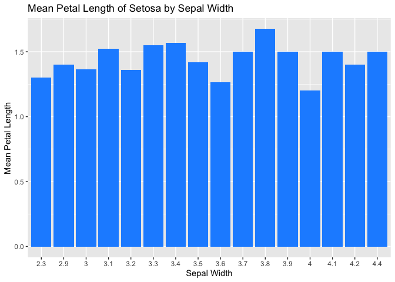
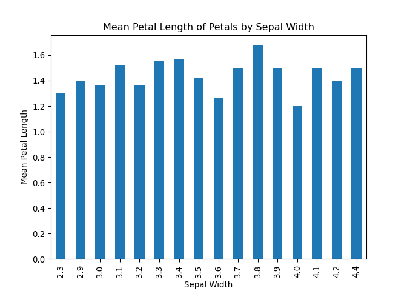
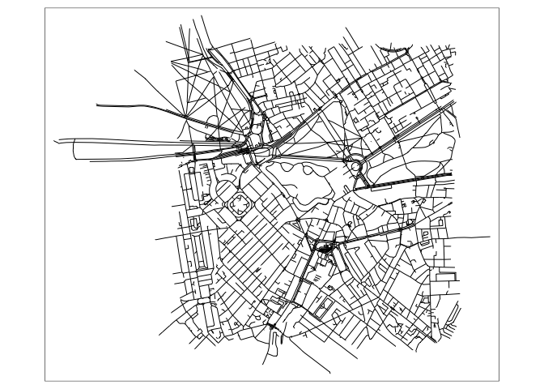
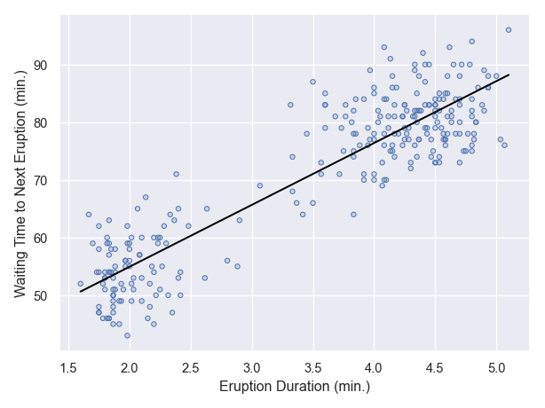
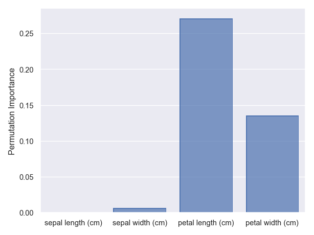
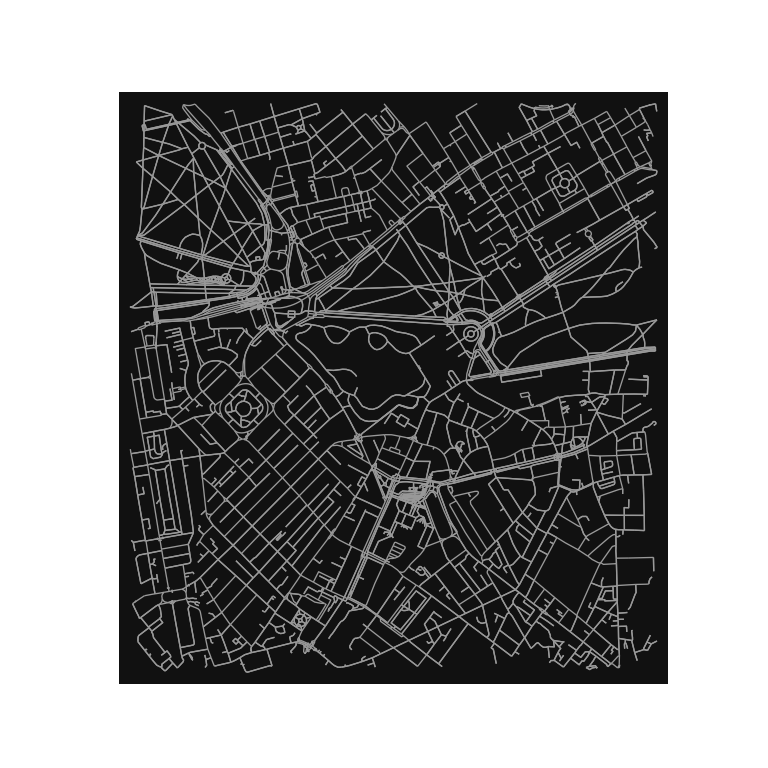
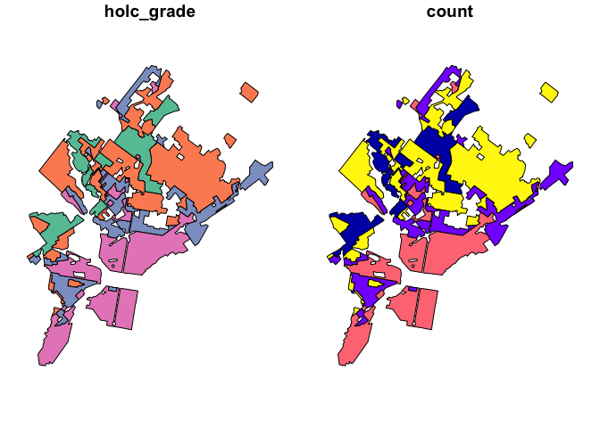

R and Python bilingualism
================

Welcome to the R and Python bilingualism reference guide! If you’re
fluent in one of these languages but hesitant to learn the other, you’re
in the right place. The good news is that there are many similarities
between R and Python that make it easy to switch between the two.

Both R and Python are widely used in data science and are open-source,
meaning that they are free to use and constantly being improved by the
community. They both have extensive libraries for data analysis,
visualization, and machine learning. In fact, many of the libraries in
both languages have similar names and functions, such as Pandas in
Python and data.table in R.

While there are differences between the two languages, they can
complement each other well. Python is versatile and scalable, making it
ideal for large and complex projects such as web development and
artificial intelligence. Object-oriented programming is easier and more
common in Python, which is useful for large development teams. R, on the
other hand, is known for its exceptional statistical capabilities and is
often used in data analysis and modeling. Visualization is also easier
in R, making it a popular choice for creating graphs and charts.

By learning both R and Python, you’ll be able to take advantage of the
strengths of each language and create more efficient and robust data
analysis workflows. Don’t let the differences between the two languages
intimidate you - once you become familiar with one, learning the other
will be much easier.

So, whether you’re a Python enthusiast looking to expand your
statistical analysis capabilities, or an R user interested in exploring
the world of web development and artificial intelligence, this guide
will help you become bilingual in R and Python.

## How to get help

If you know how to get help with one programming language, it’s not too
different in a different one.

### Offline in your coding environment

In both R and Python, you can print out the documentation for any
function or object using the `help()` function. For example:

``` r
help(print)
```

``` python
help(print)
```

    Help on built-in function print in module builtins:

    print(...)
        print(value, ..., sep=' ', end='\n', file=sys.stdout, flush=False)
        
        Prints the values to a stream, or to sys.stdout by default.
        Optional keyword arguments:
        file:  a file-like object (stream); defaults to the current sys.stdout.
        sep:   string inserted between values, default a space.
        end:   string appended after the last value, default a newline.
        flush: whether to forcibly flush the stream.

### Official documentation pages

There are also some great documentation of Python, R, and third party
libraries on the internet. You can find the same information about
parameters, attributes, returns, and methods that you get by running
`help()`, online. We also recommend checking out the associated **user
guides** and **plot gallerys**!

Here are some of our favorite documentation pages. First, manuals for
the programming languages:

- [Python manual](https://docs.python.org/3.10/)

- [The R manuals](https://rstudio.github.io/r-manuals/), formatted for
  the web

> Note that if you are **citing** a program language, it is conventional
> to cite the manual for the version you used unless the authors specify
> otherwise.

Some of our favorite Python libraries for Earth Data Science:

- [xarray labeled multidimensional
  arrays](https://docs.xarray.dev/en/stable/) and [rioxarray arrays with
  coordinates](https://corteva.github.io/rioxarray/stable/)

- [pandas data frames: tabular data and
  databases](https://pandas.pydata.org/docs/) and [geopandas data frames
  with coordinates](https://geopandas.org/en/stable/)

- [Seaborn data visualization](https://seaborn.pydata.org/)

Some of our favorite R libraries for Earth Data Science:

- [tidyverse collection of libraries for data
  science](https://www.tidyverse.org/)

- [ggplot2 data visualization (technically part of tidyverse but often
  used on its own)](https://ggplot2.tidyverse.org/) and [cowplot figure
  layout](https://cran.r-project.org/web/packages/cowplot/vignettes/introduction.html)

We recommend checking out official documentation before heading to sites
like CodeAcademy or GeeksForGeeks that summarize documentation. They are
often missing key details (but can have examples if you are having
trouble finding those)

### Books

There are many many books out there on how to learn both R and Python!
We have heard from many learners who had success with the [O’Reill
books](https://www.oreilly.com/products/books-videos.html). In
particular, you can check out the following freely available books for
download or reading on the web:

- [Think Python: How to Think Like a Computer
  Scientist](https://greenteapress.com/wp/think-python-2e/) by Dr. Allen
  Downey - This book is especially targeted at developing bilingualism,
  even though it is a Python book. It originally was published as Think
  Java, and then:

  <div>

  > “Jeff Elkner, a high school teacher in Virginia, adopted my book and
  > translated it into Python. He sent me a copy of his translation, and
  > I had the unusual experience of learning Python by reading my own
  > book.”

  </div>

- [R for Data Science](https://r4ds.had.co.nz/) by Hadley Wickham
  focuses on tidyverse-style R but covers a lot of the intricacies of
  the language as well.

### Message boards

Finally, there are lots of sites out there where you can post and answer
questions, or read other peoples’ questions and answers. Some of our
favorites:

- [StackOverflow](https://stackoverflow.com/)

- [GitHub](https://github.com/) Issues pages for the project in question

- Or you can search and see what comes up - there are other good but
  more obscure sources out there like Google groups pages

### ChatGPT

We used ChatGPT to write the first version of this document because it’s
pretty good at coding. Some things you can try:

- Paste some code and ask ChatGPT what it does

- Paste some code and ask ChatGPT to find bugs in it

- Ask ChatGPT to write you code that does what you want

- Ask ChatGPT to translate from R to Python or vice versa

While there’s no guarantee, we’ve gotten plenty of working answers out,
with minimal changes needed. ChatGPT can be loaded as an extension to
many development environments like VSCode, although you may hit a pay
wall.

## Packages: No need to write it from scratch

One thing Python and R have in common is they are extendable using
external packages or libraries. You should have all the packages you
need for today installed already.

> Note that **package** and **library** are used interchangeably

### Installing packages

R libraries are stored and managed in a repository called CRAN. You can
download and install R packages with the install.packages() function:

R code:

``` r
# Install the dplyr package from CRAN
install.packages("dplyr")
```

Installing Python packages can be trickier than installing R packages.
Python libraries are stored and managed in a few different repositories
and their dependencies are not regulated as strictly as R libraries are
in CRAN. Python’s default package manager `pip` can be used in a
terminal or command line to install packages from the `PyPI` repository,
and this is a good solution if you need to install a single simple
package, like the `requests` package that provides a clean interface for
downloads. However, `pip` has long had some challenges, which you are
very likely to run into if you are using a package that requires the
GDAL library for coordinate transformations (like `cartopy`, `rioxarray`
or `geopandas`).

So what is an earth scientist to do? Most packages can also be installed
from the Anaconda repository by using `conda install ...` or better yet
`mamba install ...`. `mamba` is a version of `conda` that is much faster
at solving environments. For most packages, we also recommending
specifying the `conda-forge` channel, as below:

bash code to install Python packages:

``` bash
# First install mamba with conda if needed
conda install -c conda-forge mamba
# Install the pandas package from Anaconda
mamba install -c conda-forge pandas
```

It is common to install all the packages you need at once to keep from
boxing yourself into a corner with incompatible version numbers, or to
facilitate packaging your own library. In R, the `renv` library has a
number of tools for enviroment management; in Python, your best bet is
`mamba`. You should have everything you need already if you are working
on JetStream2. However, if you want to run this code on your own
computer, you can go ahead and install the R and Python environments as
follows, provided that you have renv and mamba installed:

``` r
renv::install()
```

``` bash
mamba env create -f environment.yml
```

For the Python environment to work within an RMarkdown file, you may
need to run the following code in R:

``` r
library(reticulate)
Sys.setenv(
  RETICULATE_PYTHON=path.expand(
    '~/opt/miniconda3/envs/earth-analytics-python/bin/python'))
use_condaenv('earth-analytics-python')
```

### Loading libraries in R and Python

In R, libraries can be loaded using the library() function:

R code:

``` r
# Load the dplyr library
library(dplyr)
```

In Python, libraries can be loaded using the import statement. Here’s an
example:

Python code:

``` python
# Load the pandas library
import pandas as pd
```

Note that the package or library must be installed from the respective
repository before it can be loaded. Also, make sure you have the correct
repository specified in your system before installing packages. By
default, R uses CRAN as its primary repository, whereas Anaconda uses
its own repository by default.

Importing libraries from R imports all the functions inside the library
under their own name. For example, once you have installed the r package
`readr`, you can use the included function `read.csv()` directly. On the
other hand, with a typical Python import like the one for `pandas`
above, you need to specify the package, e.g. `pd.read_csv`. This can be
cumbersome if you have to type the package name a lot (that’s why we
`import pandas as pd` instead of `import pandas` – our way we only have
to type out the two-letter alias `pd`). On the other hand, it can also
be really handy if you are trying to figure out what packages you need
to install to use a function in your own code.

> **GOTCHA ALERT:** The dot `.` is a special character in Python, but
> not in R. It is kind of like the `/` in your file system; instead of
> navigating your file tree, it navigates a tree structure like a class
> or a library.

### reticulate - Why choose?

The reticulate package lets you run share variables between R and
Python.

You only need to install packages once, but you need to mount those
packages with the library() function each time you open R.

``` r
library(reticulate)
```

Now, let’s create a Python list and assign it to a variable py_list:

R code:

``` python
py_list = [1, 2, 3]
```

We can now print out the py_list variable in Python using the
py_run_string() function:

R code:

``` r
py_run_string("print(py_list)")
```

This will output `[1, 2, 3]` in the Python console.

Now, let’s create an R vector and assign it to a variable r_vec:

R code:

``` r
r_vec <- c(4, 5, 6)
```

> Notice that in Python we use `=` to assign variables, while in R we
> use `<-`. Actually, we could use either one in R, but here we’re
> following the popular [tidyverse style
> guide](https://style.tidyverse.org/). In R there is a distinction
> between the assignment operator `<-` and the parameter setting
> operator `=`. In Python these are considered the same.

We can now print out the py_list variable in R using the py\$ syntax to
access Python variables:

R code:

``` r
print(py$py_list)
print(py)
```

This will output \[1, 2, 3\] in the R console. Conversely, we can get
the R variable `r_vec` in Python:

``` python
print(r.r_vec)
```

> There’s that dot `.` again - in this case it is getting the r_vec
> variable from within the “R interface object” `r` similarly to how the
> `$` character gets attributes of the `py` object.

### Load packages and change settings

In both R and Python, it is suggested to do all your library/package
imports at the top of your file. This makes it easier for others to run
or copy your code.

``` r
options(java.parameters = "-Xmx5G")

library(readr)
library(r5r)
```

    Please make sure you have already allocated some memory to Java by running:
      options(java.parameters = '-Xmx2G').
    You should replace '2G' by the amount of memory you'll require. Currently, Java memory is set to -Xmx5G

``` r
library(sf)
```

    Linking to GEOS 3.11.0, GDAL 3.5.3, PROJ 9.1.0; sf_use_s2() is TRUE

``` r
library(data.table)
library(ggplot2)
library(interp)
library(dplyr)
```


    Attaching package: 'dplyr'

    The following objects are masked from 'package:data.table':

        between, first, last

    The following objects are masked from 'package:stats':

        filter, lag

    The following objects are masked from 'package:base':

        intersect, setdiff, setequal, union

``` r
library(osmdata)
```

    Data (c) OpenStreetMap contributors, ODbL 1.0. https://www.openstreetmap.org/copyright

``` r
library(ggthemes)
library(sf)
library(data.table)
library(ggplot2)
library(akima)
```


    Attaching package: 'akima'

    The following objects are masked from 'package:interp':

        aspline, bicubic, bicubic.grid, bilinear, bilinear.grid,
        franke.data, franke.fn, interp, interp2xyz, interpp

``` r
library(dplyr)
library(raster)
```

    Loading required package: sp


    Attaching package: 'raster'

    The following object is masked from 'package:dplyr':

        select

``` r
library(osmdata)
library(mapview)
library(cowplot)
```


    Attaching package: 'cowplot'

    The following object is masked from 'package:ggthemes':

        theme_map

``` r
library(here)
```

    here() starts at /Users/elsa/04-workshops/pre-innovation-summit-training

``` r
library(testthat)
```


    Attaching package: 'testthat'

    The following object is masked from 'package:dplyr':

        matches

    The following objects are masked from 'package:readr':

        edition_get, local_edition

``` r
library(reticulate)
Sys.setenv(
  RETICULATE_PYTHON=path.expand(
    '~/opt/miniconda3/envs/earth-analytics-python/bin/python'))
use_condaenv('earth-analytics-python')
```

``` python
import os
import pathlib
import pickle
import sys
sys.argv.append(["--max-memory", "5G"])

import contextily as cx
import dask
import geopandas
import matplotlib.pyplot as plt
import numpy as np
import pandas as pd
import requests
import rioxarray as rxr
```

    /Users/elsa/opt/miniconda3/envs/earth-analytics-python/lib/python3.8/site-packages/scipy/__init__.py:146: UserWarning: A NumPy version >=1.16.5 and <1.23.0 is required for this version of SciPy (detected version 1.23.5
      warnings.warn(f"A NumPy version >={np_minversion} and <{np_maxversion}"

``` python
import seaborn as sns
import seaborn.objects as so
import xarray as xr
from plotnine import ggplot, aes, geom_point, labs, ggtitle
```

R and Python are two popular programming languages used for data
analysis, statistics, and machine learning. Although they share some
similarities, there are some fundamental differences between them.
Here’s an example code snippet in R and Python to illustrate some of the
differences:

<div class="columns">

<div class="column" width="50%">

R Code:

``` r
# Create a vector of numbers from 1 to 10
x <- 1:10

# Compute the mean of the vector
mean_x <- mean(x)

# Print the result
print(mean_x)
```

    [1] 5.5

</div>

<div class="column" width="50%">

Python Code:

``` python
import numpy as np

# Create a numpy array of numbers from 1 to 10
x_arr = np.array(range(1, 10))

# Compute the mean of the array
mean_x = x_arr.mean()

# Print the result
print(mean_x)
```

    5.0

</div>

</div>

In this example, we can see that there are several differences between R
and Python:

Syntax: `<-` in R vs. `=` in Python; `$` in R vs. `.` in Python

Libraries: Python relies heavily on external libraries such as numpy,
pandas, and xarray for data analysis, while R has built-in functions for
many data analysis tasks. The Python libraries require extra
installation steps, but they have the potential to be much faster when
working with large amounts of data because they are compiled to take
full advantage of your hardware and advances in mathematics kernel
libraries.

Function vs. Methods: Python is an object-oriented language, which means
that where you would use a function in R, you often must apply a method
to an object in Python - see `mean()` in R vs. `x_arr.mean()` in Python.
Another way to think about this is that functions and methods are verbs
(`pd.read_csv()`), classes are nouns (`csv.writer()`), and methods are
also verbs but they act on the object they are part of
(`my_csv_writer.writerows()`).

Style:

These are just a few of the many differences between R and Python.
Ultimately, the choice between the two languages will depend on your
specific needs and preferences.

## Using and managing tabular data

### Load tabular data from the web

For tabular data like comma separate value (CSV) files, all you need to
get started is a web url. Another thing to notice in the following cells
is how to add line breaks in long strings

<div class="columns">

<div class="column" width="50%">

R Code:

``` r
library(readr)

penguins_url <- paste0(
  'https://raw.githubusercontent.com/allisonhorst/palmerpenguins/',
  'main/inst/extdata/penguins.csv')

# Load penguins data
penguins_df <- read_csv(penguins_url)
```

    Rows: 344 Columns: 8
    ── Column specification ────────────────────────────────────────────────────────
    Delimiter: ","
    chr (3): species, island, sex
    dbl (5): bill_length_mm, bill_depth_mm, flipper_length_mm, body_mass_g, year

    ℹ Use `spec()` to retrieve the full column specification for this data.
    ℹ Specify the column types or set `show_col_types = FALSE` to quiet this message.

``` r
penguins_df
```

    # A tibble: 344 × 8
       species island    bill_length_mm bill_depth_mm flipper_length_mm body_mass_g
       <chr>   <chr>              <dbl>         <dbl>             <dbl>       <dbl>
     1 Adelie  Torgersen           39.1          18.7               181        3750
     2 Adelie  Torgersen           39.5          17.4               186        3800
     3 Adelie  Torgersen           40.3          18                 195        3250
     4 Adelie  Torgersen           NA            NA                  NA          NA
     5 Adelie  Torgersen           36.7          19.3               193        3450
     6 Adelie  Torgersen           39.3          20.6               190        3650
     7 Adelie  Torgersen           38.9          17.8               181        3625
     8 Adelie  Torgersen           39.2          19.6               195        4675
     9 Adelie  Torgersen           34.1          18.1               193        3475
    10 Adelie  Torgersen           42            20.2               190        4250
    # ℹ 334 more rows
    # ℹ 2 more variables: sex <chr>, year <dbl>

</div>

<div class="column" width="50%">

Python code:

``` python
import pandas as pd

penguins_url = (
    'https://raw.githubusercontent.com/allisonhorst/palmerpenguins/'
    'main/inst/extdata/penguins.csv'
)
    
# Load in penguins data
penguins_df = pd.read_csv(penguins_url)
penguins_df
```

           species     island  bill_length_mm  ...  body_mass_g     sex  year
    0       Adelie  Torgersen            39.1  ...       3750.0    male  2007
    1       Adelie  Torgersen            39.5  ...       3800.0  female  2007
    2       Adelie  Torgersen            40.3  ...       3250.0  female  2007
    3       Adelie  Torgersen             NaN  ...          NaN     NaN  2007
    4       Adelie  Torgersen            36.7  ...       3450.0  female  2007
    ..         ...        ...             ...  ...          ...     ...   ...
    339  Chinstrap      Dream            55.8  ...       4000.0    male  2009
    340  Chinstrap      Dream            43.5  ...       3400.0  female  2009
    341  Chinstrap      Dream            49.6  ...       3775.0    male  2009
    342  Chinstrap      Dream            50.8  ...       4100.0    male  2009
    343  Chinstrap      Dream            50.2  ...       3775.0  female  2009

    [344 rows x 8 columns]

</div>

</div>

### Forming reproducible file paths

In both R and Python, it is important to use **reproducible file paths**
when collaborating on or sharing code. That means files should be
relative to the current directory, or even better inside the home
directory so it can be specified on every computer.

First, we might want to know where the **working directory** is. If you
build a **relative** file path (one that doesn’t start with something
like a `/` on Unix systems or `C://` on Windows systems) the working
directory will be where your code looks for that path:

``` r
print(getwd())
```

    [1] "/Users/elsa/04-workshops/pre-innovation-summit-training/docs/2_R_and_Py_bilingualism/code/code_demo"

``` python
import os

os.getcwd()
```

    '/Users/elsa/04-workshops/pre-innovation-summit-training/docs/2_R_and_Py_bilingualism/code/code_demo'

Next, let’s make a cross-platform file path to a data directory in your
home folder and set that as your new working directory. Despite the use
of the Unix-style `~` to indicate the home directory, this code should
work on both Windows and Unix computers. Windows users can check out
`help(path.expand)` in the R console for more information on what the
home directory is.

> We know that sometimes it doesn’t work to put data in your home
> directory. Another option is putting a configuration file with the
> data path in the home directory. Keeping the data in your project
> directory is also an option.

``` r
data_dir <- file.path(path.expand('~'), 'esiil-summit', 'r_and_py')

# Make the data directory
dir.create(data_dir, showWarnings=F, recursive=T)
print(data_dir)
```

    [1] "/Users/elsa/esiil-summit/r_and_py"

``` python
import os

data_dir = os.path.join(pathlib.Path.home(), 'esiil-summit', 'r_and_py')

# Make the data directory
os.makedirs(data_dir, exist_ok=True)
print(data_dir)
```

    /Users/elsa/esiil-summit/r_and_py

You should see your username in both paths.

Parameter notes:

- In R we get a warning if the directory we’re creating already exists,
  which is suppressed by the `showWarnings=F` parameter. In Python, it
  is an error unless the `exist_ok=True` parameter is supplied.

- In R, we can use the same function to create a single directory and
  multiple nested directories, as long as we use the `recursive=T`
  parameter. In Python, there is a different `os.mkdir()` function for
  creating single directories.

> **GOTCHA ALERT**: In Python, boolean values are `True` and `False`; in
> R they are `TRUE` or `T` and `FALSE` or `F`

Finally, let’s practice copying the data files included in this lesson
to the reproducible data directory:

``` r
project_data_dir <- file.path('..', '..', 'data')
data_dir <- file.path(path.expand('~'), 'esiil-summit', 'r_and_py')
file.copy(from=project_data_dir, to=data_dir, recursive=T)
```

    [1] TRUE

``` python
import os
import pathlib
import shutil

project_data_dir = os.path.join('..', '..', 'data')
data_dir = os.path.join(pathlib.Path.home(), 'esiil-summit', 'r_and_py')
shutil.move(project_data_dir, data_dir)
```

    Error: shutil.Error: Destination path '/Users/elsa/esiil-summit/r_and_py/data' already exists

> Note that Python will not replace an existing directory, so you mush
> do only one of these operations (or delete the files)

### Getting tabular data to and from text files

You can also load data from comma-separated value (`.csv`) and other
tabular text files.

``` r
library(readr)

data_dir <- file.path(path.expand('~'), 'esiil-summit', 'r_and_py')
penguins_csv_path = file.path(data_dir, "penguins.csv")

penguins_df <- read_csv(penguins_csv_path)
```

    New names:
    Rows: 344 Columns: 9
    ── Column specification
    ──────────────────────────────────────────────────────── Delimiter: "," chr
    (3): species, island, sex dbl (6): ...1, bill_length_mm, bill_depth_mm,
    flipper_length_mm, body_mass_g...
    ℹ Use `spec()` to retrieve the full column specification for this data. ℹ
    Specify the column types or set `show_col_types = FALSE` to quiet this message.
    • `` -> `...1`

``` r
penguins_df
```

    # A tibble: 344 × 9
        ...1 species island    bill_length_mm bill_depth_mm flipper_length_mm
       <dbl> <chr>   <chr>              <dbl>         <dbl>             <dbl>
     1     0 Adelie  Torgersen           39.1          18.7               181
     2     1 Adelie  Torgersen           39.5          17.4               186
     3     2 Adelie  Torgersen           40.3          18                 195
     4     3 Adelie  Torgersen           NA            NA                  NA
     5     4 Adelie  Torgersen           36.7          19.3               193
     6     5 Adelie  Torgersen           39.3          20.6               190
     7     6 Adelie  Torgersen           38.9          17.8               181
     8     7 Adelie  Torgersen           39.2          19.6               195
     9     8 Adelie  Torgersen           34.1          18.1               193
    10     9 Adelie  Torgersen           42            20.2               190
    # ℹ 334 more rows
    # ℹ 3 more variables: body_mass_g <dbl>, sex <chr>, year <dbl>

``` python
import pandas as pd

penguins_csv_path = os.path.join(data_dir, "penguins.csv")

penguins_df = pd.read_csv(penguins_csv_path)
penguins_df
```

         Unnamed: 0    species     island  ...  body_mass_g     sex  year
    0             0     Adelie  Torgersen  ...       3750.0    male  2007
    1             1     Adelie  Torgersen  ...       3800.0  female  2007
    2             2     Adelie  Torgersen  ...       3250.0  female  2007
    3             3     Adelie  Torgersen  ...          NaN     NaN  2007
    4             4     Adelie  Torgersen  ...       3450.0  female  2007
    ..          ...        ...        ...  ...          ...     ...   ...
    339         339  Chinstrap      Dream  ...       4000.0    male  2009
    340         340  Chinstrap      Dream  ...       3400.0  female  2009
    341         341  Chinstrap      Dream  ...       3775.0    male  2009
    342         342  Chinstrap      Dream  ...       4100.0    male  2009
    343         343  Chinstrap      Dream  ...       3775.0  female  2009

    [344 rows x 9 columns]

Let’s save that data so if we like we can work offline (and avoid
hitting the server too many times). You can also save your own results
or processed data this way.

> Notice that in R this is a **function** and in Python it is a
> **method** of our `pd.DataFrame` object.

``` r
library(readr)

data('iris')

data_dir <- file.path(path.expand('~'), 'esiil-summit', 'r_and_py')

# Write iris data to CSV
iris_r_csv_path = file.path(data_dir, "iris_r.csv")
write_csv(iris, file=iris_r_csv_path)
```

``` python
import seaborn as sns
iris_df = sns.load_dataset('iris')

# Write iris data to CSV
iris_py_csv_path = os.path.join(data_dir, "iris_py.csv")
iris_df.to_csv(iris_py_csv_path, index=False)
```

> **GOTCHA ALERT**: The pandas `pd.DataFrame.to_csv()` method is not
> *quite* symmetrical with `pd.read_csv()`. This is because pandas
> `DataFrame`s have an **index**, or row identifier, and you need to
> choose how to deal with it when reading and writing files. Since in
> this case the index is simply a row number and not critical
> information, we’ve solved this problem by eliminating the index
> altogether in the file using the `index=False` parameter. Go ahead and
> try removing it to see what happens when we reload!

You can also load data from comma-separated value (`.csv`) and other
tabular text files.

``` r
library(readr)

penguins_csv_path = file.path(data_dir, "penguins.csv")

penguins_df <- read_csv(penguins_csv_path)
```

    New names:
    Rows: 344 Columns: 9
    ── Column specification
    ──────────────────────────────────────────────────────── Delimiter: "," chr
    (3): species, island, sex dbl (6): ...1, bill_length_mm, bill_depth_mm,
    flipper_length_mm, body_mass_g...
    ℹ Use `spec()` to retrieve the full column specification for this data. ℹ
    Specify the column types or set `show_col_types = FALSE` to quiet this message.
    • `` -> `...1`

``` r
penguins_df
```

    # A tibble: 344 × 9
        ...1 species island    bill_length_mm bill_depth_mm flipper_length_mm
       <dbl> <chr>   <chr>              <dbl>         <dbl>             <dbl>
     1     0 Adelie  Torgersen           39.1          18.7               181
     2     1 Adelie  Torgersen           39.5          17.4               186
     3     2 Adelie  Torgersen           40.3          18                 195
     4     3 Adelie  Torgersen           NA            NA                  NA
     5     4 Adelie  Torgersen           36.7          19.3               193
     6     5 Adelie  Torgersen           39.3          20.6               190
     7     6 Adelie  Torgersen           38.9          17.8               181
     8     7 Adelie  Torgersen           39.2          19.6               195
     9     8 Adelie  Torgersen           34.1          18.1               193
    10     9 Adelie  Torgersen           42            20.2               190
    # ℹ 334 more rows
    # ℹ 3 more variables: body_mass_g <dbl>, sex <chr>, year <dbl>

``` python
import os

import pandas as pd

penguins_csv_path = os.path.join(data_dir, "penguins.csv")

penguins_df = pd.read_csv(penguins_csv_path)
penguins_df
```

         Unnamed: 0    species     island  ...  body_mass_g     sex  year
    0             0     Adelie  Torgersen  ...       3750.0    male  2007
    1             1     Adelie  Torgersen  ...       3800.0  female  2007
    2             2     Adelie  Torgersen  ...       3250.0  female  2007
    3             3     Adelie  Torgersen  ...          NaN     NaN  2007
    4             4     Adelie  Torgersen  ...       3450.0  female  2007
    ..          ...        ...        ...  ...          ...     ...   ...
    339         339  Chinstrap      Dream  ...       4000.0    male  2009
    340         340  Chinstrap      Dream  ...       3400.0  female  2009
    341         341  Chinstrap      Dream  ...       3775.0    male  2009
    342         342  Chinstrap      Dream  ...       4100.0    male  2009
    343         343  Chinstrap      Dream  ...       3775.0  female  2009

    [344 rows x 9 columns]

### Serialize data

In both Python and R, you can also **serialize** objects so they can be
read back into the environment quickly (but aren’t easily readable by
other programming languages).

> **Why serialize?** This can be a great option when you want to cache
> intermediate analysis results, long downloads, or if you need to send
> objects from one worker to another in a multiprocessing context.

R Code:

``` r
penguins_rds_path = file.path(data_dir, "penguins.rds")

# Serialize penguin data
saveRDS(penguins_df, file=penguins_rds_path)
```

Python code:

``` python
import os

penguins_pickle_path = os.path.join(data_dir, "penguins.pickle")

# Serialize penguins data
penguins_df.to_pickle(penguins_pickle_path)
```

Go ahead and take a look at those files to see what they look like! One
way to do so is by using a terminal and the command
`head /path/to/penguins/file`.

### Load serialized data

``` r
penguins_rds_path = file.path(data_dir, "penguins.rds")

# Unserialize penguin data
penguins_from_serial_df <- readRDS(penguins_rds_path)
penguins_from_serial_df
```

    # A tibble: 344 × 9
        ...1 species island    bill_length_mm bill_depth_mm flipper_length_mm
       <dbl> <chr>   <chr>              <dbl>         <dbl>             <dbl>
     1     0 Adelie  Torgersen           39.1          18.7               181
     2     1 Adelie  Torgersen           39.5          17.4               186
     3     2 Adelie  Torgersen           40.3          18                 195
     4     3 Adelie  Torgersen           NA            NA                  NA
     5     4 Adelie  Torgersen           36.7          19.3               193
     6     5 Adelie  Torgersen           39.3          20.6               190
     7     6 Adelie  Torgersen           38.9          17.8               181
     8     7 Adelie  Torgersen           39.2          19.6               195
     9     8 Adelie  Torgersen           34.1          18.1               193
    10     9 Adelie  Torgersen           42            20.2               190
    # ℹ 334 more rows
    # ℹ 3 more variables: body_mass_g <dbl>, sex <chr>, year <dbl>

In R, there are a number of slightly different functions for serializing
data. For example, you can check out base R `save()` and `load()`
functions as well if you need to save multiple objects (or a whole
environment) at once.

``` python
import pandas as pd

penguins_pickle_path = os.path.join(data_dir, "penguins.pickle")

# Unserialize penguin data
penguins_from_serial_df = pd.read_pickle(penguins_pickle_path)
penguins_from_serial_df
```

         Unnamed: 0    species     island  ...  body_mass_g     sex  year
    0             0     Adelie  Torgersen  ...       3750.0    male  2007
    1             1     Adelie  Torgersen  ...       3800.0  female  2007
    2             2     Adelie  Torgersen  ...       3250.0  female  2007
    3             3     Adelie  Torgersen  ...          NaN     NaN  2007
    4             4     Adelie  Torgersen  ...       3450.0  female  2007
    ..          ...        ...        ...  ...          ...     ...   ...
    339         339  Chinstrap      Dream  ...       4000.0    male  2009
    340         340  Chinstrap      Dream  ...       3400.0  female  2009
    341         341  Chinstrap      Dream  ...       3775.0    male  2009
    342         342  Chinstrap      Dream  ...       4100.0    male  2009
    343         343  Chinstrap      Dream  ...       3775.0  female  2009

    [344 rows x 9 columns]

You can also use the `pickle` library to pickle objects in Python. In
this case, the `pd.DataFrame` method for pickling takes care of some of
the details for us (as long as we’re working only with `pandas`
objects).

## Data Plots

R Code:

``` r
# Plot the penguin data
ggplot(penguins_df, aes(x = bill_length_mm, y = body_mass_g, color=species)) +
  # Create a scatter plot of the data
  geom_point() +
  # Label the plot
  labs(x = 'Bill Length (mm)', y = 'Body Mass (g)', color = 'Species') +
  # Add a title
  ggtitle('Penguin Characteristics by Species')
```

    Warning: Removed 2 rows containing missing values (`geom_point()`).


Python seaborn.objects code:

``` python
# Make a scatter plot with the penguin data
(
    so.Plot(penguins_df, x='bill_length_mm', y='body_mass_g')
    # Make a scatter plot colored by species
    .add(so.Dot(), color='species')
    # Add labels
    .label(
        x='Bill Length (mm)', y='Body Mass (g)', color='Species',
        title='Penguin Characteristics by Species')
    # Give the legend some more room so it doesn't overlap the data
    .layout(engine="constrained")
    # Display the plot
    .show()
)
```

    /Users/elsa/opt/miniconda3/envs/earth-analytics-python/lib/python3.8/_collections_abc.py:832: MatplotlibDeprecationWarning: 
    The savefig.jpeg_quality rcparam was deprecated in Matplotlib 3.3 and will be removed two minor releases later.
    /Users/elsa/opt/miniconda3/envs/earth-analytics-python/lib/python3.8/_collections_abc.py:832: MatplotlibDeprecationWarning: 
    The savefig.jpeg_quality rcparam was deprecated in Matplotlib 3.3 and will be removed two minor releases later.
    /Users/elsa/Library/Caches/org.R-project.R/R/renv/cache/v5/R-4.3/x86_64-apple-darwin20/reticulate/1.28/86c441bf33e1d608db773cb94b848458/reticulate/python/rpytools/call.py:10: UserWarning: There are no gridspecs with layoutgrids. Possibly did not call parent GridSpec with the "figure" keyword


> **GOTCHA ALERT:** In Python, you will usually need to put `.show()` or
> something similar at the end of your code to see your plot. Otherwise
> you may see something like:
>
>     <seaborn._core.plot.Plot object at 0x7f81493e4070>

``` python
from plotnine import ggplot, aes, geom_point, labs, theme, ggtitle

# Plot the penguin data
(
    ggplot(penguins_df, aes(x = 'bill_length_mm', y = 'body_mass_g', color='species'))
    # Create a scatter plot of the data
    + geom_point()
    # For some reason the legend gets cut off
    + theme(subplots_adjust={'right': 0.8})
    # Label the plot
    + labs(x = 'Bill Length (mm)', y = 'Body Mass (g)', color = 'Species')
    # Add a title
    + ggtitle('Penguin Characteristics by Species')
)
```

    <ggplot: (8762036318199)>

    /Users/elsa/opt/miniconda3/envs/earth-analytics-python/lib/python3.8/site-packages/plotnine/layer.py:401: PlotnineWarning: geom_point : Removed 2 rows containing missing values.


> **GOTCHA ALERT:** If you are used to `ggplot2` and are using
> `plotnine`, there are a few things to be aware of. One is that
> [quasiquotation](https://adv-r.hadley.nz/quasiquotation.html) allows
> you to leave quotes out of your `ggplot2` code. There is no equivalent
> in Python - you must use quotes on column names and anything else that
> isn’t a defined name in your environment!
>
> You also must surround the code for plotting with parentheses to get
> the `+` syntax for layers to work in Python.
>
> Finally, we had some display problems had to adjust the plot theme to
> see the legend. This may have to do with the interactive coding
> environment

In both cases, we generate some sample data and create a scatter plot to
visualize the relationship between the variables.

Some notes on plotting packages:

- In R, although there is a built-in `base` plotting functionality, the
  `ggplot2` package is overwhelmingly used for static plotting. `gg`
  stands for Grammar of Graphics, and is an intuitive interface for
  making plots that convey the information you want.

- In Python, there are many options, nearly all of them based on either
  the Matlab-inspired `matplotlib`. `matplotlib` gives you a lot of
  control over your plot, but on the downside you *have* to control
  nearly everything about your plot. We recommend the `seaborn.objects`
  or `so` interface used above, though it is relatively new, because it
  is a flexible and powerful interface that does not require you to
  learn any `matplotlib`. You can also plot with nearly identical syntax
  to `ggplot2` using the `plotnine` library.

- For making interactive plots, the go-to libraries are typically based
  on Javascript and available in both R and Python. Some popular options
  are: `plotly`, `leaflet` (R) or `folium` (Python), and `bokeh`.

## Piping and Chaining

Piping is a powerful feature in R that allows for a more streamlined and
readable code. In Python, you can code in a similar style using a
process called method chaining.

GOTCHA ALERT: As the name implies, to use method chaining you need to be
using a method of the object you’re working with. There is a .pipe()
method of pd.DataFrames that that allows you to use method chaining with
functions that you wrote or imported.

GOTCHA ALERT: Though code pipelines can be easier to read, they can be
harder to debug. If you get an error in an R pipeline, you may not get
the information you need about where that error occurred. You can avoid
problems by testing your pipelines one line at a time.

The syntax for piping is different from method chaining. In R, piping is
done using the %\>% operator from the magrittr package. In Python,
method chaining is done by applying methods to the results of previous
methods, using that dot . again, making sure to surround the whole
statement with parentheses so you can format it nicely. Both of these
operators have the effect of taking whatever object is before them (on
the left) and making it the first argument in the next function/method.

R code without pipes:

``` r
library(dplyr)

# Create a data frame
df <- data.frame(x = c(1,2,3), y = c(4,5,6))

# Calculate the sum of x and y and the take the sum of the new column z
summarize(mutate(df, z = x + y), sum_z = sum(z))
```

      sum_z
    1    21

R code with piping:

``` r
library(dplyr)

# Create a data frame
df <- data.frame(x = c(1,2,3), y = c(4,5,6))


df %>%
  # Calculate the vector sum of column x and y
  mutate(z = x + y) %>%
  # Calculate the sum of the new column z
  summarize(sum_z = sum(z))
```

      sum_z
    1    21

Python code without chaining:

``` python
import pandas as pd

# create a DataFrame
df = pd.DataFrame({'x': [1,2,3], 'y': [4,5,6]})

# Calculate the sum of column x and y
df_with_sum = df.assign(z = df.x + df.y)

# Calculate the sum of the new column z
df_with_sum.agg(sum_z = ('z', 'sum'))
```

            z
    sum_z  21

Python code with chaining:

``` python
import pandas as pd

# Create a DataFrame
df = pd.DataFrame({'x': [1,2,3], 'y': [4,5,6]})

(
    df
    # Calculate the sum of column x and y
    .assign(z = df.x + df.y)
    # Calculate the sum o the new column z
    .agg(sum_z = ('z', 'sum'))
)
```

            z
    sum_z  21

As we can see, the syntax for piping is slightly different between R and
Python, but the concept remains the same. Piping can make our code more
readable and easier to follow, which is an important aspect of creating
efficient and effective code. It avoids obtuse many-layer nested
functions and also keeping lots of intermediate processing steps in
memory as variables.

#### Try it yourself!

Below are two hidden cells with R and Python code to do the following
analysis:

1.  Start with the iris dataset
2.  Filter it to only include rows where the Species column is “setosa”
3.  Group the remaining rows by the Sepal.Width column
4.  Calculate the mean Petal.Length for each group
5.  Convert Sepal.Width to a factor variable to ensure that it is
    treated as a categorical variable in the visualization.
6.  Finally, we create a bar plot, with Sepal.Width on the x-axis and
    mean.Petal.Length on the y-axis. The resulting plot shows the mean
    petal length of setosa flowers for each sepal width category.

We challenge you to pick the coding language you are least familiar with
and try writing the workflow above. If you need help, you can look at
the code in the more familiar language, or check out our version in the
less familiar.

Your code:

``` r
# Your R code here
```

``` python
# Your Python code here
```

R code:

<details>
<summary>Show the R code</summary>

``` r
library(dplyr)
library(ggplot2)

data(iris)

iris %>%
  filter(Species == "setosa") %>%
  group_by(Sepal.Width) %>%
  summarise(mean.Petal.Length = mean(Petal.Length)) %>%
  mutate(Sepal.Width = as.factor(Sepal.Width)) %>%
  ggplot(aes(x = Sepal.Width, y = mean.Petal.Length)) +
  geom_bar(stat = "identity", fill = "dodgerblue") +
  labs(title = "Mean Petal Length of Setosa by Sepal Width",
       x = "Sepal Width",
       y = "Mean Petal Length")
```

</details>



Python code:

<details>
<summary>Show the Python code</summary>

``` python
import matplotlib.pyplot as plt
import pandas as pd
import seaborn as sns

iris_df = sns.load_dataset('iris')

(
    iris_df
    [iris_df.species=='setosa']
    .groupby('sepal_width')
    .agg(mean_petal_length=('petal_length', 'mean'))
    .plot.bar(
        title='Mean Petal Length of Petals by Sepal Width',
        xlabel='Sepal Width',
        y='mean_petal_length', ylabel='Mean Petal Length',
        legend=False)
)
plt.show()
```

</details>



## Linear regression

R Code:

``` r
# Load the "ggplot2" package for plotting
library(ggplot2)

# Get some sample data
data('faithful')
faithful
```

        eruptions waiting
    1       3.600      79
    2       1.800      54
    3       3.333      74
    4       2.283      62
    5       4.533      85
    6       2.883      55
    7       4.700      88
    8       3.600      85
    9       1.950      51
    10      4.350      85
    11      1.833      54
    12      3.917      84
    13      4.200      78
    14      1.750      47
    15      4.700      83
    16      2.167      52
    17      1.750      62
    18      4.800      84
    19      1.600      52
    20      4.250      79
    21      1.800      51
    22      1.750      47
    23      3.450      78
    24      3.067      69
    25      4.533      74
    26      3.600      83
    27      1.967      55
    28      4.083      76
    29      3.850      78
    30      4.433      79
    31      4.300      73
    32      4.467      77
    33      3.367      66
    34      4.033      80
    35      3.833      74
    36      2.017      52
    37      1.867      48
    38      4.833      80
    39      1.833      59
    40      4.783      90
    41      4.350      80
    42      1.883      58
    43      4.567      84
    44      1.750      58
    45      4.533      73
    46      3.317      83
    47      3.833      64
    48      2.100      53
    49      4.633      82
    50      2.000      59
    51      4.800      75
    52      4.716      90
    53      1.833      54
    54      4.833      80
    55      1.733      54
    56      4.883      83
    57      3.717      71
    58      1.667      64
    59      4.567      77
    60      4.317      81
    61      2.233      59
    62      4.500      84
    63      1.750      48
    64      4.800      82
    65      1.817      60
    66      4.400      92
    67      4.167      78
    68      4.700      78
    69      2.067      65
    70      4.700      73
    71      4.033      82
    72      1.967      56
    73      4.500      79
    74      4.000      71
    75      1.983      62
    76      5.067      76
    77      2.017      60
    78      4.567      78
    79      3.883      76
    80      3.600      83
    81      4.133      75
    82      4.333      82
    83      4.100      70
    84      2.633      65
    85      4.067      73
    86      4.933      88
    87      3.950      76
    88      4.517      80
    89      2.167      48
    90      4.000      86
    91      2.200      60
    92      4.333      90
    93      1.867      50
    94      4.817      78
    95      1.833      63
    96      4.300      72
    97      4.667      84
    98      3.750      75
    99      1.867      51
    100     4.900      82
    101     2.483      62
    102     4.367      88
    103     2.100      49
    104     4.500      83
    105     4.050      81
    106     1.867      47
    107     4.700      84
    108     1.783      52
    109     4.850      86
    110     3.683      81
    111     4.733      75
    112     2.300      59
    113     4.900      89
    114     4.417      79
    115     1.700      59
    116     4.633      81
    117     2.317      50
    118     4.600      85
    119     1.817      59
    120     4.417      87
    121     2.617      53
    122     4.067      69
    123     4.250      77
    124     1.967      56
    125     4.600      88
    126     3.767      81
    127     1.917      45
    128     4.500      82
    129     2.267      55
    130     4.650      90
    131     1.867      45
    132     4.167      83
    133     2.800      56
    134     4.333      89
    135     1.833      46
    136     4.383      82
    137     1.883      51
    138     4.933      86
    139     2.033      53
    140     3.733      79
    141     4.233      81
    142     2.233      60
    143     4.533      82
    144     4.817      77
    145     4.333      76
    146     1.983      59
    147     4.633      80
    148     2.017      49
    149     5.100      96
    150     1.800      53
    151     5.033      77
    152     4.000      77
    153     2.400      65
    154     4.600      81
    155     3.567      71
    156     4.000      70
    157     4.500      81
    158     4.083      93
    159     1.800      53
    160     3.967      89
    161     2.200      45
    162     4.150      86
    163     2.000      58
    164     3.833      78
    165     3.500      66
    166     4.583      76
    167     2.367      63
    168     5.000      88
    169     1.933      52
    170     4.617      93
    171     1.917      49
    172     2.083      57
    173     4.583      77
    174     3.333      68
    175     4.167      81
    176     4.333      81
    177     4.500      73
    178     2.417      50
    179     4.000      85
    180     4.167      74
    181     1.883      55
    182     4.583      77
    183     4.250      83
    184     3.767      83
    185     2.033      51
    186     4.433      78
    187     4.083      84
    188     1.833      46
    189     4.417      83
    190     2.183      55
    191     4.800      81
    192     1.833      57
    193     4.800      76
    194     4.100      84
    195     3.966      77
    196     4.233      81
    197     3.500      87
    198     4.366      77
    199     2.250      51
    200     4.667      78
    201     2.100      60
    202     4.350      82
    203     4.133      91
    204     1.867      53
    205     4.600      78
    206     1.783      46
    207     4.367      77
    208     3.850      84
    209     1.933      49
    210     4.500      83
    211     2.383      71
    212     4.700      80
    213     1.867      49
    214     3.833      75
    215     3.417      64
    216     4.233      76
    217     2.400      53
    218     4.800      94
    219     2.000      55
    220     4.150      76
    221     1.867      50
    222     4.267      82
    223     1.750      54
    224     4.483      75
    225     4.000      78
    226     4.117      79
    227     4.083      78
    228     4.267      78
    229     3.917      70
    230     4.550      79
    231     4.083      70
    232     2.417      54
    233     4.183      86
    234     2.217      50
    235     4.450      90
    236     1.883      54
    237     1.850      54
    238     4.283      77
    239     3.950      79
    240     2.333      64
    241     4.150      75
    242     2.350      47
    243     4.933      86
    244     2.900      63
    245     4.583      85
    246     3.833      82
    247     2.083      57
    248     4.367      82
    249     2.133      67
    250     4.350      74
    251     2.200      54
    252     4.450      83
    253     3.567      73
    254     4.500      73
    255     4.150      88
    256     3.817      80
    257     3.917      71
    258     4.450      83
    259     2.000      56
    260     4.283      79
    261     4.767      78
    262     4.533      84
    263     1.850      58
    264     4.250      83
    265     1.983      43
    266     2.250      60
    267     4.750      75
    268     4.117      81
    269     2.150      46
    270     4.417      90
    271     1.817      46
    272     4.467      74

``` r
# Perform linear regression
model <- lm(waiting ~ eruptions, data=faithful)

# Print the model summary
summary(model)
```


    Call:
    lm(formula = waiting ~ eruptions, data = faithful)

    Residuals:
         Min       1Q   Median       3Q      Max 
    -12.0796  -4.4831   0.2122   3.9246  15.9719 

    Coefficients:
                Estimate Std. Error t value Pr(>|t|)    
    (Intercept)  33.4744     1.1549   28.98   <2e-16 ***
    eruptions    10.7296     0.3148   34.09   <2e-16 ***
    ---
    Signif. codes:  0 '***' 0.001 '**' 0.01 '*' 0.05 '.' 0.1 ' ' 1

    Residual standard error: 5.914 on 270 degrees of freedom
    Multiple R-squared:  0.8115,    Adjusted R-squared:  0.8108 
    F-statistic:  1162 on 1 and 270 DF,  p-value: < 2.2e-16

``` r
# Plot the data and regression line
faithful %>%
  ggplot(aes(x = eruptions, y = waiting)) +
  # Training data
  geom_point(color='blue') +
  # Linear regression
  geom_smooth(method = "lm", se = FALSE, color='black') +
  labs(x = 'Eruption Duration (min.)', y = 'Waiting Time to Next Eruption (min.)')
```

    `geom_smooth()` using formula = 'y ~ x'



Python code:

``` python

import matplotlib.pyplot as plt
import seaborn as sns
import statsmodels.formula.api as smf

faithful_df = sns.load_dataset('geyser')

# Perform linear regression
model = smf.ols('waiting ~ duration', data=faithful_df).fit()

# Print the model summary
print(model.summary())

# Plot the data with a regression line
```

                                OLS Regression Results                            
    ==============================================================================
    Dep. Variable:                waiting   R-squared:                       0.811
    Model:                            OLS   Adj. R-squared:                  0.811
    Method:                 Least Squares   F-statistic:                     1162.
    Date:                Thu, 18 May 2023   Prob (F-statistic):          8.13e-100
    Time:                        00:09:34   Log-Likelihood:                -868.38
    No. Observations:                 272   AIC:                             1741.
    Df Residuals:                     270   BIC:                             1748.
    Df Model:                           1                                         
    Covariance Type:            nonrobust                                         
    ==============================================================================
                     coef    std err          t      P>|t|      [0.025      0.975]
    ------------------------------------------------------------------------------
    Intercept     33.4744      1.155     28.985      0.000      31.201      35.748
    duration      10.7296      0.315     34.089      0.000      10.110      11.349
    ==============================================================================
    Omnibus:                        5.492   Durbin-Watson:                   2.543
    Prob(Omnibus):                  0.064   Jarque-Bera (JB):                4.683
    Skew:                           0.237   Prob(JB):                       0.0962
    Kurtosis:                       2.567   Cond. No.                         12.6
    ==============================================================================

    Notes:
    [1] Standard Errors assume that the covariance matrix of the errors is correctly specified.

``` python
(
    so.Plot(faithful_df, x='duration', y='waiting')
    # Training data
    .add(so.Dots())
    # Linear regression
    .add(so.Line(color='black'), so.PolyFit(order=1))
    .label(x = 'Eruption Duration (min.)', y = 'Waiting Time to Next Eruption (min.)')
    .show()
)
```

    /Users/elsa/opt/miniconda3/envs/earth-analytics-python/lib/python3.8/_collections_abc.py:832: MatplotlibDeprecationWarning: 
    The savefig.jpeg_quality rcparam was deprecated in Matplotlib 3.3 and will be removed two minor releases later.
    /Users/elsa/opt/miniconda3/envs/earth-analytics-python/lib/python3.8/_collections_abc.py:832: MatplotlibDeprecationWarning: 
    The savefig.jpeg_quality rcparam was deprecated in Matplotlib 3.3 and will be removed two minor releases later.



In both cases, we generate some sample data with a linear relationship
between x and y, and then perform a simple linear regression to estimate
the slope and intercept of the line. We then plot the data and
regression line to visualize the fit.

There are a few differences in the syntax and functionality between the
two approaches:

- Library and package names: In R, we use the `lm()` function from the
  `base` package to perform linear regression, while in Python, we use
  the `olm()` function from the `statsmodels` library.

## Random Forest

R Code:

``` r
# Load the "randomForest" package
library(randomForest)

# Load the "iris" dataset
data(iris)

# Split the data into training and testing sets
set.seed(123)
train_idx <- sample(1:nrow(iris), nrow(iris) * 0.7, replace = FALSE)
train_data <- iris[train_idx, ]
test_data <- iris[-train_idx, ]

# Build a random forest model
rf_model <- randomForest(Species ~ ., data = train_data, ntree = 500)

# Make predictions on the testing set
predictions <- predict(rf_model, test_data)

# Calculate accuracy of the model
accuracy <- sum(predictions == test_data$Species) / nrow(test_data)
print(paste("Accuracy:", accuracy))
```

    [1] "Accuracy: 0.977777777777778"

Python code:

``` python
import pandas as pd
import seaborn.objects as so
from sklearn.datasets import load_iris
from sklearn.ensemble import RandomForestClassifier
from sklearn.inspection import permutation_importance
from sklearn.metrics import confusion_matrix
from sklearn.model_selection import train_test_split

# Load the "iris" dataset
iris = load_iris()

# Split the data into training and testing sets
X_train, X_test, y_train, y_test = train_test_split(
    iris.data, iris.target, test_size=0.3, random_state=123)

# Build a random forest model
rf_model = RandomForestClassifier(
    n_estimators=500, random_state=123, oob_score=True)
rf_model.fit(X_train, y_train)

# Make predictions on the testing set
```

    RandomForestClassifier(n_estimators=500, oob_score=True, random_state=123)

``` python
predictions = rf_model.predict(X_test)

# OOB score
print('OOB score: ', rf_model.oob_score_)

# Accuracy on test data
```

    OOB score:  0.9428571428571428

``` python
accuracy = sum(predictions == y_test) / len(y_test)
print("Accuracy:", accuracy)

# Confusion Matrix
```

    Accuracy: 0.9555555555555556

``` python
print(confusion_matrix(y_test, predictions))

# Plot feature permutation importances
```

    [[18  0  0]
     [ 0 10  0]
     [ 0  2 15]]

``` python
importances = permutation_importance(
    rf_model, X_test, y_test, 
    n_repeats=10, random_state=123)
(
    so.Plot(
        pd.DataFrame(
            {
                'importance': importances.importances_mean, 
                'feature': iris.feature_names
            }
        ),
        x='feature',
        y='importance')
    .add(so.Bar())
    .label(x='', y='Permutation Importance')
    .show()
)
```

    /Users/elsa/opt/miniconda3/envs/earth-analytics-python/lib/python3.8/_collections_abc.py:832: MatplotlibDeprecationWarning: 
    The savefig.jpeg_quality rcparam was deprecated in Matplotlib 3.3 and will be removed two minor releases later.
    /Users/elsa/opt/miniconda3/envs/earth-analytics-python/lib/python3.8/_collections_abc.py:832: MatplotlibDeprecationWarning: 
    The savefig.jpeg_quality rcparam was deprecated in Matplotlib 3.3 and will be removed two minor releases later.



In both cases, we load the iris dataset and split it into training and
testing sets. We then build a random forest model using the training
data and evaluate its accuracy on the testing data.

There are a few differences in the syntax and functionality between the
two approaches:

- Library and package names: In R, we use the randomForest package to
  build random forest models, while in Python, we use the
  RandomForestClassifier class from the sklearn.ensemble module. We also
  use different libraries for loading and manipulating data (pandas and
  numpy in Python, and built-in datasets in R). Model parameters: The
  syntax for setting model parameters is slightly different in R and
  Python. For example, in R, we specify the number of trees using the
  ntree parameter, while in Python, we use the n_estimators parameter.
  Data format: In R, we use a data frame to store the input data, while
  in Python, we use numpy arrays.

## Basic streetmap from Open Street Map

R Code:

``` r
# Load the "osmdata" package for mapping
library(osmdata)
library(tmap)

# Define the map bounding box
bbox <- c(left = -0.16, bottom = 51.49, right = -0.13, top = 51.51)

# Get the OpenStreetMap data
osm_data <- opq(bbox) %>% 
  add_osm_feature(key = "highway") %>% 
  osmdata_sf()

# Plot the map using tmap
tm_shape(osm_data$osm_lines) + 
  tm_lines()
```


Python code:

``` python
# Load the "osmnx" package for mapping
import osmnx as ox

# Define the map bounding box
bbox = {'south': 51.49, 'west': -0.16, 'north': 51.51, 'east': -0.13}

# Get the OpenStreetMap data
osm_graph = ox.graph_from_bbox(**bbox)

# Plot the map using osmnx
ox.plot_graph(osm_graph, node_size=0)
```

    (<Figure size 800x800 with 0 Axes>, <AxesSubplot:>)



In both cases, we define the map bounding box, retrieve the
OpenStreetMap data using the specified bounding box, and plot the map.

The main differences between the two approaches are:

- Package names and syntax: In R, we use the osmdata package and its
  syntax to download and process the OpenStreetMap data, while in
  Python, we use the osmnx package and its syntax. We also could have
  access the OSM API directly, but these packages make it convenient to
  get boundaries and roads with only a few lines of code.

- Mapping libraries: In R, we use the tmap package to create a static
  map of the OpenStreetMap data, while in Python, we use the built-in
  ox.plot_graph function from the osmnx package to plot the map.

- In both Python and R, we define the bounding box as new type of object
  (for this notebook). In R, we use a named vector; in Python, we use a
  dictionary. There are some (very) subtle differences between the
  implementation of these objects, but for now we can treat them as the
  same. Using **named** formats for data like named vectors,
  dictionaries, and dataframes help us to write clean and readable code.
  For example, in this case each coordinate could be either latitude or
  longitude and the names help distinguish that.

> **GOTCHA ALERT**: In Python, asterisks are not only used for
> multiplication like in R. As in the code above, we can use a single
> asterisk before a list to **unpack** it (provide each element
> separately), or a double asterisk to **unpack** a dictionary.

## CNN on Raster data

R Code:

``` r
# Load the "keras" package for building the CNN
library(tensorflow)
library(keras)

# Load the "raster" package for working with raster data
library(raster)

# Load the "magrittr" package for pipe operator
library(magrittr)

# Load the data as a raster brick
raster_data <- brick("raster_data.tif")

# Split the data into training and testing sets
split_data <- sample(1:nlayers(raster_data), size = nlayers(raster_data)*0.8, replace = FALSE)
train_data <- raster_data[[split_data]]
test_data <- raster_data[[setdiff(1:nlayers(raster_data), split_data)]]

# Define the CNN model
model <- keras_model_sequential() %>% 
  layer_conv_2d(filters = 32, kernel_size = c(3, 3), activation = "relu", input_shape = c(ncol(train_data), nrow(train_data), ncell(train_data))) %>% 
  layer_max_pooling_2d(pool_size = c(2, 2)) %>% 
  layer_dropout(rate = 0.25) %>% 
  layer_flatten() %>% 
  layer_dense(units = 128, activation = "relu") %>% 
  layer_dropout(rate = 0.5) %>% 
  layer_dense(units = nlayers(train_data), activation = "softmax")

# Compile the model
model %>% compile(loss = "categorical_crossentropy", optimizer = "adam", metrics = "accuracy")

# Train the model
history <- model %>% fit(x = array(train_data), y = to_categorical(1:nlayers(train_data)), epochs = 10, validation_split = 0.2)

# Evaluate the model
model %>% evaluate(x = array(test_data), y = to_categorical(1:nlayers(test_data)))

# Plot the model accuracy over time
plot(history)
```

## for loops

Here is an example of a for loop in R:

R code

``` r
# Create a vector of numbers
numbers <- c(1, 2, 3, 4, 5)

# Use a for loop to print out each number in the vector
for (i in numbers) {
  print(i)
}
```

    [1] 1
    [1] 2
    [1] 3
    [1] 4
    [1] 5

In this example, the for loop iterates over each element in the numbers
vector, assigning the current element to the variable `i`. The
`print(i)` function is then executed for each iteration, outputting the
value of `i`.

Here is the equivalent example in Python:

Python code:

``` python
# Create a list of numbers
numbers = [1, 2, 3, 4, 5]

# Use a for loop to print out each number in the list
for i in numbers:
    print(i)
```

    1
    2
    3
    4
    5

Both languages also support nested for loops, which can be used to
perform iterations over multiple dimensions, such as looping through a
2D array.

> **GOTCHA ALERT**: In both R and Python, the **looping variable** (in
> this case `i`) is created by the `for` loop, which is why you can use
> it even though you didn’t define it. However, `i` is not deleted after
> the `for` loop! Be careful about using **looping variables** with the
> same name as other variables in your code, because they can write over
> each other - we recommend not reusing the same variable within the
> same notebook as you get started.

> **GOTCHA ALERT**: In both Python and R, `for` loops are not generally
> the most efficient way of dealing with large arrays. Instead, use
> built-in **vectorized** functions in R and the `numpy` package in
> Python to take advantage of optimized linear algebra libraries.

## Functions

Both R and Python are powerful languages for writing functions that can
take input, perform a specific task, and return output.

R Code:

``` r
library(roxygen2)

# Define a function that takes two arguments and returns their sum
sum_r <- function(a, b) {
  return(a + b)
}

# Call the function with two arguments and print the result
result_r <- sum_r(3, 5)
print(result_r)
```

    [1] 8

Python code:

``` python
# Define a function that takes two arguments and returns their sum
def sum_py(a, b):
    return a + b

# Call the function with two arguments and print the result
result_py = sum_py(3, 5)
print(result_py)
```

    8

In both cases, we define a function that takes two arguments and returns
their sum. In R, we use the function keyword to define a function, while
in Python, we use the def keyword. The function body in R is enclosed in
curly braces, while in Python it is indented.

There are a few differences in the syntax and functionality between the
two approaches:

- Function arguments: In R, function arguments are separated by commas,
  while in Python they are enclosed in parentheses. The syntax for
  specifying default arguments and variable-length argument lists can
  also differ between the two languages.

- Return: In R, `return()` is a function that needs parentheses. In
  Python, it is a keyword, and so no parenthesed are used. This type of
  syntax in Python is called a **statement**.

- Function names: In R there is a convention of using dots `.` instead
  of underscores in function and variable names. This is impossible in
  Python because of the nature of the dot `.` special character in
  Python.

## Parallel

Parallel computing is a technique used to execute multiple computational
tasks simultaneously, which can significantly reduce the time or memory
required to complete a task. In earth science, we are more often limited
by memory than processing capability (CPUs) because we tend to perform
simple operations on lots of spatial data, and parallel computing can
help split up a problem so it **takes longer but runs with less
memory**. However, cloud infrastructure with GPUs that are designed for
images and ample memory could change the balance there.

In general, when we talk about parallel computing, we mean something
called **embarrassingly parallel** problems. Essentially, that means
that we can split up our data into roughly equal chunks, perform our
operation on all the chunks (which should take roughly the same amount
of time), and then recombine – all without the parallel tasks needing to
communicate with each other. There are tools, such as the [Message
Passing Interface (openmpi](https://www.open-mpi.org/)) that can be used
with either programming language for more complex parallelization tasks.

> **GOTCHA ALERT**: It’s a common misconception that parallelizing code
> can magically speed up code. In reality, using code that takes
> advantage of (blazingly fast) basic linear algebra libraries can speed
> up code more than parallelizing a (much) slower method. In addition,
> creating parallel tasks requires some **overhead** - time to split up
> data and start the processes. Be prepared to experiment with the
> number and types of tasks if you truly want to optimize your code for
> a particular system. On the other hand - often you can just find a
> bigger computer, especially if you make friends with the Cyverse folks
> ;)

Both R and Python have built-in support for parallel computing. In this
answer, we will introduce you to some options in each language.

### Parallel computing in R

In R, there are several packages that support parallel computing, such
as parallel, foreach, and doParallel. The parallel package provides
basic functionality for parallel computing, while foreach and doParallel
provide higher-level abstractions that make it easier to write parallel
code.

Here is an example of using the `foreach` and `doParallel` packages to
execute a loop in parallel. Notice that there are two steps here -
setting up the cluster with certain parameters (in this case we ask for
4 tasks), and then running a `for` loop substitute that takes advantage
of the cluster.:

R code:

``` r
library(foreach)
library(doParallel)
```

    Loading required package: iterators

    Loading required package: parallel

``` r
# Define a function to apply in parallel
myfunc <- function(x) {
  # some computation here
  return(x^2)
}

# Generate some data
mydata <- 1:100

# Apply the function in series
single_start <- Sys.time()
result = c()
for (i in mydata) {
  #Sys.sleep(.1)
  append(result, i)
}

# Calculate rough wall time
single_time <- Sys.time() - single_start

# Time vectorized
vector_start <- Sys.time()
result = lapply(mydata, myfunc)
vector_time <- Sys.time() - single_start

cluster_start <- Sys.time()
# Set up a parallel backend with 4 workers
cl <- makeCluster(4)
registerDoParallel(cl)

# Apply the function to the data in parallel
result <- foreach(i = mydata) %dopar% {
  myfunc(i)
}

# Stop the cluster
stopCluster(cl)

# Calculate rough wall time
cluster_time <- Sys.time() - cluster_start

print(paste('Time without cluster: ', single_time))
```

    [1] "Time without cluster:  0.00683379173278809"

``` r
print(paste('Time vectorized: ', vector_time))
```

    [1] "Time vectorized:  0.0131227970123291"

``` r
print(paste('Time with cluster: ', cluster_time))
```

    [1] "Time with cluster:  0.346697807312012"

Oops! Our parallel version takes **more** time. Let’s try making our
function take longer, to simulate what happens in a more complex
situation. Uncomment the `Sys.sleep(.1)` line in `myfunc` above and run
again. In this case, the vectorized version is slightly slower that the
`for` loop, but that is probably not universally true!

> **GOTCHA ALERT**: This `foreach` method creates a **new task for every
> number**. Go ahead and try increasing to 100000 numbers. That’s not a
> very efficient way to work with large lists because of the overhead
> required to make each process. We’d rather use a technique that would
> split the numbers into larger **chunks**.

In this example, we:

1.  use the makeCluster() function to set up a cluster with 4 workers
2.  registerDoParallel() function to register the cluster as the
    parallel backend for foreach
3.  define a function myfunc() that takes an input x and returns x^2.
4.  generate some data
5.  use foreach to apply myfunc() to each element of mydata in parallel,
    using the %dopar% operator to tell R to use the cluster we set up
    earlier.
6.  Close the cluster - this prevents the code from continuing to use
    unnecessary overhead

### R Tidyverse parallel

In R Tidyverse, we can use the furrr package for parallel computing.
Here’s an example of using furrr to parallelize a map function:

R Tidy code:

``` r
library(tidyverse)
library(furrr)

# Generate a list of numbers
numbers <- 1:10

# Use the future_map function from furrr to parallelize the map function
start <- Sys.time()
plan(multisession)
squares <- future_map(numbers, function(x) x^2)
print(paste('Run time: ', Sys.time() - start))
```

    [1] "Run time:  4.24300909042358"

In this example, we first load the Tidyverse and furrr libraries. We
then generate a list of numbers from 1 to 10. We then use the plan
function to set the parallelization strategy to “multisession”, which
will use multiple CPU cores to execute the code. Finally, we use the
future_map function from furrr to apply the function x^2 to each number
in the list in parallel.

### Parallel computing in Python

In Python, the standard library includes the `multiprocessing` module
and the `threading` module, which provides basic support for parallel
computing. By convention, these modules have identical classes like
`Pool` below which are imported individually. This allows you to switch
between **threading** (sharing memory resources) and **multiprocessing**
(pre-allocated memory resources) without needing to change your code.
This choice is beyond the scope of this workshop, but in both directions
this can be a cause of differences in performance.

> **GOTCHA ALERT**: Python can give you more control over your
> multitasking. That also means you have more power to mess things up.
> One infamous problem you can run into is called the GIL or Global
> Interpreter Lock. This happens when multiple threads try to run code
> at the same time (processes don’t have this constraint) and Python
> won’t let them. This is not a problem when your code is
> memory-limited, but can definitely be a problem with CPU-limited code.
> You can also run into problems with file access and the GIL.

Here is an example of using the multiprocessing module to execute a loop
in parallel:

Python code:

``` python
import time
from multiprocessing import Pool

# Generate a list of numbers
numbers = list(range(1, 1000001))

# Use a for loop
for_start = time.time()

squares = []
for n in numbers:
    squares.append(n**2)
    
print('Run time with for loop: {}'.format(time.time() - for_start))

# Use the map function and a pool of workers to parallelize the square function
```

    Run time with for loop: 0.2819862365722656

``` python
start = time.time()
with Pool(4) as pool:
    squares = pool.apply_async(pow, numbers, {'exp': 2})
    
print('Run time with Pool: {}'.format(time.time() - start))
```

    Run time with Pool: 0.16815876960754395

Like R, if we used fewer numbers we don’t necessarily see and advantage
to parallelizing.

In this example, we define a function myfunc() that takes an input x and
returns x^2. We generate some data mydata and use the Pool class from
the multiprocessing module to set up a pool of 4 workers. We then use
the map() method of the Pool class to apply myfunc() to each element of
mydata in parallel.

> **GOTCHA ALERT**: When multiprocessing in Python, you sometimes can’t
> use your own function unless you have imported it from another file.
> Go figure.

Another option in Python is the `dask` library. `dask` is a
sophisticated library for working with larger-than-memory datasets on a
variety of different types of systems from personal computers to
high-performance clusters, and is (some of us believe) by itself a great
reason to use Python if certain types of multiprocessing are needed. We
don’t have an example here because `dask` is designed to work with
objects like `pandas` `DataFrames` and `xarray` `DataArrays`. You can
check out a range of examples on the [dask documentation
page](https://docs.dask.org/en/stable/).

## Data wrangling

Data wrangling is an important part of any data analysis project, and
both R and Python provide tools and libraries for performing this task.
In this answer, we will compare and contrast data wrangling in R’s
tidyverse and Python’s pandas library, with working examples in code.

Data Wrangling in R Tidyverse

The tidyverse is a collection of R packages designed for data science,
and it includes several packages that are useful for data wrangling. One
of the most popular packages is dplyr, which provides a grammar of data
manipulation for data frames.

Here is an example of using dplyr to filter, mutate, and summarize a
data frame:

R code

``` r
library(dplyr)

# Load data
data(mtcars)

# Filter for cars with more than 100 horsepower
mtcars %>%
  filter(hp > 100) %>%
  # Add a new column with fuel efficiency in km per liter
  mutate(kmpl = 0.425 * mpg) %>%
  # Group by number of cylinders and summarize
  group_by(cyl) %>%
  summarize(mean_hp = mean(hp),
            mean_kmpl = mean(kmpl))
```

    # A tibble: 3 × 3
        cyl mean_hp mean_kmpl
      <dbl>   <dbl>     <dbl>
    1     4    111      11.0 
    2     6    122.      8.39
    3     8    209.      6.42

In this example, we first filter the mtcars data frame to only include
cars with more than 100 horsepower. We then use mutate to create a new
column with fuel efficiency in kilometers per liter. Finally, we group
the data by the number of cylinders and calculate the mean horsepower
and fuel efficiency.

Data Wrangling in Python Pandas

Pandas is a popular library for data manipulation in Python. It provides
a data frame object similar to R’s data frames, along with a wide range
of functions for data wrangling.

# Load the iris dataset and pipe it into the next function

``` python
( 
    pd.read_csv(
        ("https://archive.ics.uci.edu/ml/machine-learning-databases/"
         "iris/iris.data"),
        header=None, 
        names=[
            'sepal_length', 
            'sepal_width', 
            'petal_length', 
            'petal_width', 
            'class'])
  
  # Select columns and pivot the dataset
  .loc[:, ['sepal_length', 'sepal_width', 'petal_length']]
  .melt(var_name='variable', value_name='value')
  
  # Group by variable and calculate mean
  .groupby('variable', as_index=False)
  .mean()
  
  # Filter for mean greater than 3.5 and sort by descending mean
  .query('value > 3.5')
  .sort_values('value', ascending=False)
)
```

           variable     value
    1  sepal_length  5.843333
    0  petal_length  3.758667

Here is an example of using pandas to filter, transform, and group a
data frame:

Python code:

``` python
import pandas as pd

# Load data
mtcars = pd.read_csv('https://raw.githubusercontent.com/mwaskom/seaborn-data/master/mtcars.csv')

# Filter for cars with more than 100 horsepower
filtered_mtcars = mtcars[mtcars['hp'] > 100]

# Add a new column with fuel efficiency in km per liter
filtered_mtcars['kmpl'] = 0.425 * filtered_mtcars['mpg']

# Group by number of cylinders and calculate mean horsepower and fuel efficiency
grouped_mtcars = filtered_mtcars.groupby('cyl').agg({'hp': 'mean',
                                                     'kmpl': 'mean'})
```

In this example, we first load the mtcars data from a CSV file. We then
filter the data to only include cars with more than 100 horsepower,
using boolean indexing. We use the assign function to create a new
column with fuel efficiency in kilometers per liter. Finally, we group
the data by the number of cylinders and calculate the mean horsepower
and fuel efficiency.

Comparison

Overall, both R’s tidyverse and Python’s pandas provide similar
functionality for data wrangling. Both allow for filtering,
transforming, and aggregating data frames. The syntax for performing
these operations is slightly different between the two languages, with R
using the %\>% operator for chaining operations and Python using method
chaining or the apply family of functions.

One key difference between the two languages is that R’s tidyverse
provides a consistent grammar for data manipulation across its various
packages, making it easier to learn and use. However, Python’s pandas
library has a larger developer community and is more versatile for use
in other applications, such as web development or machine learning.

In conclusion, both R and Python provide powerful tools for data
wrangling, and the choice between the two ultimately depends on the
specific needs of the user and their familiarity

## Data from API

Retrieving data from an API is a common task in both R and Python. Here
are examples of how to retrieve data from an API in both languages:

Python

To retrieve data from an API in Python, we can use the requests library.
Here’s an example of how to retrieve weather data from the
OpenWeatherMap API:

Python code:

``` python
import requests

url = 'https://api.openweathermap.org/data/2.5/weather?q=London,uk&appid=API_KEY'

response = requests.get(url)

data = response.json()

print(data)
```

This code retrieves the current weather data for London from the
OpenWeatherMap API. We first construct the API URL with the location and
API key, then use the requests.get() function to make a request to the
API. We then extract the JSON data from the response using the .json()
method and print the resulting data.

R

In R, we can use the httr package to retrieve data from an API. Here’s
an example of how to retrieve weather data from the OpenWeatherMap API
in R:

R code:

``` r
library(httr)

url <- 'https://api.openweathermap.org/data/2.5/weather?q=London,uk&appid=API_KEY'

response <- GET(url)

data <- content(response, 'text')

print(data)
```

This code is similar to the Python code above. We first load the httr
library, then construct the API URL and use the GET() function to make a
request to the API. We then extract the data from the response using the
content() function and print the resulting data.

Retrieving Data from an API in R Tidyverse In R Tidyverse, we can use
the httr and jsonlite packages to retrieve and process data from an API.

R code:

``` r
# Load required packages
library(httr)
library(jsonlite)

# Define API endpoint
endpoint <- "https://jsonplaceholder.typicode.com/posts"

# Retrieve data from API
response <- GET(endpoint)

# Extract content from response
content <- content(response, "text")

# Convert content to JSON
json <- fromJSON(content)

# Convert JSON to a data frame
df <- as.data.frame(json)
```

In the above example, we use the GET() function from the httr package to
retrieve data from an API endpoint, and the content() function to
extract the content of the response. We then use the fromJSON() function
from the jsonlite package to convert the JSON content to a list, and the
as.data.frame() function to convert the list to a data frame.

Retrieving Data from an API in Python In Python, we can use the requests
library to retrieve data from an API, and the json library to process
the JSON data.

Python code:

``` python

# Load required libraries
import requests
import json

# Define API endpoint
endpoint = "https://jsonplaceholder.typicode.com/posts"

# Retrieve data from API
response = requests.get(endpoint)

# Extract content from response
content = response.content

# Convert content to JSON
json_data = json.loads(content)

# Convert JSON to a list of dictionaries
data = [dict(row) for row in json_data]
```

In the above example, we use the get() function from the requests
library to retrieve data from an API endpoint, and the content attribute
to extract the content of the response. We then use the loads() function
from the json library to convert the JSON content to a list of
dictionaries.

Comparison Both R Tidyverse and Python provide powerful tools for
retrieving and processing data from an API. In terms of syntax, the two
languages are somewhat similar. In both cases, we use a library to
retrieve data from the API, extract the content of the response, and
then process the JSON data. However, there are some differences in the
specific functions and methods used. For example, in R Tidyverse, we use
the content() function to extract the content of the response, whereas
in Python, we use the content attribute. Additionally, in R Tidyverse,
we use the fromJSON() function to convert the JSON data to a list,
whereas in Python, we use the loads() function.

## Census data

Retrieving USA census data in R, R Tidy, and Python can be done using
different packages and libraries. Here are some working examples in code
for each language:

R:

To retrieve census data in R, we can use the tidycensus package. Here’s
an example of how to retrieve the total population for the state of
California:

R code:

``` r
library(tidycensus)
library(tidyverse)

# Set your Census API key
census_api_key("your_api_key")

# Get the total population for the state of California
ca_pop <- get_acs(
  geography = "state",
  variables = "B01003_001",
  state = "CA"
) %>% 
  rename(total_population = estimate) %>% 
  select(total_population)

# View the result
ca_pop
```

R Tidy:

To retrieve census data in R Tidy, we can also use the tidycensus
package. Here’s an example of how to retrieve the total population for
the state of California using pipes and dplyr functions:

R tidy code:

``` r
library(tidycensus)
library(tidyverse)

# Set your Census API key
census_api_key("your_api_key")

# Get the total population for the state of California
ca_pop <- get_acs(
  geography = "state",
  variables = "B01003_001",
  state = "CA"
) %>% 
  rename(total_population = estimate) %>% 
  select(total_population)

# View the result
ca_pop
```

Python:

To retrieve census data in Python, we can use the census library. Here’s
an example of how to retrieve the total population for the state of
California:

Python code:

``` python
from census import Census
from us import states
import pandas as pd

# Set your Census API key
c = Census("your_api_key")

# Get the total population for the state of California
ca_pop = c.acs5.state(("B01003_001"), states.CA.fips, year=2019)

# Convert the result to a Pandas DataFrame
ca_pop_df = pd.DataFrame(ca_pop)

# Rename the column
ca_pop_df = ca_pop_df.rename(columns={"B01003_001E": "total_population"})

# Select only the total population column
ca_pop_df = ca_pop_df[["total_population"]]

# View the result
ca_pop_df
```

## Lidar data

To find Lidar data in R and Python, you typically need to start by
identifying sources of Lidar data and then accessing them using
appropriate packages and functions. Here are some examples of how to
find Lidar data in R and Python:

R:

Identify sources of Lidar data: The USGS National Map Viewer provides
access to Lidar data for the United States. You can also find Lidar data
on state and local government websites, as well as on commercial data
providers’ websites. Access the data: You can use the lidR package in R
to download and read Lidar data in the LAS format. For example, the
following code downloads and reads Lidar data for a specific area:

R code:

``` r
library(lidR)

# Download Lidar data
LASfile <- system.file("extdata", "Megaplot.laz", package="lidR")
lidar <- readLAS(LASfile)

# Visualize the data
plot(lidar)
```

Python:

Identify sources of Lidar data: The USGS 3DEP program provides access to
Lidar data for the United States. You can also find Lidar data on state
and local government websites, as well as on commercial data providers’
websites. Access the data: You can use the pylastools package in Python
to download and read Lidar data in the LAS format. For example, the
following code downloads and reads Lidar data for a specific area:

Python code:

``` r
py_install("requests")
py_install("pylas")
py_install("laspy")
```

``` python
import requests
from pylas import read
import laspy
import numpy as np

# Download Lidar data
url = "https://s3-us-west-2.amazonaws.com/usgs-lidar-public/USGS_LPC_CA_SanFrancisco_2016_LAS_2018.zip"
lasfile = "USGS_LPC_CA_SanFrancisco_2016_LAS_2018.las"
r = requests.get(url, allow_redirects=True)
open(lasfile, 'wb').write(r.content)

# Read the data
lidar = read(lasfile)

# Visualize the data
laspy.plot.plot(lidar)
```

## Data for black lives

Data for Black Lives (<https://d4bl.org/>) is a movement that uses data
science to create measurable change in the lives of Black people. While
the Data for Black Lives website provides resources, reports, articles,
and datasets related to racial equity, it doesn’t provide a direct API
for downloading data.

Instead, you can access the Data for Black Lives GitHub repository
(<https://github.com/Data4BlackLives>) to find datasets and resources to
work with. In this example, we’ll use a sample dataset available at
<https://github.com/Data4BlackLives/covid-19/tree/master/data>. The
dataset “COVID19_race_data.csv” contains COVID-19 race-related data.

R: In R, we’ll use the ‘readr’ and ‘dplyr’ packages to read, process,
and analyze the dataset.

R code:

``` r
# Install and load necessary libraries

library(readr)
library(dplyr)

# Read the CSV file
url <- "https://raw.githubusercontent.com/Data4BlackLives/covid-19/master/data/COVID19_race_data.csv"
data <- read_csv(url)

# Basic information about the dataset
print(dim(data))
print(head(data))

# Example analysis: calculate the mean of 'cases_total' by 'state'
data %>%
  group_by(state) %>%
  summarize(mean_cases_total = mean(cases_total, na.rm = TRUE)) %>%
  arrange(desc(mean_cases_total))
```

Python: In Python, we’ll use the ‘pandas’ library to read, process, and
analyze the dataset.

Python code:

``` python
import pandas as pd

# Read the CSV file
url = "https://raw.githubusercontent.com/Data4BlackLives/covid-19/master/data/COVID19_race_data.csv"
data = pd.read_csv(url)

# Basic information about the dataset
print(data.shape)
print(data.head())

# Example analysis: calculate the mean of 'cases_total' by 'state'
mean_cases_total = data.groupby("state")["cases_total"].mean().sort_values(ascending=False)
print(mean_cases_total)
```

In conclusion, both R and Python provide powerful libraries and tools
for downloading, processing, and analyzing datasets, such as those found
in the Data for Black Lives repository. The ‘readr’ and ‘dplyr’
libraries in R offer a simple and intuitive way to read and manipulate
data, while the ‘pandas’ library in Python offers similar functionality
with a different syntax. Depending on your preferred programming
language and environment, both options can be effective in working with
social justice datasets.

## Propublica Congress API

The ProPublica Congress API provides information about the U.S. Congress
members and their voting records. In this example, we’ll fetch data
about the current Senate members and calculate the number of members in
each party.

R: In R, we’ll use the ‘httr’ and ‘jsonlite’ packages to fetch and
process data from the ProPublica Congress API.

R code:

``` r
# load necessary libraries
library(httr)
library(jsonlite)

# Replace 'your_api_key' with your ProPublica API key

#

# Fetch data about the current Senate members
url <- "https://api.propublica.org/congress/v1/117/senate/members.json"
response <- GET(url, add_headers(`X-API-Key` = api_key))

# Check if the request was successful
if (http_status(response)$category == "Success") {
  data <- content(response, "parsed")
  members <- data$results[[1]]$members
  
  # Calculate the number of members in each party
  party_counts <- table(sapply(members, function(x) x$party))
  print(party_counts)
} else {
  print(http_status(response)$message)
}
```


     D  I ID  R 
    49  1  2 51 

Python: In Python, we’ll use the ‘requests’ library to fetch data from
the ProPublica Congress API and ‘pandas’ library to process the data.

python code:

``` python
# Install necessary libraries

import requests
import pandas as pd

# Replace 'your_api_key' with your ProPublica API key
api_key = "your_api_key"
headers = {"X-API-Key": api_key}

# Fetch data about the current Senate members
url = "https://api.propublica.org/congress/v1/117/senate/members.json"
response = requests.get(url, headers=headers)

# Check if the request was successful
if response.status_code == 200:
    data = response.json()
    members = data["results"][0]["members"]
    
    # Calculate the number of members in each party
    party_counts = pd.DataFrame(members)["party"].value_counts()
    print(party_counts)
else:
    print(f"Error: {response.status_code}")
```

In conclusion, both R and Python offer efficient ways to fetch and
process data from APIs like the ProPublica Congress API. The ‘httr’ and
‘jsonlite’ libraries in R provide a straightforward way to make HTTP
requests and parse JSON data, while the ‘requests’ library in Python
offers similar functionality. The ‘pandas’ library in Python can be used
for data manipulation and analysis, and R provides built-in functions
like table() for aggregating data. Depending on your preferred
programming language and environment, both options can be effective for
working with the ProPublica Congress API.

## Nonprofit Explorer API by ProPublica

The Nonprofit Explorer API by ProPublica provides data on tax-exempt
organizations in the United States. In this example, we’ll search for
organizations with the keyword “education” and analyze the results.

R: In R, we’ll use the ‘httr’ and ‘jsonlite’ packages to fetch and
process data from the Nonprofit Explorer API.

R code:

``` r
# Install and load necessary libraries
library(httr)
library(jsonlite)

# Fetch data for organizations with the keyword "education"
url <- "https://projects.propublica.org/nonprofits/api/v2/search.json?q=education"
response <- GET(url)

# Check if the request was successful
if (http_status(response)$category == "Success") {
  data <- content(response, "parsed")
  organizations <- data$organizations
  
  # Count the number of organizations per state
  state_counts <- table(sapply(organizations, function(x) x$state))
  print(state_counts)
} else {
  print(http_status(response)$message)
}
```


         AZ      CA      CO      DC      FL      GA      HI      IA      ID      IL 
          3      19       6       2       4       1       1       1       1       5 
    Indiana      LA      MA      MD      MI      MN      MO      MP      MS      NC 
          1       2       1       1       2       5       3       1       2       2 
         ND      NE      NJ      NY      OH  Oregon      PA      TX      UT      VA 
          1       1       3       1       6       1       2      13       2       3 
         WA      ZZ 
          2       2 

Python: In Python, we’ll use the ‘requests’ library to fetch data from
the Nonprofit Explorer API and ‘pandas’ library to process the data.

Python code:

``` python
# Install necessary libraries
import requests
import pandas as pd

# Fetch data for organizations with the keyword "education"
url = "https://projects.propublica.org/nonprofits/api/v2/search.json?q=education"
response = requests.get(url)

# Check if the request was successful
if response.status_code == 200:
    data = response.json()
    organizations = data["organizations"]
    
    # Count the number of organizations per state
    state_counts = pd.DataFrame(organizations)["state"].value_counts()
    print(state_counts)
else:
    print(f"Error: {response.status_code}")
```

    CA         19
    TX         13
    OH          6
    CO          6
    IL          5
    MN          5
    FL          4
    MO          3
    NJ          3
    VA          3
    AZ          3
    DC          2
    MS          2
    WA          2
    MI          2
    UT          2
    NC          2
    LA          2
    PA          2
    ZZ          2
    Indiana     1
    NE          1
    NY          1
    Oregon      1
    HI          1
    GA          1
    MP          1
    MD          1
    IA          1
    ID          1
    ND          1
    MA          1
    Name: state, dtype: int64

In conclusion, both R and Python offer efficient ways to fetch and
process data from APIs like the Nonprofit Explorer API. The ‘httr’ and
‘jsonlite’ libraries in R provide a straightforward way to make HTTP
requests and parse JSON data, while the ‘requests’ library in Python
offers similar functionality. The ‘pandas’ library in Python can be used
for data manipulation and analysis, and R provides built-in functions
like table() for aggregating data. Depending on your preferred
programming language and environment, both options can be effective for
working with the Nonprofit Explorer API.

## Campaign Finance API by ProPublica

The Campaign Finance API by the Federal Election Commission (FEC)
provides data on campaign finance in U.S. federal elections. In this
example, we’ll fetch data about individual contributions for the 2020
election cycle and analyze the results.

R: In R, we’ll use the ‘httr’ and ‘jsonlite’ packages to fetch and
process data from the Campaign Finance API.

R code:

``` r
# Install and load necessary libraries
library(httr)
library(jsonlite)

# Fetch data about individual contributions for the 2020 election cycle
url <- "https://api.open.fec.gov/v1/schedules/schedule_a/?api_key='OGwpkX7tH5Jihs1qQcisKfVAMddJzmzouWKtKoby'&two_year_transaction_period=2020&sort_hide_null=false&sort_null_only=false&per_page=20&page=1"
response <- GET(url)

# Check if the request was successful
if (http_status(response)$category == "Success") {
  data <- content(response, "parsed")
  contributions <- data$results
  
  # Calculate the total contributions per state
  state_totals <- aggregate(contributions$contributor_state, by = list(contributions$contributor_state), FUN = sum)
  colnames(state_totals) <- c("State", "Total_Contributions")
  print(state_totals)
} else {
  print(http_status(response)$message)
}
```

    [1] "Client error: (403) Forbidden"

Python: In Python, we’ll use the ‘requests’ library to fetch data from
the Campaign Finance API and ‘pandas’ library to process the data.

Python code:

``` python
# Install necessary libraries

import requests
import pandas as pd

# Fetch data about individual contributions for the 2020 election cycle
url = "https://api.open.fec.gov/v1/schedules/schedule_a/?api_key=your_api_key&two_year_transaction_period=2020&sort_hide_null=false&sort_null_only=false&per_page=20&page=1"
response = requests.get(url)

# Check if the request was successful
if response.status_code == 200:
    data = response.json()
    contributions = data["results"]
    
    # Calculate the total contributions per state
    df = pd.DataFrame(contributions)
    state_totals = df.groupby("contributor_state")["contribution_receipt_amount"].sum()
    print(state_totals)
else:
    print(f"Error: {response.status_code}")
```

    Error: 403

In conclusion, both R and Python offer efficient ways to fetch and
process data from APIs like the Campaign Finance API. The ‘httr’ and
‘jsonlite’ libraries in R provide a straightforward way to make HTTP
requests and parse JSON data, while the ‘requests’ library in Python
offers similar functionality. The ‘pandas’ library in Python can be used
for data manipulation and analysis, and R provides built-in functions
like aggregate() for aggregating data. Depending on your preferred
programming language and environment, both options can be effective for
working with the Campaign Finance API.

Note: Remember to replace your_api_key with your actual FEC API key in
the code examples above.

## Historic Redlining

Historic redlining data refers to data from the Home Owners’ Loan
Corporation (HOLC) that created residential security maps in the 1930s,
which contributed to racial segregation and disinvestment in minority
neighborhoods. One popular source for this data is the Mapping
Inequality project (<https://dsl.richmond.edu/panorama/redlining/>).

In this example, we’ll download historic redlining data for Philadelphia
in the form of a GeoJSON file and analyze the data in R and Python.

R: In R, we’ll use the ‘sf’ and ‘dplyr’ packages to read and process the
GeoJSON data.

R code:

``` r
# Install and load necessary libraries
library(sf)
library(dplyr)

# Download historic redlining data for Philadelphia
url <- "https://dsl.richmond.edu/panorama/redlining/static/downloads/geojson/PAPhiladelphia1937.geojson"
philly_geojson <- read_sf(url)

# Count the number of areas per HOLC grade
grade_counts <- philly_geojson %>%
  group_by(holc_grade) %>%
  summarize(count = n())

plot(grade_counts)
```



Python: In Python, we’ll use the ‘geopandas’ library to read and process
the GeoJSON data.

Python code:

``` python
# Install necessary libraries


import geopandas as gpd

# Download historic redlining data for Philadelphia
url = "https://dsl.richmond.edu/panorama/redlining/static/downloads/geojson/PAPhiladelphia1937.geojson"
philly_geojson = gpd.read_file(url)

# Count the number of areas per HOLC grade
grade_counts = philly_geojson["holc_grade"].value_counts()
print(grade_counts)
```

    B    28
    D    26
    C    18
    A    10
    Name: holc_grade, dtype: int64

In conclusion, both R and Python offer efficient ways to download and
process historic redlining data in the form of GeoJSON files. The ‘sf’
package in R provides a simple way to read and manipulate spatial data,
while the ‘geopandas’ library in Python offers similar functionality.
The ‘dplyr’ package in R can be used for data manipulation and analysis,
and Python’s built-in functions like value_counts() can be used for
aggregating data. Depending on your preferred programming language and
environment, both options can be effective for working with historic
redlining data.

## Indian Entities Recognized and Eligible To Receive Services by BIA

The Bureau of Indian Affairs (BIA) provides a PDF document containing a
list of Indian Entities Recognized and Eligible To Receive Services. To
analyze the data, we’ll first need to extract the information from the
PDF. In this example, we’ll extract the names of the recognized tribes
and count the number of tribes per state.

R: In R, we’ll use the ‘pdftools’ package to extract text from the PDF
and the ‘stringr’ package to process the text data.

R code:

``` r
# Install and load necessary libraries
library(pdftools)
library(stringr)
library(dplyr)

# Download the BIA PDF
url <- "https://www.govinfo.gov/content/pkg/FR-2022-01-28/pdf/2022-01789.pdf"
temp_file <- tempfile(fileext = ".pdf")
download.file(url, temp_file, mode = "wb")

# Extract text from the PDF
pdf_text <- pdf_text(temp_file)
tribe_text <- pdf_text[4:length(pdf_text)]

# Define helper functions
tribe_state_extractor <- function(text_line) {
  regex_pattern <- "(.*),\\s+([A-Z]{2})$"
  tribe_state <- str_match(text_line, regex_pattern)
  return(tribe_state)
}

is_valid_tribe_line <- function(text_line) {
  regex_pattern <- "^\\d+\\s+"
  return(!is.na(str_match(text_line, regex_pattern)))
}

# Process text data to extract tribes and states
tribe_states <- sapply(tribe_text, tribe_state_extractor)
valid_lines <- sapply(tribe_text, is_valid_tribe_line)
tribe_states <- tribe_states[valid_lines, 2:3]

# Count the number of tribes per state
tribe_data <- as.data.frame(tribe_states)
colnames(tribe_data) <- c("Tribe", "State")
state_counts <- tribe_data %>%
  group_by(State) %>%
  summarise(Count = n())

print(state_counts)
```

    # A tibble: 0 × 2
    # ℹ 2 variables: State <chr>, Count <int>

Python: In Python, we’ll use the ‘PyPDF2’ library to extract text from
the PDF and the ‘re’ module to process the text data.

Python code:

``` python
# Install necessary libraries
import requests
import PyPDF2
import io
import re
from collections import Counter

# Download the BIA PDF
url = "https://www.bia.gov/sites/bia.gov/files/assets/public/raca/online-tribal-leaders-directory/tribal_leaders_2021-12-27.pdf"
response = requests.get(url)

# Extract text from the PDF
pdf_reader = PyPDF2.PdfFileReader(io.BytesIO(response.content))
tribe_text = [pdf_reader.getPage(i).extractText() for i in range(3, pdf_reader.numPages)]

# Process text data to extract tribes and states
tribes = [re.findall(r'^\d+\s+(.+),\s+([A-Z]{2})', line) for text in tribe_text for line in text.split('\n') if line]
tribe_states = [state for tribe, state in tribes]

# Count the number of tribes per state
state_counts = Counter(tribe_states)
print(state_counts)
```

In conclusion, both R and Python offer efficient ways to download and
process the list of Indian Entities Recognized and Eligible To Receive
Services from the BIA. The ‘pdftools’ package in R provides a simple way
to extract text from PDF files, while the ‘PyPDF2’ library in Python
offers similar functionality. The ‘stringr’ package in R and the ‘re’
module in Python can be used to process and analyze text data. Depending
on your preferred programming language and environment, both options can
be effective for working with BIA data.

## National Atlas - Indian Lands of the United States dataset

In this example, we will download and analyze the National Atlas -
Indian Lands of the United States dataset in both R and Python. We will
read the dataset and count the number of Indian lands per state.

R: In R, we’ll use the ‘sf’ package to read the Shapefile and the
‘dplyr’ package to process the data.

R code:

``` r
# Install and load necessary libraries

library(sf)
library(dplyr)

# Download the Indian Lands dataset
url <- "https://prd-tnm.s3.amazonaws.com/StagedProducts/Small-scale/data/Boundaries/indlanp010g.shp_nt00968.tar.gz"
temp_file <- tempfile(fileext = ".tar.gz")
download.file(url, temp_file, mode = "wb")
untar(temp_file, exdir = tempdir())

# Read the Shapefile
shapefile_path <- file.path(tempdir(), "indlanp010g.shp")
indian_lands <- read_sf(shapefile_path)

# Count the number of Indian lands per state
# state_counts <- indian_lands %>%
#   group_by(STATE) %>%
#   summarize(count = n())

plot(indian_lands)
```

    Warning: plotting the first 9 out of 23 attributes; use max.plot = 23 to plot
    all


Python: In Python, we’ll use the ‘geopandas’ and ‘pandas’ libraries to
read the Shapefile and process the data.

Python code:

``` python
import geopandas as gpd
import pandas as pd
import requests
import tarfile
import os
from io import BytesIO

# Download the Indian Lands dataset
url = "https://prd-tnm.s3.amazonaws.com/StagedProducts/Small-scale/data/Boundaries/indlanp010g.shp_nt00966.tar.gz"
response = requests.get(url)
tar_file = tarfile.open(fileobj=BytesIO(response.content), mode='r:gz')

# Extract Shapefile
temp_dir = "temp"
if not os.path.exists(temp_dir):
    os.makedirs(temp_dir)

tar_file.extractall(path=temp_dir)
shapefile_path = os.path.join(temp_dir, "indlanp010g.shp")

# Read the Shapefile
indian_lands = gpd.read_file(shapefile_path)

# Count the number of Indian lands per state
state_counts = indian_lands.groupby("STATE").size().reset_index(name="count")

print(state_counts)
```

Both R and Python codes download the dataset and read the Shapefile
using the respective packages. They then group the data by the ‘STATE’
attribute and calculate the count of Indian lands per state.
