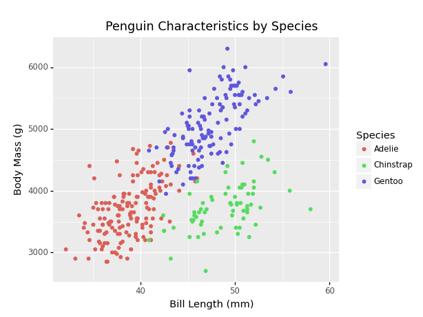

R and Python bilingualism
================

Welcome to the R and Python bilingualism reference guide! If you’re
fluent in one of these languages but hesitant to learn the other, you’re
in the right place. The good news is that there are many similarities
between R and Python that make it easy to switch between the two.

Both R and Python are widely used in data science and are open-source,
meaning that they are free to use and constantly being improved by the
community. They both have extensive libraries for data analysis,
visualization, and machine learning. In fact, many of the libraries in
both languages have similar names and functions, such as Pandas in
Python and data.table in R.

While there are differences between the two languages, they can
complement each other well. Python is versatile and scalable, making it
ideal for large and complex projects such as web development and
artificial intelligence. Object-oriented programming is easier and more
common in Python, which is useful for large development teams. R, on the
other hand, is known for its exceptional statistical capabilities and is
often used in data analysis and modeling. Visualization is also easier
in R, making it a popular choice for creating graphs and charts.

By learning both R and Python, you’ll be able to take advantage of the
strengths of each language and create more efficient and robust data
analysis workflows. Don’t let the differences between the two languages
intimidate you - once you become familiar with one, learning the other
will be much easier.

So, whether you’re a Python enthusiast looking to expand your
statistical analysis capabilities, or an R user interested in exploring
the world of web development and artificial intelligence, this guide
will help you become bilingual in R and Python.

## Packages/libraries – No need to write it from scratch

One thing Python and R have in common is they are extendable using
external packages or libraries. You should have all the packages you
need for today installed already.

R libraries are stored and managed in a repository called CRAN. You can
download and install R packages with the install.packages() function:

R code:

``` r
# Install the dplyr package from CRAN
install.packages("dplyr")
```

Installing Python packages can be trickier than installing R packages.
Python libraries are stored and managed in a few different repositories
and their dependencies are not regulated as strictly as R libraries are
in CRAN. Python’s default package manager `pip` can be used in a
terminal or command line to install packages from the `PyPI` repository,
and this is a good solution if you need to install a single simple
package, like the `requests` package that handles downloads. However,
`pip` has long had some challenges, which you are very likely to run
into if you are using a package that requires the GDAL library for
coordinate transformations (like `cartopy`, `rioxarray` or `geopandas`).

So what is an earth scientist to do? Most packages can also be installed
from the Anaconda repository by using the `conda install` or better yet
`mamba install` command. `mamba` is a version of `conda` that is much
faster at solving environments. For most packages, we also recommending
specifying the `conda-forge` channel, as below:

bash code to install Python packages:

``` bash
# First install mamba with conda if needed
conda install -c conda-forge mamba
# Install the pandas package from Anaconda
mamba install -c conda-forge pandas
```

It is common in Python to install all the packages you need at once.
This prevents incompatible packages from being loaded. Installing an
environment from and environment.yml file can be done with the following
code:

``` bash
mamba env create -f environment.yml
```

The `environment.yml` file in this repository is an example of an
environment that will let you run all the Python code in this notebook.

### Loading libraries in R and Python

In R, libraries can be loaded using the library() function:

R code:

``` r
# Load the dplyr library
library(dplyr)
```

In Python, libraries can be loaded using the import statement. Here’s an
example:

Python code:

``` python
# Load the pandas library
import pandas as pd
```

Note that the package or library must be installed from the respective
repository before it can be loaded. Also, make sure you have the correct
repository specified in your system before installing packages. By
default, R uses CRAN as its primary repository, whereas Anaconda uses
its own repository by default.

Importing libraries from R imports all the functions inside the library
under their own name. For example, once you have installed the r package
`readr`, you can use the included function `read.csv()` directly. On the
other hand, with a typical Python import like the one for `pandas`
above, you need to specify the package, e.g. `pd.read_csv`. This can be
cumbersome if you have to type the package name a lot (that’s why we
`import pandas as pd` instead of `import pandas` – our way we only have
to type out the two-letter alias `pd`). On the other hand, it can also
be really handy if you are trying to figure out what packages you need
to install to use a function in your own code.

> **GOTCHA ALERT:** The dot `.` is a special character in Python, but
> not in R. It is kind of like the `/` in your file system; instead of
> navigating your file tree, it navigates a tree structure like a class
> or a library.

### reticulate - Why choose?

The reticulate package lets you run share variables between R and
Python.

You only need to install packages once, but you need to mount those
packages with the library() function each time you open R.

``` r
library(reticulate)
```

Now, let’s create a Python list and assign it to a variable py_list:

R code:

``` python
py_list = [1, 2, 3]
```

We can now print out the py_list variable in Python using the
py_run_string() function:

R code:

``` r
py_run_string("print(py_list)")
```

This will output `[1, 2, 3]` in the Python console.

Now, let’s create an R vector and assign it to a variable r_vec:

R code:

``` r
r_vec <- c(4, 5, 6)
```

> Notice that in Python we use `=` to assign variables, while in R we
> use `<-`. Actually, we could use either one in R, but here we’re
> following the popular [tidyverse style
> guide](https://style.tidyverse.org/). In R there is a distinction
> between the assignment operator `<-` and the parameter setting
> operator `=`. In Python these are considered the same.

We can now print out the py_list variable in R using the py\$ syntax to
access Python variables:

R code:

``` r
print(py$py_list)
print(py)
```

This will output \[1, 2, 3\] in the R console. Conversely, we can get
the R variable `r_vec` in Python:

``` python
print(r.r_vec)
```

> There’s that dot `.` again - in this case it is getting the r_vec
> variable from within the “R interface object” `r` similarly to how the
> `$` character gets attributes of the `py` object.

### Load packages and change settings

In both R and Python, it is suggested to do all your library/package
imports at the top of your file. This makes it easier for others to run
or copy your code.

``` r
options(java.parameters = "-Xmx5G")

library(readr)
library(r5r)
```

    Please make sure you have already allocated some memory to Java by running:
      options(java.parameters = '-Xmx2G').
    You should replace '2G' by the amount of memory you'll require. Currently, Java memory is set to -Xmx5G

``` r
library(sf)
```

    Linking to GEOS 3.11.0, GDAL 3.5.3, PROJ 9.1.0; sf_use_s2() is TRUE

``` r
library(data.table)
library(ggplot2)
library(interp)
library(dplyr)
```


    Attaching package: 'dplyr'

    The following objects are masked from 'package:data.table':

        between, first, last

    The following objects are masked from 'package:stats':

        filter, lag

    The following objects are masked from 'package:base':

        intersect, setdiff, setequal, union

``` r
library(osmdata)
```

    Data (c) OpenStreetMap contributors, ODbL 1.0. https://www.openstreetmap.org/copyright

``` r
library(ggthemes)
library(sf)
library(data.table)
library(ggplot2)
library(akima)
```


    Attaching package: 'akima'

    The following objects are masked from 'package:interp':

        aspline, bicubic, bicubic.grid, bilinear, bilinear.grid,
        franke.data, franke.fn, interp, interp2xyz, interpp

``` r
library(dplyr)
library(raster)
```

    Loading required package: sp


    Attaching package: 'raster'

    The following object is masked from 'package:dplyr':

        select

``` r
library(osmdata)
library(mapview)
library(cowplot)
```


    Attaching package: 'cowplot'

    The following object is masked from 'package:ggthemes':

        theme_map

``` r
library(here)
```

    here() starts at /Users/elsa/04-workshops/pre-innovation-summit-training

``` r
library(testthat)
```


    Attaching package: 'testthat'

    The following object is masked from 'package:dplyr':

        matches

    The following objects are masked from 'package:readr':

        edition_get, local_edition

``` r
library(reticulate)
Sys.setenv(
  RETICULATE_PYTHON=path.expand('~/opt/miniconda3/envs/earth-analytics-python/bin/python'))
use_condaenv('earth-analytics-python')
```

``` python
import os
import pathlib
import pickle
import sys
sys.argv.append(["--max-memory", "5G"])

import contextily as cx
import dask
import geopandas
import matplotlib.pyplot as plt
import numpy as np
import pandas as pd
import r5py
import requests
import rioxarray as rxr
```

    /Users/elsa/opt/miniconda3/envs/earth-analytics-python/lib/python3.8/site-packages/scipy/__init__.py:146: UserWarning: A NumPy version >=1.16.5 and <1.23.0 is required for this version of SciPy (detected version 1.23.5
      warnings.warn(f"A NumPy version >={np_minversion} and <{np_maxversion}"

``` python
import seaborn as sns
import seaborn.objects as so
import xarray as xr
from plotnine import ggplot, aes, geom_point, labs, ggtitle
```

R and Python are two popular programming languages used for data
analysis, statistics, and machine learning. Although they share some
similarities, there are some fundamental differences between them.
Here’s an example code snippet in R and Python to illustrate some of the
differences:

R Code:

``` r
# Create a vector of numbers from 1 to 10
x <- 1:10

# Compute the mean of the vector
mean_x <- mean(x)

# Print the result
print(mean_x)
```

    [1] 5.5

Python Code:

``` python
# Create a numpy array of numbers from 1 to 10
x_arr = np.array(range(1, 10))

# Compute the mean of the array
mean_x = x_arr.mean()

# Print the result
print(mean_x)
```

    5.0

In this example, we can see that there are several differences between R
and Python:

Syntax: `<-` in R vs. `=` in Python; `$` in R vs. `.` in Python

Libraries: Python relies heavily on external libraries such as numpy,
pandas, and xarray for data analysis, while R has built-in functions for
many data analysis tasks. The Python libraries require extra
installation steps, but they have the potential to be much faster when
working with large amounts of data because they are compiled to take
full advantage of your hardware and advances in mathematics kernel
libraries.

Function vs. Methods: Python is an object-oriented language, which means
that where you would use a function in R, you often must apply a method
to an object in Python - see `mean()` in R vs. `x_arr.mean()` in Python.
Another way to think about this is that functions and methods are verbs
(`pd.read_csv()`), classes are nouns (`csv.writer()`), and methods are
also verbs but they act on the object they are part of
(`my_csv_writer.writerows()`).

Style:

These are just a few of the many differences between R and Python.
Ultimately, the choice between the two languages will depend on your
specific needs and preferences.

## Using and managing tabular data

### Load tabular data from the web

For tabular data like comma separate value (CSV) files, all you need to
get started is a web url. Another thing to notice in the following cells
is how to add line breaks in long strings

R Code:

``` r
penguins_url <- paste0(
  'https://raw.githubusercontent.com/allisonhorst/palmerpenguins/',
  'main/inst/extdata/penguins.csv')

# Load penguins data
penguins_df <- read_csv(penguins_url)
```

    Rows: 344 Columns: 8
    ── Column specification ────────────────────────────────────────────────────────
    Delimiter: ","
    chr (3): species, island, sex
    dbl (5): bill_length_mm, bill_depth_mm, flipper_length_mm, body_mass_g, year

    ℹ Use `spec()` to retrieve the full column specification for this data.
    ℹ Specify the column types or set `show_col_types = FALSE` to quiet this message.

``` r
penguins_df
```

    # A tibble: 344 × 8
       species island    bill_length_mm bill_depth_mm flipper_length_mm body_mass_g
       <chr>   <chr>              <dbl>         <dbl>             <dbl>       <dbl>
     1 Adelie  Torgersen           39.1          18.7               181        3750
     2 Adelie  Torgersen           39.5          17.4               186        3800
     3 Adelie  Torgersen           40.3          18                 195        3250
     4 Adelie  Torgersen           NA            NA                  NA          NA
     5 Adelie  Torgersen           36.7          19.3               193        3450
     6 Adelie  Torgersen           39.3          20.6               190        3650
     7 Adelie  Torgersen           38.9          17.8               181        3625
     8 Adelie  Torgersen           39.2          19.6               195        4675
     9 Adelie  Torgersen           34.1          18.1               193        3475
    10 Adelie  Torgersen           42            20.2               190        4250
    # ℹ 334 more rows
    # ℹ 2 more variables: sex <chr>, year <dbl>

Python code:

``` python
penguins_url = (
    'https://raw.githubusercontent.com/allisonhorst/palmerpenguins/'
    'main/inst/extdata/penguins.csv'
)
    
# Load in penguins data
penguins_df = pd.read_csv(penguins_url)
penguins_df
```

           species     island  bill_length_mm  ...  body_mass_g     sex  year
    0       Adelie  Torgersen            39.1  ...       3750.0    male  2007
    1       Adelie  Torgersen            39.5  ...       3800.0  female  2007
    2       Adelie  Torgersen            40.3  ...       3250.0  female  2007
    3       Adelie  Torgersen             NaN  ...          NaN     NaN  2007
    4       Adelie  Torgersen            36.7  ...       3450.0  female  2007
    ..         ...        ...             ...  ...          ...     ...   ...
    339  Chinstrap      Dream            55.8  ...       4000.0    male  2009
    340  Chinstrap      Dream            43.5  ...       3400.0  female  2009
    341  Chinstrap      Dream            49.6  ...       3775.0    male  2009
    342  Chinstrap      Dream            50.8  ...       4100.0    male  2009
    343  Chinstrap      Dream            50.2  ...       3775.0  female  2009

    [344 rows x 8 columns]

### Forming reproducible file paths

In both R and Python, it is important to use **reproducible file paths**
when collaborating on or sharing code. That means files should be
relative to the current directory, or even better inside the home
directory so it can be specified on every computer.

First, we might want to know where the **working directory** is. If you
build a **relative** file path (one that doesn’t start with something
like a `/` on Unix systems or `C://` on Windows systems) the working
directory will be where your code looks for that path:

``` r
getwd()
```

    [1] "/Users/elsa/04-workshops/pre-innovation-summit-training/docs/2_R_and_Py_bilingualism/code/code_demo"

``` python
os.getcwd()
```

    '/Users/elsa/04-workshops/pre-innovation-summit-training/docs/2_R_and_Py_bilingualism/code/code_demo'

Next, let’s make a cross-platform file path to a data directory in your
home folder and set that as your new working directory. Despite the use
of the Unix-style `~` to indicate the home directory, this code should
work on both Windows and Unix computers. Windows users can check out
`help(path.expand)` in the R console for more information on what the
home directory is.

> We know that sometimes it doesn’t work to put data in your home
> directory. Another option is putting a configuration file with the
> data path in the home directory. Keeping the data in your project
> directory is also an option.

``` r
data_dir <- file.path(path.expand('~'), 'esiil-summit', 'r_and_py')

# Make the data directory
dir.create(data_dir, showWarnings=F, recursive=T)
print(data_dir)
```

    [1] "/Users/elsa/esiil-summit/r_and_py"

``` python
data_dir = os.path.join(pathlib.Path.home(), 'esiil-summit', 'r_and_py')

# Make the data directory
os.makedirs(data_dir, exist_ok=True)
print(data_dir)
```

    /Users/elsa/esiil-summit/r_and_py

You should see your username in both paths.

Parameter notes:

- In R we get a warning if the directory we’re creating already exists,
  which is suppressed by the `showWarnings=F` parameter. In Python, it
  is an error unless the `exist_ok=True` parameter is supplied.

- In R, we can use the same function to create a single directory and
  multiple nested directories, as long as we use the `recursive=T`
  parameter. In Python, there is a different `os.mkdir()` function for
  creating single directories.

> **GOTCHA ALERT**: In Python, boolean values are `True` and `False`; in
> R they are `TRUE` or `T` and `FALSE` or `F`

### Getting tabular data to and from text files

Let’s save that data so if we like we can work offline (and avoid
hitting the server too many times). You can also save your own results
or processed data this way.

> Notice that in R this is a **function** and in Python it is a
> **method** of our `pd.DataFrame` object.

``` r
# Write penguin data to CSV
penguins_r_csv_path = file.path(data_dir, "penguins_r.csv")
write_csv(penguins_df, file=penguins_r_csv_path)
```

``` python
# Write penguin data to CSV
penguins_py_csv_path = os.path.join(data_dir, "penguins_py.csv")
penguins_df.to_csv(penguins_py_csv_path, index=False)
```

> **GOTCHA ALERT**: The pandas `pd.DataFrame.to_csv()` method is not
> *quite* symmetrical with `pd.read_csv()`. This is because pandas
> `DataFrame`s have an **index**, or row identifier, and you need to
> choose how to deal with it when reading and writing files. Since in
> this case the index is simply a row number and not critical
> information, we’ve solved this problem by eliminating the index
> altogether in the file using the `index=False` parameter. Go ahead and
> try removing it to see what happens when we reload!

Now we can delete our original data frames. We wouldn’t normally need to
do this, but we want to make sure the data are really loading from
`.csv`. You should get errors from both print statements.

``` r
rm(penguins_df)
print(penguins_df)
```

``` python
del penguins_df
print(penguins_df)
```

finally – reload the Palmer Penguin data from the saved `.csv` files.

``` r
penguins_df <- read_csv(penguins_r_csv_path)
```

    Rows: 344 Columns: 8
    ── Column specification ────────────────────────────────────────────────────────
    Delimiter: ","
    chr (3): species, island, sex
    dbl (5): bill_length_mm, bill_depth_mm, flipper_length_mm, body_mass_g, year

    ℹ Use `spec()` to retrieve the full column specification for this data.
    ℹ Specify the column types or set `show_col_types = FALSE` to quiet this message.

``` r
penguins_df
```

    # A tibble: 344 × 8
       species island    bill_length_mm bill_depth_mm flipper_length_mm body_mass_g
       <chr>   <chr>              <dbl>         <dbl>             <dbl>       <dbl>
     1 Adelie  Torgersen           39.1          18.7               181        3750
     2 Adelie  Torgersen           39.5          17.4               186        3800
     3 Adelie  Torgersen           40.3          18                 195        3250
     4 Adelie  Torgersen           NA            NA                  NA          NA
     5 Adelie  Torgersen           36.7          19.3               193        3450
     6 Adelie  Torgersen           39.3          20.6               190        3650
     7 Adelie  Torgersen           38.9          17.8               181        3625
     8 Adelie  Torgersen           39.2          19.6               195        4675
     9 Adelie  Torgersen           34.1          18.1               193        3475
    10 Adelie  Torgersen           42            20.2               190        4250
    # ℹ 334 more rows
    # ℹ 2 more variables: sex <chr>, year <dbl>

``` python
penguins_df = pd.read_csv(penguins_py_csv_path)
penguins_df
```

           species     island  bill_length_mm  ...  body_mass_g     sex  year
    0       Adelie  Torgersen            39.1  ...       3750.0    male  2007
    1       Adelie  Torgersen            39.5  ...       3800.0  female  2007
    2       Adelie  Torgersen            40.3  ...       3250.0  female  2007
    3       Adelie  Torgersen             NaN  ...          NaN     NaN  2007
    4       Adelie  Torgersen            36.7  ...       3450.0  female  2007
    ..         ...        ...             ...  ...          ...     ...   ...
    339  Chinstrap      Dream            55.8  ...       4000.0    male  2009
    340  Chinstrap      Dream            43.5  ...       3400.0  female  2009
    341  Chinstrap      Dream            49.6  ...       3775.0    male  2009
    342  Chinstrap      Dream            50.8  ...       4100.0    male  2009
    343  Chinstrap      Dream            50.2  ...       3775.0  female  2009

    [344 rows x 8 columns]

### Serialize data

In both Python and R, you can also **serialize** objects so they can be
read back into the environment quickly (but aren’t easily readable by
other programming languages).

> **Why serialize?** This can be a great option when you want to cache
> intermediate analysis results, long downloads, or if you need to send
> objects from one worker to another in a multiprocessing context.

R Code:

``` r
penguins_rds_path = file.path(data_dir, "penguins.rds")

# Serialize penguin data
saveRDS(penguins_df, file=penguins_rds_path)
```

Python code:

``` python
penguins_pickle_path = os.path.join(data_dir, "penguins.pickle")

# Serialize penguins data
with open(penguins_pickle_path, 'wb') as penguins_file:
    pickle.dump(penguins_df, penguins_file)
```

In Python, it is important to use a **context manager**
(`with open(...) as file:`) when accessing files, as otherwise a file
connection may stay open and drain resources. You can choose:

- whether to open files for reading (`'r'`) or writing (`'w'`)

- whether to interpret the content as a string (default) or binary/bytes
  as needed to write pickled data (add a `b`)

You can rely on the `pandas` library to manage your file connections for
you, so there’s no need for a context manager.

Go ahead and take a look at those files to see what they look like! You
can do so using a terminal and the command
`head /path/to/penguins/file`.

### Load serialized data

``` r
# Clear penguin data from environment
rm(penguins_df)

# Unserialize penguin data
penguins_df <- readRDS(penguins_rds_path)
penguins_df
```

    # A tibble: 344 × 8
       species island    bill_length_mm bill_depth_mm flipper_length_mm body_mass_g
       <chr>   <chr>              <dbl>         <dbl>             <dbl>       <dbl>
     1 Adelie  Torgersen           39.1          18.7               181        3750
     2 Adelie  Torgersen           39.5          17.4               186        3800
     3 Adelie  Torgersen           40.3          18                 195        3250
     4 Adelie  Torgersen           NA            NA                  NA          NA
     5 Adelie  Torgersen           36.7          19.3               193        3450
     6 Adelie  Torgersen           39.3          20.6               190        3650
     7 Adelie  Torgersen           38.9          17.8               181        3625
     8 Adelie  Torgersen           39.2          19.6               195        4675
     9 Adelie  Torgersen           34.1          18.1               193        3475
    10 Adelie  Torgersen           42            20.2               190        4250
    # ℹ 334 more rows
    # ℹ 2 more variables: sex <chr>, year <dbl>

In R, there are a number of slightly different functions for serializing
data. For example, you can check out `save()` and `load()` as well if
you need to save multiple objects at once.

``` python
# Clear penguin data from environment
del penguins_df

# Unserialize penguin data
with open(penguins_pickle_path, 'rb') as penguins_file:
    penguins_df = pickle.load(penguins_file)
penguins_df
```

           species     island  bill_length_mm  ...  body_mass_g     sex  year
    0       Adelie  Torgersen            39.1  ...       3750.0    male  2007
    1       Adelie  Torgersen            39.5  ...       3800.0  female  2007
    2       Adelie  Torgersen            40.3  ...       3250.0  female  2007
    3       Adelie  Torgersen             NaN  ...          NaN     NaN  2007
    4       Adelie  Torgersen            36.7  ...       3450.0  female  2007
    ..         ...        ...             ...  ...          ...     ...   ...
    339  Chinstrap      Dream            55.8  ...       4000.0    male  2009
    340  Chinstrap      Dream            43.5  ...       3400.0  female  2009
    341  Chinstrap      Dream            49.6  ...       3775.0    male  2009
    342  Chinstrap      Dream            50.8  ...       4100.0    male  2009
    343  Chinstrap      Dream            50.2  ...       3775.0  female  2009

    [344 rows x 8 columns]

## Data Plots

R Code:

``` r
# Plot the penguin data
ggplot(penguins_df, aes(x = bill_length_mm, y = body_mass_g, color=species)) +
  # Create a scatter plot of the data
  geom_point() +
  # Label the plot
  labs(x = 'Bill Length (mm)', y = 'Body Mass (g)', color = 'Species') +
  # Add a title
  ggtitle('Penguin Characteristics by Species')
```

    Warning: Removed 2 rows containing missing values (`geom_point()`).


Python seaborn.objects code:

``` python
# Make a scatter plot with the penguin data
(so.Plot(penguins_df, x='bill_length_mm', y='body_mass_g')
 # Make a scatter plot colored by species
 .add(so.Dot(), color='species')
 # Add labels
 .label(
     x='Bill Length (mm)', y='Body Mass (g)', color='Species',
     title='Penguin Characteristics by Species')
 # Give the legend some more room so it doesn't overlap the data
 .layout(engine="constrained")
 # Display the plot
 .show()
)
```

    /Users/elsa/opt/miniconda3/envs/earth-analytics-python/lib/python3.8/_collections_abc.py:832: MatplotlibDeprecationWarning: 
    The savefig.jpeg_quality rcparam was deprecated in Matplotlib 3.3 and will be removed two minor releases later.
    /Users/elsa/opt/miniconda3/envs/earth-analytics-python/lib/python3.8/_collections_abc.py:832: MatplotlibDeprecationWarning: 
    The savefig.jpeg_quality rcparam was deprecated in Matplotlib 3.3 and will be removed two minor releases later.
    /Library/Frameworks/R.framework/Versions/4.3-x86_64/Resources/library/reticulate/python/rpytools/call.py:10: UserWarning: There are no gridspecs with layoutgrids. Possibly did not call parent GridSpec with the "figure" keyword


> **GOTCHA ALERT:** In Python, you will usually need to put `.show()` at
> the end of your code to see your plot. Otherwise you may see something
> like:
>
>     <seaborn._core.plot.Plot object at 0x7f81493e4070>

``` python
# Plot the penguin data
(ggplot(penguins_df, aes(x = 'bill_length_mm', y = 'body_mass_g', color='species')) +
  # Create a scatter plot of the data
  geom_point() +
  # Label the plot
  labs(x = 'Bill Length (mm)', y = 'Body Mass (g)', color = 'Species') +
  # Add a title
  ggtitle('Penguin Characteristics by Species')
)
```

    <ggplot: (8778360618310)>

    /Users/elsa/opt/miniconda3/envs/earth-analytics-python/lib/python3.8/site-packages/plotnine/layer.py:401: PlotnineWarning: geom_point : Removed 2 rows containing missing values.


> **GOTCHA ALERT:** If you are used to `ggplot2` and are using
> `plotnine`, there are a few things to be aware of. One is that
> **quosures** and related structures allow you to leave quotes out of
> your `ggplot2` code. You can’t do this in Python - you must use quotes
> on column names! You also must surround the code for plotting with
> parentheses to get the `+` syntax for layers to work in Python.
> Finally, we had some display problems in RStudio and had to set the
> figure size. This shouldn’t be a problem in a Python-focused
> environment like Jupyter Notebook.

In both cases, we generate some sample data and create a scatter plot to
visualize the relationship between the variables.

Some notes on plotting packages:

- In R, although there is a built-in `base` plotting functionality, the
  `ggplot2` package is overwhelmingly used for plotting. `gg` stands for
  Grammar of Graphics, and is an intuitive interface for making plots
  that convey the information you want.

- In Python, there are many options, based on either the Matlab-inspired
  `matplotlib` or various JavaScript libraries like `leaflet`.
  `matplotlib` gives you a lot of control over your plot, but on the
  downside you *have* to control nearly everything about your plot. We
  recommend the `seaborn.objects` or `so` interface used above, though
  it is relatively new, because it is a flexible and powerful interface
  that does not require you to learn any `matplotlib`. You can also plot
  with nearly identical syntax to `ggplot2` using the `plotnine`
  library.

## Linear regression

R Code:

``` r
# Load the "ggplot2" package for plotting
library(ggplot2)

# Generate some sample data
x <- seq(1, 10, 1)
y <- x + rnorm(10)

# Perform linear regression
model_r <- lm(y ~ x)

# Print the model summary
summary(model_r)
```


    Call:
    lm(formula = y ~ x)

    Residuals:
        Min      1Q  Median      3Q     Max 
    -0.9902 -0.5704  0.1817  0.4286  0.7938 

    Coefficients:
                Estimate Std. Error t value Pr(>|t|)    
    (Intercept)  0.02457    0.45007   0.055    0.958    
    x            0.98742    0.07254  13.613 8.16e-07 ***
    ---
    Signif. codes:  0 '***' 0.001 '**' 0.01 '*' 0.05 '.' 0.1 ' ' 1

    Residual standard error: 0.6588 on 8 degrees of freedom
    Multiple R-squared:  0.9586,    Adjusted R-squared:  0.9534 
    F-statistic: 185.3 on 1 and 8 DF,  p-value: 8.157e-07

``` r
# Plot the data and regression line
ggplot(data.frame(x, y), aes(x = x, y = y)) +
  geom_point() +
  geom_smooth(method = "lm", se = FALSE)
```

    `geom_smooth()` using formula = 'y ~ x'


Python code:

``` python
# Load the "matplotlib" and "scikit-learn" libraries
import matplotlib.pyplot as plt
from sklearn.linear_model import LinearRegression

# Generate some sample data
import numpy as np
x = np.arange(1, 11)
y = x + np.random.normal(0, 1, 10)

# Perform linear regression
model_py = LinearRegression().fit(x.reshape(-1, 1), y)

# Print the model coefficients
print("Coefficients: ", model_py.coef_)
```

    Coefficients:  [0.98507314]

``` python
print("Intercept: ", model_py.intercept_)

#clear last plot
```

    Intercept:  0.10538584341896495

``` python
plt.clf()

# Plot the data and regression line
plt.scatter(x, y)
plt.plot(x, model_py.predict(x.reshape(-1, 1)), color='red')
plt.show()
```


In both cases, we generate some sample data with a linear relationship
between x and y, and then perform a simple linear regression to estimate
the slope and intercept of the line. We then plot the data and
regression line to visualize the fit.

There are a few differences in the syntax and functionality between the
two approaches:

Library and package names: In R, we use the lm() function from the base
package to perform linear regression, while in Python, we use the
LinearRegression() class from the scikit-learn library. Additionally, we
use the ggplot2 package in R for plotting, while we use the matplotlib
library in Python. Data format: In R, we can specify the dependent and
independent variables in the formula used for regression. In Python, we
need to reshape the input data to a two-dimensional array before fitting
the model. Model summary: In R, we can use the summary() function to
print a summary of the model, including the estimated coefficients,
standard errors, and p-values. In Python, we need to print the
coefficients and intercept separately.

## Random Forest

R Code:

``` r
# Load the "randomForest" package
library(randomForest)

# Load the "iris" dataset
data(iris)

# Split the data into training and testing sets
set.seed(123)
train_idx <- sample(1:nrow(iris), nrow(iris) * 0.7, replace = FALSE)
train_data <- iris[train_idx, ]
test_data <- iris[-train_idx, ]

# Build a random forest model
rf_model <- randomForest(Species ~ ., data = train_data, ntree = 500)

# Make predictions on the testing set
predictions <- predict(rf_model, test_data)

# Calculate accuracy of the model
accuracy <- sum(predictions == test_data$Species) / nrow(test_data)
print(paste("Accuracy:", accuracy))
```

    [1] "Accuracy: 0.977777777777778"

Python code:

``` python
# Load the "pandas", "numpy", and "sklearn" libraries
import pandas as pd
import numpy as np
from sklearn.ensemble import RandomForestClassifier
from sklearn.datasets import load_iris
from sklearn.model_selection import train_test_split

# Load the "iris" dataset
iris = load_iris()

# Split the data into training and testing sets
X_train, X_test, y_train, y_test = train_test_split(iris.data, iris.target, test_size=0.3, random_state=123)

# Build a random forest model
rf_model = RandomForestClassifier(n_estimators=500, random_state=123)
rf_model.fit(X_train, y_train)

# Make predictions on the testing set
```

    RandomForestClassifier(n_estimators=500, random_state=123)

``` python
predictions = rf_model.predict(X_test)

# Calculate accuracy of the model
accuracy = sum(predictions == y_test) / len(y_test)
print("Accuracy:", accuracy)
```

    Accuracy: 0.9555555555555556

In both cases, we load the iris dataset and split it into training and
testing sets. We then build a random forest model using the training
data and evaluate its accuracy on the testing data.

There are a few differences in the syntax and functionality between the
two approaches:

Library and package names: In R, we use the randomForest package to
build random forest models, while in Python, we use the
RandomForestClassifier class from the sklearn.ensemble module. We also
use different libraries for loading and manipulating data (pandas and
numpy in Python, and built-in datasets in R). Model parameters: The
syntax for setting model parameters is slightly different in R and
Python. For example, in R, we specify the number of trees using the
ntree parameter, while in Python, we use the n_estimators parameter.
Data format: In R, we use a data frame to store the input data, while in
Python, we use numpy arrays.

## Basic streetmap from Open Street Map

R Code:

``` r
# Load the "osmdata" package for mapping
library(osmdata)
library(tmap)

# Define the map location and zoom level
bbox <- c(left = -0.16, bottom = 51.49, right = -0.13, top = 51.51)

# Get the OpenStreetMap data
osm_data <- opq(bbox) %>% 
  add_osm_feature(key = "highway") %>% 
  osmdata_sf()

# Plot the map using tmap
tm_shape(osm_data$osm_lines) + 
  tm_lines()
```


Python code:

``` python
# Load the "osmnx" package for mapping
import osmnx as ox

# Define the map location and zoom level
bbox = (51.49, -0.16, 51.51, -0.13)

# Get the OpenStreetMap data
osm_data = ox.graph_from_bbox(north=bbox[2], south=bbox[0], east=bbox[3], west=bbox[1], network_type='all')

# Plot the map using osmnx
ox.plot_graph(osm_data)
```

    (<Figure size 800x800 with 0 Axes>, <AxesSubplot:>)



In both cases, we define the map location and zoom level, retrieve the
OpenStreetMap data using the specified bounding box, and plot the map.

The main differences between the two approaches are:

Package names and syntax: In R, we use the osmdata package and its
syntax to download and process the OpenStreetMap data, while in Python,
we use the osmnx package and its syntax. Mapping libraries: In R, we use
the tmap package to create a static map of the OpenStreetMap data, while
in Python, we use the built-in ox.plot_graph function from the osmnx
package to plot the map.

## CNN on Raster data

R Code:

``` r
# Load the "keras" package for building the CNN
library(tensorflow)
library(keras)

# Load the "raster" package for working with raster data
library(raster)

# Load the "magrittr" package for pipe operator
library(magrittr)

# Load the data as a raster brick
raster_data <- brick("raster_data.tif")

# Split the data into training and testing sets
split_data <- sample(1:nlayers(raster_data), size = nlayers(raster_data)*0.8, replace = FALSE)
train_data <- raster_data[[split_data]]
test_data <- raster_data[[setdiff(1:nlayers(raster_data), split_data)]]

# Define the CNN model
model <- keras_model_sequential() %>% 
  layer_conv_2d(filters = 32, kernel_size = c(3, 3), activation = "relu", input_shape = c(ncol(train_data), nrow(train_data), ncell(train_data))) %>% 
  layer_max_pooling_2d(pool_size = c(2, 2)) %>% 
  layer_dropout(rate = 0.25) %>% 
  layer_flatten() %>% 
  layer_dense(units = 128, activation = "relu") %>% 
  layer_dropout(rate = 0.5) %>% 
  layer_dense(units = nlayers(train_data), activation = "softmax")

# Compile the model
model %>% compile(loss = "categorical_crossentropy", optimizer = "adam", metrics = "accuracy")

# Train the model
history <- model %>% fit(x = array(train_data), y = to_categorical(1:nlayers(train_data)), epochs = 10, validation_split = 0.2)

# Evaluate the model
model %>% evaluate(x = array(test_data), y = to_categorical(1:nlayers(test_data)))

# Plot the model accuracy over time
plot(history)
```

## Piping

Piping is a powerful feature in both R and Python that allows for a more
streamlined and readable code. However, the syntax for piping is
slightly different between the two languages.

In R, piping is done using the %\>% operator from the magrittr package,
while in Python, it is done using the \| operator from the pandas
package.

Let’s compare and contrast piping in R and Python with some examples:

Piping in R In R, we can use the %\>% operator to pipe output from one
function to another, which can make our code more readable and easier to
follow. Here’s an example:

R code:

``` r
library(dplyr)

# create a data frame
df <- data.frame(x = c(1,2,3), y = c(4,5,6))

# calculate the sum of column x and y
df %>%
  mutate(z = x + y) %>%
  summarize(sum_z = sum(z))
```

      sum_z
    1    21

In this example, we first create a data frame df with two columns x and

y\. We then pipe the output of df to mutate, which adds a new column z
to the data frame that is the sum of x and y. Finally, we pipe the
output to summarize, which calculates the sum of z and returns the
result.

Piping in Python In Python, we can use the \| operator to pipe output
from one function to another. However, instead of piping output from one
function to another, we pipe a DataFrame to a method of the DataFrame.
Here’s an example:

Python code:

``` python
import pandas as pd

# create a DataFrame
df = pd.DataFrame({'x': [1,2,3], 'y': [4,5,6]})

# calculate the sum of column x and y
(df.assign(z = df['x'] + df['y'])
   .agg(sum_z = ('z', 'sum')))
```

            z
    sum_z  21

In this example, we first create a DataFrame df with two columns x and

y\. We then use the assign() method to add a new column z to the
DataFrame that is the sum of x and y. Finally, we use the agg() method
to calculate the sum of z and return the result.

As we can see, the syntax for piping is slightly different between R and
Python, but the concept remains the same. Piping can make our code more
readable and easier to follow, which is an important aspect of creating
efficient and effective code.

R code:

``` r
library(dplyr)
library(ggplot2)

iris %>%
  filter(Species == "setosa") %>%
  group_by(Sepal.Width) %>%
  summarise(mean.Petal.Length = mean(Petal.Length)) %>%
  mutate(Sepal.Width = as.factor(Sepal.Width)) %>%
  ggplot(aes(x = Sepal.Width, y = mean.Petal.Length)) +
  geom_bar(stat = "identity", fill = "dodgerblue") +
  labs(title = "Mean Petal Length of Setosa by Sepal Width",
       x = "Sepal Width",
       y = "Mean Petal Length")
```


In this example, we start with the iris dataset and filter it to only
include rows where the Species column is “setosa”. We then group the
remaining rows by the Sepal.Width column and calculate the mean
Petal.Length for each group. Next, we convert Sepal.Width to a factor
variable to ensure that it is treated as a categorical variable in the
visualization. Finally, we create a bar plot using ggplot2, with
Sepal.Width on the x-axis and mean.Petal.Length on the y-axis. The
resulting plot shows the mean petal length of setosa flowers for each
sepal width category.

Python code:

``` python
import pandas as pd

# Load the iris dataset and pipe it into the next function
( pd.read_csv("https://archive.ics.uci.edu/ml/machine-learning-databases/iris/iris.data", header=None, names=['sepal_length', 'sepal_width', 'petal_length', 'petal_width', 'class'])
  
  # Select columns and pivot the dataset
  .loc[:, ['sepal_length', 'sepal_width', 'petal_length']]
  .melt(var_name='variable', value_name='value')
  
  # Group by variable and calculate mean
  .groupby('variable', as_index=False)
  .mean()
  
  # Filter for mean greater than 3.5 and sort by descending mean
  .query('value > 3.5')
  .sort_values('value', ascending=False)
)
```

           variable     value
    1  sepal_length  5.843333
    0  petal_length  3.758667

## for loops

Here is an example of a for loop in R:

R code

``` r
# Create a vector of numbers
numbers <- c(1, 2, 3, 4, 5)

# Use a for loop to print out each number in the vector
for (i in numbers) {
  print(i)
}
```

    [1] 1
    [1] 2
    [1] 3
    [1] 4
    [1] 5

In this example, the for loop iterates over each element in the numbers
vector, assigning the current element to the variable i. The print(i)
statement is then executed for each iteration, outputting the value of

i\.

Here is the equivalent example in Python:

Python code

``` python
# Create a list of numbers
numbers = [1, 2, 3, 4, 5]

# Use a for loop to print out each number in the list
for i in numbers:
  print(i)
```

    1
    2
    3
    4
    5

In Python, the for loop iterates over each element in the numbers list,
assigning the current element to the variable i. The print(i) statement
is then executed for each iteration, outputting the value of i.

Both languages also support nested for loops, which can be used to
perform iterations over multiple dimensions, such as looping through a
2D array.

## Functions

Both R and Python are powerful languages for writing functions that can
take input, perform a specific task, and return output.

R Code:

``` r
# Define a function that takes two arguments and returns their sum
sum_r <- function(a, b) {
  return(a + b)
}

# Call the function with two arguments and print the result
result_r <- sum_r(3, 5)
print(result_r)
```

    [1] 8

Python code:

``` python
# Define a function that takes two arguments and returns their sum
def sum_py(a, b):
    return a + b

# Call the function with two arguments and print the result
result_py = sum_py(3, 5)
print(result_py)
```

    8

In both cases, we define a function that takes two arguments and returns
their sum. In R, we use the function keyword to define a function, while
in Python, we use the def keyword. The function body in R is enclosed in
curly braces, while in Python it is indented.

There are a few differences in the syntax and functionality between the
two approaches:

Function arguments: In R, function arguments are separated by commas,
while in Python they are enclosed in parentheses. The syntax for
specifying default arguments and variable-length argument lists can also
differ between the two languages. Return statement: In R, we use the
return keyword to specify the return value of a function, while in
Python, we simply use the return statement. Function names: Function
names in R and Python can differ significantly. In the example above, we
used the sum_r() function in R and the sum_py() function in Python to
calculate the sum of two numbers.

## Parallel

Parallel computing is a technique used to execute multiple computational
tasks simultaneously, which can significantly reduce the time required
to complete a task. Both R and Python have built-in support for parallel
computing, although the approaches are slightly different. In this
answer, we will compare and contrast the parallel computing capabilities
of R and Python, and provide working examples in code.

Parallel computing in R In R, there are several packages that support
parallel computing, such as parallel, foreach, and doParallel. The
parallel package provides basic functionality for parallel computing,
while foreach and doParallel provide higher-level abstractions that make
it easier to write parallel code.

Here is an example of using the foreach package to execute a loop in
parallel:

R code:

``` r
library(foreach)
library(doParallel)

# Set up a parallel backend with 4 workers
cl <- makeCluster(4)
registerDoParallel(cl)

# Define a function to apply in parallel
myfunc <- function(x) {
  # some computation here
  return(x^2)
}

# Generate some data
mydata <- 1:1000

# Apply the function to the data in parallel
result <- foreach(i = mydata) %dopar% {
  myfunc(i)
}

# Stop the cluster
stopCluster(cl)
```

In this example, we use the makeCluster() function to set up a cluster
with 4 workers, and the registerDoParallel() function to register the
cluster as the parallel backend for foreach. We then define a function
myfunc() that takes an input x and returns x^2. We generate some data
mydata and use foreach to apply myfunc() to each element of mydata in
parallel, using the %dopar% operator.

R Tidyverse parallel

In R Tidyverse, we can use the furrr package for parallel computing.
Here’s an example of using furrr to parallelize a map function:

R Tidy code:

``` r
library(tidyverse)
library(furrr)

# Generate a list of numbers
numbers <- 1:10

# Use the future_map function from furrr to parallelize the map function
plan(multisession)
squares <- future_map(numbers, function(x) x^2)
```

In this example, we first load the Tidyverse and furrr libraries. We
then generate a list of numbers from 1 to 10. We then use the plan
function to set the parallelization strategy to “multisession”, which
will use multiple CPU cores to execute the code. Finally, we use the
future_map function from furrr to apply the function x^2 to each number
in the list in parallel.

Parallel computing in Python In Python, the standard library includes
the multiprocessing module, which provides basic support for parallel
computing. Additionally, there are several third-party packages that
provide higher-level abstractions, such as joblib and dask.

Here is an example of using the multiprocessing module to execute a loop
in parallel:

Python code:

``` python
def square(x):
    return x**2
  
from multiprocessing import Pool

# Generate a list of numbers
numbers = list(range(1, 11))

# Use the map function and a pool of workers to parallelize the square function
with Pool() as pool:
    squares = pool.map(square, numbers)
    
print(squares)
```

In this example, we define a function myfunc() that takes an input x and
returns x^2. We generate some data mydata and use the Pool class from
the multiprocessing module to set up a pool of 4 workers. We then use
the map() method of the Pool class to apply myfunc() to each element of
mydata in parallel.

Comparison and contrast Both R and Python have built-in support for
parallel computing, with similar basic functionality for creating and
managing parallel processes. However, the higher-level abstractions
differ between the two languages. In R, the foreach package provides a
high-level interface that makes it easy to write parallel code, while in
Python, the multiprocessing module provides a basic interface that can
be extended using third-party packages like joblib and dask.

Additionally, Python has better support for distributed computing using
frameworks like Apache Spark, while R has better support for
shared-memory parallelism using tools like data.table and ff.

## Data wrangling

Data wrangling is an important part of any data analysis project, and
both R and Python provide tools and libraries for performing this task.
In this answer, we will compare and contrast data wrangling in R’s
tidyverse and Python’s pandas library, with working examples in code.

Data Wrangling in R Tidyverse

The tidyverse is a collection of R packages designed for data science,
and it includes several packages that are useful for data wrangling. One
of the most popular packages is dplyr, which provides a grammar of data
manipulation for data frames.

Here is an example of using dplyr to filter, mutate, and summarize a
data frame:

R code

``` r
library(dplyr)

# Load data
data(mtcars)

# Filter for cars with more than 100 horsepower
mtcars %>%
  filter(hp > 100) %>%
  # Add a new column with fuel efficiency in km per liter
  mutate(kmpl = 0.425 * mpg) %>%
  # Group by number of cylinders and summarize
  group_by(cyl) %>%
  summarize(mean_hp = mean(hp),
            mean_kmpl = mean(kmpl))
```

    # A tibble: 3 × 3
        cyl mean_hp mean_kmpl
      <dbl>   <dbl>     <dbl>
    1     4    111      11.0 
    2     6    122.      8.39
    3     8    209.      6.42

In this example, we first filter the mtcars data frame to only include
cars with more than 100 horsepower. We then use mutate to create a new
column with fuel efficiency in kilometers per liter. Finally, we group
the data by the number of cylinders and calculate the mean horsepower
and fuel efficiency.

Data Wrangling in Python Pandas

Pandas is a popular library for data manipulation in Python. It provides
a data frame object similar to R’s data frames, along with a wide range
of functions for data wrangling.

Here is an example of using pandas to filter, transform, and group a
data frame:

Python code:

``` python
import pandas as pd

# Load data
mtcars = pd.read_csv('https://raw.githubusercontent.com/mwaskom/seaborn-data/master/mtcars.csv')

# Filter for cars with more than 100 horsepower
filtered_mtcars = mtcars[mtcars['hp'] > 100]

# Add a new column with fuel efficiency in km per liter
filtered_mtcars['kmpl'] = 0.425 * filtered_mtcars['mpg']

# Group by number of cylinders and calculate mean horsepower and fuel efficiency
grouped_mtcars = filtered_mtcars.groupby('cyl').agg({'hp': 'mean',
                                                     'kmpl': 'mean'})
```

In this example, we first load the mtcars data from a CSV file. We then
filter the data to only include cars with more than 100 horsepower,
using boolean indexing. We use the assign function to create a new
column with fuel efficiency in kilometers per liter. Finally, we group
the data by the number of cylinders and calculate the mean horsepower
and fuel efficiency.

Comparison

Overall, both R’s tidyverse and Python’s pandas provide similar
functionality for data wrangling. Both allow for filtering,
transforming, and aggregating data frames. The syntax for performing
these operations is slightly different between the two languages, with R
using the %\>% operator for chaining operations and Python using method
chaining or the apply family of functions.

One key difference between the two languages is that R’s tidyverse
provides a consistent grammar for data manipulation across its various
packages, making it easier to learn and use. However, Python’s pandas
library has a larger developer community and is more versatile for use
in other applications, such as web development or machine learning.

In conclusion, both R and Python provide powerful tools for data
wrangling, and the choice between the two ultimately depends on the
specific needs of the user and their familiarity

## Data from API

Retrieving data from an API is a common task in both R and Python. Here
are examples of how to retrieve data from an API in both languages:

Python

To retrieve data from an API in Python, we can use the requests library.
Here’s an example of how to retrieve weather data from the
OpenWeatherMap API:

Python code:

``` python
import requests

url = 'https://api.openweathermap.org/data/2.5/weather?q=London,uk&appid=API_KEY'

response = requests.get(url)

data = response.json()

print(data)
```

This code retrieves the current weather data for London from the
OpenWeatherMap API. We first construct the API URL with the location and
API key, then use the requests.get() function to make a request to the
API. We then extract the JSON data from the response using the .json()
method and print the resulting data.

R

In R, we can use the httr package to retrieve data from an API. Here’s
an example of how to retrieve weather data from the OpenWeatherMap API
in R:

R code:

``` r
library(httr)

url <- 'https://api.openweathermap.org/data/2.5/weather?q=London,uk&appid=API_KEY'

response <- GET(url)

data <- content(response, 'text')

print(data)
```

This code is similar to the Python code above. We first load the httr
library, then construct the API URL and use the GET() function to make a
request to the API. We then extract the data from the response using the
content() function and print the resulting data.

Retrieving Data from an API in R Tidyverse In R Tidyverse, we can use
the httr and jsonlite packages to retrieve and process data from an API.

R code:

``` r
# Load required packages
library(httr)
library(jsonlite)

# Define API endpoint
endpoint <- "https://jsonplaceholder.typicode.com/posts"

# Retrieve data from API
response <- GET(endpoint)

# Extract content from response
content <- content(response, "text")

# Convert content to JSON
json <- fromJSON(content)

# Convert JSON to a data frame
df <- as.data.frame(json)
```

In the above example, we use the GET() function from the httr package to
retrieve data from an API endpoint, and the content() function to
extract the content of the response. We then use the fromJSON() function
from the jsonlite package to convert the JSON content to a list, and the
as.data.frame() function to convert the list to a data frame.

Retrieving Data from an API in Python In Python, we can use the requests
library to retrieve data from an API, and the json library to process
the JSON data.

Python code:

``` python

# Load required libraries
import requests
import json

# Define API endpoint
endpoint = "https://jsonplaceholder.typicode.com/posts"

# Retrieve data from API
response = requests.get(endpoint)

# Extract content from response
content = response.content

# Convert content to JSON
json_data = json.loads(content)

# Convert JSON to a list of dictionaries
data = [dict(row) for row in json_data]
```

In the above example, we use the get() function from the requests
library to retrieve data from an API endpoint, and the content attribute
to extract the content of the response. We then use the loads() function
from the json library to convert the JSON content to a list of
dictionaries.

Comparison Both R Tidyverse and Python provide powerful tools for
retrieving and processing data from an API. In terms of syntax, the two
languages are somewhat similar. In both cases, we use a library to
retrieve data from the API, extract the content of the response, and
then process the JSON data. However, there are some differences in the
specific functions and methods used. For example, in R Tidyverse, we use
the content() function to extract the content of the response, whereas
in Python, we use the content attribute. Additionally, in R Tidyverse,
we use the fromJSON() function to convert the JSON data to a list,
whereas in Python, we use the loads() function.

## Census data

Retrieving USA census data in R, R Tidy, and Python can be done using
different packages and libraries. Here are some working examples in code
for each language:

R:

To retrieve census data in R, we can use the tidycensus package. Here’s
an example of how to retrieve the total population for the state of
California:

R code:

``` r
library(tidycensus)
library(tidyverse)

# Set your Census API key
census_api_key("your_api_key")

# Get the total population for the state of California
ca_pop <- get_acs(
  geography = "state",
  variables = "B01003_001",
  state = "CA"
) %>% 
  rename(total_population = estimate) %>% 
  select(total_population)

# View the result
ca_pop
```

R Tidy:

To retrieve census data in R Tidy, we can also use the tidycensus
package. Here’s an example of how to retrieve the total population for
the state of California using pipes and dplyr functions:

R tidy code:

``` r
library(tidycensus)
library(tidyverse)

# Set your Census API key
census_api_key("your_api_key")

# Get the total population for the state of California
ca_pop <- get_acs(
  geography = "state",
  variables = "B01003_001",
  state = "CA"
) %>% 
  rename(total_population = estimate) %>% 
  select(total_population)

# View the result
ca_pop
```

Python:

To retrieve census data in Python, we can use the census library. Here’s
an example of how to retrieve the total population for the state of
California:

Python code:

``` python
from census import Census
from us import states
import pandas as pd

# Set your Census API key
c = Census("your_api_key")

# Get the total population for the state of California
ca_pop = c.acs5.state(("B01003_001"), states.CA.fips, year=2019)

# Convert the result to a Pandas DataFrame
ca_pop_df = pd.DataFrame(ca_pop)

# Rename the column
ca_pop_df = ca_pop_df.rename(columns={"B01003_001E": "total_population"})

# Select only the total population column
ca_pop_df = ca_pop_df[["total_population"]]

# View the result
ca_pop_df
```

## Lidar data

To find Lidar data in R and Python, you typically need to start by
identifying sources of Lidar data and then accessing them using
appropriate packages and functions. Here are some examples of how to
find Lidar data in R and Python:

R:

Identify sources of Lidar data: The USGS National Map Viewer provides
access to Lidar data for the United States. You can also find Lidar data
on state and local government websites, as well as on commercial data
providers’ websites. Access the data: You can use the lidR package in R
to download and read Lidar data in the LAS format. For example, the
following code downloads and reads Lidar data for a specific area:

R code:

``` r
library(lidR)

# Download Lidar data
LASfile <- system.file("extdata", "Megaplot.laz", package="lidR")
lidar <- readLAS(LASfile)

# Visualize the data
plot(lidar)
```

Python:

Identify sources of Lidar data: The USGS 3DEP program provides access to
Lidar data for the United States. You can also find Lidar data on state
and local government websites, as well as on commercial data providers’
websites. Access the data: You can use the pylastools package in Python
to download and read Lidar data in the LAS format. For example, the
following code downloads and reads Lidar data for a specific area:

Python code:

``` r
py_install("requests")
py_install("pylas")
py_install("laspy")
```

``` python
import requests
from pylas import read
import laspy
import numpy as np

# Download Lidar data
url = "https://s3-us-west-2.amazonaws.com/usgs-lidar-public/USGS_LPC_CA_SanFrancisco_2016_LAS_2018.zip"
lasfile = "USGS_LPC_CA_SanFrancisco_2016_LAS_2018.las"
r = requests.get(url, allow_redirects=True)
open(lasfile, 'wb').write(r.content)

# Read the data
lidar = read(lasfile)

# Visualize the data
laspy.plot.plot(lidar)
```

## Data for black lives

Data for Black Lives (<https://d4bl.org/>) is a movement that uses data
science to create measurable change in the lives of Black people. While
the Data for Black Lives website provides resources, reports, articles,
and datasets related to racial equity, it doesn’t provide a direct API
for downloading data.

Instead, you can access the Data for Black Lives GitHub repository
(<https://github.com/Data4BlackLives>) to find datasets and resources to
work with. In this example, we’ll use a sample dataset available at
<https://github.com/Data4BlackLives/covid-19/tree/master/data>. The
dataset “COVID19_race_data.csv” contains COVID-19 race-related data.

R: In R, we’ll use the ‘readr’ and ‘dplyr’ packages to read, process,
and analyze the dataset.

R code:

``` r
# Install and load necessary libraries

library(readr)
library(dplyr)

# Read the CSV file
url <- "https://raw.githubusercontent.com/Data4BlackLives/covid-19/master/data/COVID19_race_data.csv"
data <- read_csv(url)

# Basic information about the dataset
print(dim(data))
print(head(data))

# Example analysis: calculate the mean of 'cases_total' by 'state'
data %>%
  group_by(state) %>%
  summarize(mean_cases_total = mean(cases_total, na.rm = TRUE)) %>%
  arrange(desc(mean_cases_total))
```

Python: In Python, we’ll use the ‘pandas’ library to read, process, and
analyze the dataset.

Python code:

``` python
import pandas as pd

# Read the CSV file
url = "https://raw.githubusercontent.com/Data4BlackLives/covid-19/master/data/COVID19_race_data.csv"
data = pd.read_csv(url)

# Basic information about the dataset
print(data.shape)
print(data.head())

# Example analysis: calculate the mean of 'cases_total' by 'state'
mean_cases_total = data.groupby("state")["cases_total"].mean().sort_values(ascending=False)
print(mean_cases_total)
```

In conclusion, both R and Python provide powerful libraries and tools
for downloading, processing, and analyzing datasets, such as those found
in the Data for Black Lives repository. The ‘readr’ and ‘dplyr’
libraries in R offer a simple and intuitive way to read and manipulate
data, while the ‘pandas’ library in Python offers similar functionality
with a different syntax. Depending on your preferred programming
language and environment, both options can be effective in working with
social justice datasets.

## Propublica Congress API

The ProPublica Congress API provides information about the U.S. Congress
members and their voting records. In this example, we’ll fetch data
about the current Senate members and calculate the number of members in
each party.

R: In R, we’ll use the ‘httr’ and ‘jsonlite’ packages to fetch and
process data from the ProPublica Congress API.

R code:

``` r
# load necessary libraries
library(httr)
library(jsonlite)

# Replace 'your_api_key' with your ProPublica API key

#

# Fetch data about the current Senate members
url <- "https://api.propublica.org/congress/v1/117/senate/members.json"
response <- GET(url, add_headers(`X-API-Key` = api_key))

# Check if the request was successful
if (http_status(response)$category == "Success") {
  data <- content(response, "parsed")
  members <- data$results[[1]]$members
  
  # Calculate the number of members in each party
  party_counts <- table(sapply(members, function(x) x$party))
  print(party_counts)
} else {
  print(http_status(response)$message)
}
```


     D  I ID  R 
    49  1  2 51 

Python: In Python, we’ll use the ‘requests’ library to fetch data from
the ProPublica Congress API and ‘pandas’ library to process the data.

python code:

``` python
# Install necessary libraries

import requests
import pandas as pd

# Replace 'your_api_key' with your ProPublica API key
api_key = "your_api_key"
headers = {"X-API-Key": api_key}

# Fetch data about the current Senate members
url = "https://api.propublica.org/congress/v1/117/senate/members.json"
response = requests.get(url, headers=headers)

# Check if the request was successful
if response.status_code == 200:
    data = response.json()
    members = data["results"][0]["members"]
    
    # Calculate the number of members in each party
    party_counts = pd.DataFrame(members)["party"].value_counts()
    print(party_counts)
else:
    print(f"Error: {response.status_code}")
```

In conclusion, both R and Python offer efficient ways to fetch and
process data from APIs like the ProPublica Congress API. The ‘httr’ and
‘jsonlite’ libraries in R provide a straightforward way to make HTTP
requests and parse JSON data, while the ‘requests’ library in Python
offers similar functionality. The ‘pandas’ library in Python can be used
for data manipulation and analysis, and R provides built-in functions
like table() for aggregating data. Depending on your preferred
programming language and environment, both options can be effective for
working with the ProPublica Congress API.

## Nonprofit Explorer API by ProPublica

The Nonprofit Explorer API by ProPublica provides data on tax-exempt
organizations in the United States. In this example, we’ll search for
organizations with the keyword “education” and analyze the results.

R: In R, we’ll use the ‘httr’ and ‘jsonlite’ packages to fetch and
process data from the Nonprofit Explorer API.

R code:

``` r
# Install and load necessary libraries
library(httr)
library(jsonlite)

# Fetch data for organizations with the keyword "education"
url <- "https://projects.propublica.org/nonprofits/api/v2/search.json?q=education"
response <- GET(url)

# Check if the request was successful
if (http_status(response)$category == "Success") {
  data <- content(response, "parsed")
  organizations <- data$organizations
  
  # Count the number of organizations per state
  state_counts <- table(sapply(organizations, function(x) x$state))
  print(state_counts)
} else {
  print(http_status(response)$message)
}
```


         AZ      CA      CO      DC      FL      GA      HI      IA      ID      IL 
          3      19       6       2       4       1       1       1       1       5 
    Indiana      LA      MA      MD      MI      MN      MO      MP      MS      NC 
          1       2       1       1       2       5       3       1       2       2 
         ND      NE      NJ      NY      OH  Oregon      PA      TX      UT      VA 
          1       1       3       1       6       1       2      13       2       3 
         WA      ZZ 
          2       2 

Python: In Python, we’ll use the ‘requests’ library to fetch data from
the Nonprofit Explorer API and ‘pandas’ library to process the data.

Python code:

``` python
# Install necessary libraries
import requests
import pandas as pd

# Fetch data for organizations with the keyword "education"
url = "https://projects.propublica.org/nonprofits/api/v2/search.json?q=education"
response = requests.get(url)

# Check if the request was successful
if response.status_code == 200:
    data = response.json()
    organizations = data["organizations"]
    
    # Count the number of organizations per state
    state_counts = pd.DataFrame(organizations)["state"].value_counts()
    print(state_counts)
else:
    print(f"Error: {response.status_code}")
```

    CA         19
    TX         13
    OH          6
    CO          6
    IL          5
    MN          5
    FL          4
    MO          3
    NJ          3
    VA          3
    AZ          3
    DC          2
    MS          2
    WA          2
    MI          2
    UT          2
    NC          2
    LA          2
    PA          2
    ZZ          2
    Indiana     1
    NE          1
    NY          1
    Oregon      1
    HI          1
    GA          1
    MP          1
    MD          1
    IA          1
    ID          1
    ND          1
    MA          1
    Name: state, dtype: int64

In conclusion, both R and Python offer efficient ways to fetch and
process data from APIs like the Nonprofit Explorer API. The ‘httr’ and
‘jsonlite’ libraries in R provide a straightforward way to make HTTP
requests and parse JSON data, while the ‘requests’ library in Python
offers similar functionality. The ‘pandas’ library in Python can be used
for data manipulation and analysis, and R provides built-in functions
like table() for aggregating data. Depending on your preferred
programming language and environment, both options can be effective for
working with the Nonprofit Explorer API.

## Campaign Finance API by ProPublica

The Campaign Finance API by the Federal Election Commission (FEC)
provides data on campaign finance in U.S. federal elections. In this
example, we’ll fetch data about individual contributions for the 2020
election cycle and analyze the results.

R: In R, we’ll use the ‘httr’ and ‘jsonlite’ packages to fetch and
process data from the Campaign Finance API.

R code:

``` r
# Install and load necessary libraries
library(httr)
library(jsonlite)

# Fetch data about individual contributions for the 2020 election cycle
url <- "https://api.open.fec.gov/v1/schedules/schedule_a/?api_key='OGwpkX7tH5Jihs1qQcisKfVAMddJzmzouWKtKoby'&two_year_transaction_period=2020&sort_hide_null=false&sort_null_only=false&per_page=20&page=1"
response <- GET(url)

# Check if the request was successful
if (http_status(response)$category == "Success") {
  data <- content(response, "parsed")
  contributions <- data$results
  
  # Calculate the total contributions per state
  state_totals <- aggregate(contributions$contributor_state, by = list(contributions$contributor_state), FUN = sum)
  colnames(state_totals) <- c("State", "Total_Contributions")
  print(state_totals)
} else {
  print(http_status(response)$message)
}
```

    [1] "Client error: (403) Forbidden"

Python: In Python, we’ll use the ‘requests’ library to fetch data from
the Campaign Finance API and ‘pandas’ library to process the data.

Python code:

``` python
# Install necessary libraries

import requests
import pandas as pd

# Fetch data about individual contributions for the 2020 election cycle
url = "https://api.open.fec.gov/v1/schedules/schedule_a/?api_key=your_api_key&two_year_transaction_period=2020&sort_hide_null=false&sort_null_only=false&per_page=20&page=1"
response = requests.get(url)

# Check if the request was successful
if response.status_code == 200:
    data = response.json()
    contributions = data["results"]
    
    # Calculate the total contributions per state
    df = pd.DataFrame(contributions)
    state_totals = df.groupby("contributor_state")["contribution_receipt_amount"].sum()
    print(state_totals)
else:
    print(f"Error: {response.status_code}")
```

    Error: 403

In conclusion, both R and Python offer efficient ways to fetch and
process data from APIs like the Campaign Finance API. The ‘httr’ and
‘jsonlite’ libraries in R provide a straightforward way to make HTTP
requests and parse JSON data, while the ‘requests’ library in Python
offers similar functionality. The ‘pandas’ library in Python can be used
for data manipulation and analysis, and R provides built-in functions
like aggregate() for aggregating data. Depending on your preferred
programming language and environment, both options can be effective for
working with the Campaign Finance API.

Note: Remember to replace your_api_key with your actual FEC API key in
the code examples above.

## Historic Redlining

Historic redlining data refers to data from the Home Owners’ Loan
Corporation (HOLC) that created residential security maps in the 1930s,
which contributed to racial segregation and disinvestment in minority
neighborhoods. One popular source for this data is the Mapping
Inequality project (<https://dsl.richmond.edu/panorama/redlining/>).

In this example, we’ll download historic redlining data for Philadelphia
in the form of a GeoJSON file and analyze the data in R and Python.

R: In R, we’ll use the ‘sf’ and ‘dplyr’ packages to read and process the
GeoJSON data.

R code:

``` r
# Install and load necessary libraries
library(sf)
library(dplyr)

# Download historic redlining data for Philadelphia
url <- "https://dsl.richmond.edu/panorama/redlining/static/downloads/geojson/PAPhiladelphia1937.geojson"
philly_geojson <- read_sf(url)

# Count the number of areas per HOLC grade
grade_counts <- philly_geojson %>%
  group_by(holc_grade) %>%
  summarize(count = n())

plot(grade_counts)
```


Python: In Python, we’ll use the ‘geopandas’ library to read and process
the GeoJSON data.

Python code:

``` python
# Install necessary libraries


import geopandas as gpd

# Download historic redlining data for Philadelphia
url = "https://dsl.richmond.edu/panorama/redlining/static/downloads/geojson/PAPhiladelphia1937.geojson"
philly_geojson = gpd.read_file(url)

# Count the number of areas per HOLC grade
grade_counts = philly_geojson["holc_grade"].value_counts()
print(grade_counts)
```

    B    28
    D    26
    C    18
    A    10
    Name: holc_grade, dtype: int64

In conclusion, both R and Python offer efficient ways to download and
process historic redlining data in the form of GeoJSON files. The ‘sf’
package in R provides a simple way to read and manipulate spatial data,
while the ‘geopandas’ library in Python offers similar functionality.
The ‘dplyr’ package in R can be used for data manipulation and analysis,
and Python’s built-in functions like value_counts() can be used for
aggregating data. Depending on your preferred programming language and
environment, both options can be effective for working with historic
redlining data.

## Indian Entities Recognized and Eligible To Receive Services by BIA

The Bureau of Indian Affairs (BIA) provides a PDF document containing a
list of Indian Entities Recognized and Eligible To Receive Services. To
analyze the data, we’ll first need to extract the information from the
PDF. In this example, we’ll extract the names of the recognized tribes
and count the number of tribes per state.

R: In R, we’ll use the ‘pdftools’ package to extract text from the PDF
and the ‘stringr’ package to process the text data.

R code:

``` r
# Install and load necessary libraries
library(pdftools)
library(stringr)
library(dplyr)

# Download the BIA PDF
url <- "https://www.govinfo.gov/content/pkg/FR-2022-01-28/pdf/2022-01789.pdf"
temp_file <- tempfile(fileext = ".pdf")
download.file(url, temp_file, mode = "wb")

# Extract text from the PDF
pdf_text <- pdf_text(temp_file)
tribe_text <- pdf_text[4:length(pdf_text)]

# Define helper functions
tribe_state_extractor <- function(text_line) {
  regex_pattern <- "(.*),\\s+([A-Z]{2})$"
  tribe_state <- str_match(text_line, regex_pattern)
  return(tribe_state)
}

is_valid_tribe_line <- function(text_line) {
  regex_pattern <- "^\\d+\\s+"
  return(!is.na(str_match(text_line, regex_pattern)))
}

# Process text data to extract tribes and states
tribe_states <- sapply(tribe_text, tribe_state_extractor)
valid_lines <- sapply(tribe_text, is_valid_tribe_line)
tribe_states <- tribe_states[valid_lines, 2:3]

# Count the number of tribes per state
tribe_data <- as.data.frame(tribe_states)
colnames(tribe_data) <- c("Tribe", "State")
state_counts <- tribe_data %>%
  group_by(State) %>%
  summarise(Count = n())

print(state_counts)
```

    # A tibble: 0 × 2
    # ℹ 2 variables: State <chr>, Count <int>

Python: In Python, we’ll use the ‘PyPDF2’ library to extract text from
the PDF and the ‘re’ module to process the text data.

Python code:

``` python
# Install necessary libraries
import requests
import PyPDF2
import io
import re
from collections import Counter

# Download the BIA PDF
url = "https://www.bia.gov/sites/bia.gov/files/assets/public/raca/online-tribal-leaders-directory/tribal_leaders_2021-12-27.pdf"
response = requests.get(url)

# Extract text from the PDF
pdf_reader = PyPDF2.PdfFileReader(io.BytesIO(response.content))
tribe_text = [pdf_reader.getPage(i).extractText() for i in range(3, pdf_reader.numPages)]

# Process text data to extract tribes and states
tribes = [re.findall(r'^\d+\s+(.+),\s+([A-Z]{2})', line) for text in tribe_text for line in text.split('\n') if line]
tribe_states = [state for tribe, state in tribes]

# Count the number of tribes per state
state_counts = Counter(tribe_states)
print(state_counts)
```

In conclusion, both R and Python offer efficient ways to download and
process the list of Indian Entities Recognized and Eligible To Receive
Services from the BIA. The ‘pdftools’ package in R provides a simple way
to extract text from PDF files, while the ‘PyPDF2’ library in Python
offers similar functionality. The ‘stringr’ package in R and the ‘re’
module in Python can be used to process and analyze text data. Depending
on your preferred programming language and environment, both options can
be effective for working with BIA data.

## National Atlas - Indian Lands of the United States dataset

In this example, we will download and analyze the National Atlas -
Indian Lands of the United States dataset in both R and Python. We will
read the dataset and count the number of Indian lands per state.

R: In R, we’ll use the ‘sf’ package to read the Shapefile and the
‘dplyr’ package to process the data.

R code:

``` r
# Install and load necessary libraries

library(sf)
library(dplyr)

# Download the Indian Lands dataset
url <- "https://prd-tnm.s3.amazonaws.com/StagedProducts/Small-scale/data/Boundaries/indlanp010g.shp_nt00968.tar.gz"
temp_file <- tempfile(fileext = ".tar.gz")
download.file(url, temp_file, mode = "wb")
untar(temp_file, exdir = tempdir())

# Read the Shapefile
shapefile_path <- file.path(tempdir(), "indlanp010g.shp")
indian_lands <- read_sf(shapefile_path)

# Count the number of Indian lands per state
# state_counts <- indian_lands %>%
#   group_by(STATE) %>%
#   summarize(count = n())

plot(indian_lands)
```

    Warning: plotting the first 9 out of 23 attributes; use max.plot = 23 to plot
    all


Python: In Python, we’ll use the ‘geopandas’ and ‘pandas’ libraries to
read the Shapefile and process the data.

Python code:

``` python
import geopandas as gpd
import pandas as pd
import requests
import tarfile
import os
from io import BytesIO

# Download the Indian Lands dataset
url = "https://prd-tnm.s3.amazonaws.com/StagedProducts/Small-scale/data/Boundaries/indlanp010g.shp_nt00966.tar.gz"
response = requests.get(url)
tar_file = tarfile.open(fileobj=BytesIO(response.content), mode='r:gz')

# Extract Shapefile
temp_dir = "temp"
if not os.path.exists(temp_dir):
    os.makedirs(temp_dir)

tar_file.extractall(path=temp_dir)
shapefile_path = os.path.join(temp_dir, "indlanp010g.shp")

# Read the Shapefile
indian_lands = gpd.read_file(shapefile_path)

# Count the number of Indian lands per state
state_counts = indian_lands.groupby("STATE").size().reset_index(name="count")

print(state_counts)
```

Both R and Python codes download the dataset and read the Shapefile
using the respective packages. They then group the data by the ‘STATE’
attribute and calculate the count of Indian lands per state.
