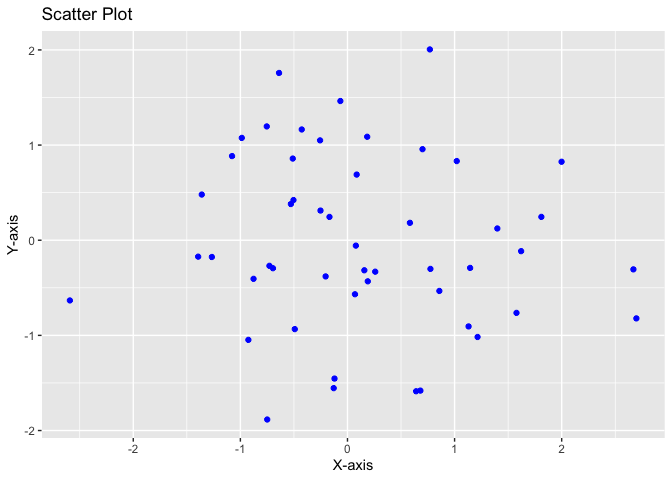
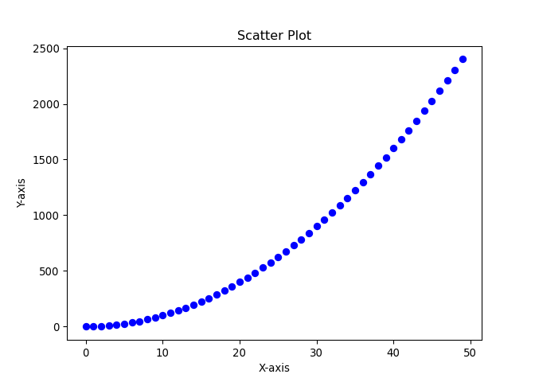
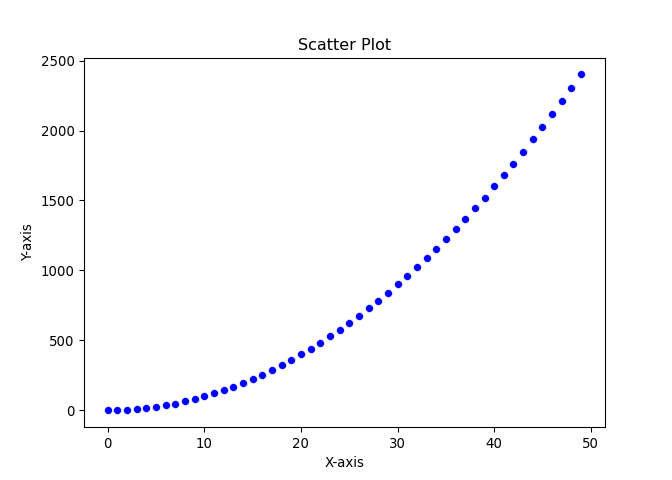

Overview of R and Python
================

## I. Introduction (5 minutes)

### A. Brief overview of R and Python:

R is a programming language and software environment for statistical
computing and graphics, commonly used by statisticians, data scientists,
and researchers. It provides a wide range of statistical and graphical
techniques and is highly extensible. Python, on the other hand, is a
versatile, high-level programming language that has a strong focus on
readability and simplicity. It is widely used for various applications,
including web development, automation, and scientific computing, making
it a popular choice for data analysis as well.

### B. Importance of being bilingual in R and Python:

Becoming proficient in both R and Python offers several advantages.
First, it broadens your skill set, making you more marketable and
versatile in the job market. Second, it allows you to choose the most
appropriate language for a given task, leveraging the strengths of each
language. For instance, you might use R for advanced statistical
modeling, while Python might be your go-to for machine learning or
integrating with web services. Finally, bilingualism helps you to
collaborate more effectively with colleagues who may prefer one language
over the other, enhancing teamwork and productivity.

### C. Course objectives:

The goal of this one-hour course is to introduce the essential
similarities and differences between R and Python, focusing on data
structures, data manipulation, and data visualization. By the end of the
course, participants should have a basic understanding of how to perform
common data analysis tasks in both languages, as well as an appreciation
for the unique strengths of each language. The course aims to provide a
foundation for further exploration and learning in both R and Python.

## II. Language Basics (10 minutes)

### A. R

#### 1. RStudio and R environment:

RStudio is an integrated development environment (IDE) for R that
provides a user-friendly interface and a comprehensive set of tools for
coding, debugging, and visualization. The R environment is an
interactive programming platform that allows you to write and execute R
code, manage packages, and explore data structures. RStudio is a popular
choice among R users, as it simplifies many tasks and improves overall
workflow.

R code:

``` r
# Example of R code
     x <- c(1, 2, 3, 4, 5)
     y <- x * 2
     print(y)
```

    [1]  2  4  6  8 10

#### 2. R syntax:

     R syntax is characterized by its use of assignment operators (e.g., `<-`), functions, and control structures (e.g., `if`, `for`, `while`). R is case-sensitive, and comments are denoted by the pound sign (`#`). One notable feature of R syntax is its preference for the use of vectors and vectorized operations, which can lead to concise and efficient code.

R code:

``` r
# Example of R syntax
     x <- seq(1, 10)
     y <- x^2
     if (mean(y) > 20) {
       print("Mean is greater than 20")
     }
```

    [1] "Mean is greater than 20"

### B. Python

#### 1. Python environment (e.g., Jupyter Notebook, IDEs):

Python can be run in various environments, such as Jupyter Notebook, a
browser-based interactive computing platform that allows you to write,
run, and share code, as well as create rich-text documents with embedded
code, equations, and visualizations. Other popular Python IDEs include
Visual Studio Code, PyCharm, and Spyder, which offer syntax
highlighting, code completion, and debugging features.

R code:

``` r
 # Example of R code
     x <- c(1, 2, 3, 4, 5)
     y <- x * 2
     print(y)
```

    [1]  2  4  6  8 10

R syntax is characterized by its use of assignment operators (e.g.,
`<-`), functions, and control structures (e.g., `if`, `for`, `while`). R
is case-sensitive, and comments are denoted by the pound sign (`#`). One
notable feature of R syntax is its preference for the use of vectors and
vectorized operations, which can lead to concise and efficient code.

R code:

``` r
# Example of R syntax
     x <- seq(1, 10)
     y <- x^2
     if (mean(y) > 20) {
       print("Mean is greater than 20")
     }
```

    [1] "Mean is greater than 20"

#### 2. Python syntax:

     Python syntax is designed to be readable and concise, using indentation to denote code blocks instead of curly braces or keywords. Python is case-sensitive, and comments are denoted by the hash sign (`#`). Like R, Python supports vectorized operations, especially when using libraries like NumPy or pandas.

Python code:

``` python
# Example of Python code
x = [1, 2, 3, 4, 5]
y = [i * 2 for i in x]
print(y)
```

    [2, 4, 6, 8, 10]

Python syntax is designed to be readable and concise, using indentation
to denote code blocks instead of curly braces or keywords. Python is
case-sensitive, and comments are denoted by the hash sign (`#`). Like R,
Python supports vectorized operations, especially when using libraries
like NumPy or pandas.

Python code:

``` python
 # Example of Python syntax
x = list(range(1, 11))
y = [i**2 for i in x]
if sum(y) / len(y) > 20:
  print("Mean is greater than 20")
```

    Mean is greater than 20

\##III. Data Structures (10 minutes) \### A. R \#### 1. Vectors: Vectors
are one-dimensional arrays that can store elements of the same data type
(e.g., numeric, character, logical). They are the most basic data
structure in R and are used extensively in R programming. Vectors can be
created using the c() function.

R code:

``` r
# Example of creating a numeric vector in R
num_vector <- c(1, 2, 3, 4, 5)
```

#### 2. Matrices:

     Matrices are two-dimensional arrays that can store elements of the same data type. They are useful for performing linear algebra operations and can be created using the `matrix()` function.

R code:

``` r
# Example of creating a matrix in R
mat <- matrix(1:9, nrow = 3, ncol = 3)
```

#### 3. Lists:

     Lists are ordered collections that can store elements of different data types, including other lists. They are similar to Python's lists but can contain heterogeneous data. Lists can be created using the `list()` function.

R code:

``` r
# Example of creating a list in R
my_list <- list("apple", 42, c(1, 2, 3), TRUE)
```

#### 4. Data frames:

     Data frames are tabular data structures that can store elements of different data types in columns. They are similar to Python's pandas DataFrame and can be created using the `data.frame()` function.

R code:

``` r
# Example of creating a data frame in R
df <- data.frame(name = c("Alice", "Bob", "Carol"),
        age = c(25, 30, 35), height = c(162, 175, 168))
```

### B. Python

#### 1. Lists:

Lists are ordered, mutable collections that can store elements of
different data types. They are similar to R’s lists and can be created
using square brackets \[\].

Python code:

``` python
# Example of creating a list in Python
my_list = ["apple", 42, [1, 2, 3], True]
```

#### 2. Tuples:

     Tuples are ordered, immutable collections that can store elements of different data types. They are similar to Python's lists but cannot be modified after creation. Tuples can be created using parentheses `()`.

Python code:

``` python
# Example of creating a tuple in Python
my_tuple = ("apple", 42, (1, 2, 3), True)
```

#### 3. Sets:

     Sets are unordered collections of unique elements. They can store elements of different data types but do not maintain their order. Sets can be created using the `set()` function or curly braces `{}`.

Python code:

``` python
# Example of creating a set in Python
my_set = {1, 2, 3, 4, 5}
```

#### 4. Dictionaries:

     Dictionaries are unordered collections of key-value pairs. They are similar to R's named lists and can store elements of different data types. Dictionaries can be created using curly braces `{}` with key-value pairs separated by colons 

Python code:

``` python
# Example of creating a dictionary in Python
my_dict = {"name": "Alice", "age": 25, "height": 162}
```

#### 5. pandas DataFrame:

pandas DataFrames are two-dimensional, mutable, and heterogeneous
tabular data structures with labeled axes (rows and columns). They are
similar to R’s data frames and are widely used for data manipulation and
analysis in Python. pandas DataFrames can be created by importing data
from various sources like CSV files, SQL databases, or even from Python
dictionaries or lists.

Python code:

``` python
# Example of creating a pandas DataFrame in Python
import pandas as pd

data = {'name': ['Alice', 'Bob', 'Carol'],
        'age': [25, 30, 35],
        'height': [162, 175, 168]}

df = pd.DataFrame(data)
```

## IV. Data Manipulation (15 minutes)

### A. R

#### 1. Base R functions:

Base R functions provide essential tools for data manipulation, such as
subsetting, reshaping, and sorting data. These functions allow you to
perform various data manipulation tasks, including filtering rows or
columns, merging and joining data frames, and aggregating data. Some
commonly used base R functions for data manipulation include subset(),
merge(), aggregate(), and order().

R code:

``` r
# Example of filtering rows using base R functions
df <- data.frame(name = c("Alice", "Bob", "Carol",        "David"),age = c(25, 30, 35, 28), height = c(162, 175,   168, 172))

# Filter rows where age is greater than 27
filtered_df <- df[df$age > 27, ]
```

#### 2. dplyr and the tidyverse:

     dplyr is a popular R package for data manipulation that is part of the tidyverse, a collection of R packages designed for data science. dplyr provides a set of intuitive and easy-to-read functions for data manipulation, such as `filter()`, `select()`, `mutate()`, `summarise()`, and `group_by()`. dplyr functions can be chained together using the pipe operator (`%>%`) to create a more readable and efficient workflow.

R code:

``` r
# Example of filtering rows using dplyr
library(dplyr)
```


    Attaching package: 'dplyr'

    The following objects are masked from 'package:stats':

        filter, lag

    The following objects are masked from 'package:base':

        intersect, setdiff, setequal, union

``` r
df <- data.frame(name = c("Alice", "Bob", "Carol",        "David"),age = c(25, 30, 35, 28),height = c(162, 175,   168, 172))

# Filter rows where age is greater than 27
filtered_df <- df %>% filter(age > 27)
head(filtered_df)
```

       name age height
    1   Bob  30    175
    2 Carol  35    168
    3 David  28    172

### B. Python

#### 1. Built-in functions:

Python has built-in functions that allow for basic data manipulation,
such as filtering, sorting, and aggregating data. However, these
functions are less flexible and less efficient when compared to
specialized libraries like pandas. Some commonly used built-in functions
for data manipulation include filter(), map(), and sorted().

Python code:

     ```python
     # Example of filtering a list using a built-in function
     data = [{"name": "Alice", "age": 25, "height": 162},
             {"name": "Bob", "age": 30, "height": 175},
             {"name": "Carol", "age": 35, "height": 168},
             {"name": "David", "age": 28, "height": 172}]

     # Filter items where age is greater than 27
     filtered_data = list(filter(lambda x: x["age"] > 27, data))
     ```

#### 2. pandas library:

     The pandas library is a powerful and flexible data manipulation tool in Python. It provides various functions for cleaning, transforming, and analyzing data in a DataFrame format, making it easy to work with structured data. Some common pandas functions for data manipulation include `loc[]`, `iloc[]`, `query()`, `merge()`, `groupby()`, and `agg()`.

Python code:

``` python
# Example of filtering rows using pandas
import pandas as pd

data = {'name': ['Alice', 'Bob', 'Carol', 'David'],
             'age': [25, 30, 35, 28],
             'height': [162, 175, 168, 172]}

df = pd.DataFrame(data)

# Filter rows where age is greater than 27
filtered_df = df[df['age'] > 27]
```

     ```python
     # Example of filtering rows using pandas
     import pandas as pd

     data = {'name': ['Alice', 'Bob', 'Carol', 'David'],
             'age': [25, 30, 35, 28],
             'height': [162, 175, 168, 172]}

     df = pd.DataFrame(data)

     # Filter rows where age is greater than 27
     filtered_df = df[df['age'] > 27]
     ```

## V. Data Visualization (10 minutes)

### A. R

#### 1. Base R plotting:

Base R provides built-in plotting functions that enable users to create
simple visualizations directly from data structures like vectors and
data frames. These functions include plot(), hist(), boxplot(), and
barplot(). While base R plotting can create a wide range of
visualizations, the syntax and customization options may be less
intuitive compared to more specialized libraries like ggplot2.

R code:

``` r
# Example of a scatter plot using base R plotting
df <- data.frame(x = rnorm(50), y = rnorm(50))

plot(df$x, df$y, main = "Scatter Plot", xlab = "X-axis", ylab = "Y-axis", col = "blue")
```



#### 2. ggplot2:

     ggplot2 is a popular R package for data visualization and is part of the tidyverse. It implements the "Grammar of Graphics" concept, which allows users to create complex and customizable visualizations using a consistent and intuitive syntax. With ggplot2, users can create a wide range of visualizations, including scatter plots, bar charts, histograms, and more, using functions like `ggplot()`, `geom_point()`, `geom_bar()`, and `geom_histogram()`.

R code:

``` r
# Example of a scatter plot using ggplot2
library(ggplot2)

df <- data.frame(x = rnorm(50), y = rnorm(50))

ggplot(df, aes(x = x, y = y)) +
    geom_point(color = "blue") +
    ggtitle("Scatter Plot") +
    xlab("X-axis") +
    ylab("Y-axis")
```


B. Python \#### 1. matplotlib: matplotlib is a widely-used data
visualization library in Python that provides a comprehensive set of
tools for creating static, animated, and interactive visualizations. It
is inspired by MATLAB’s plotting system and offers a simple and flexible
interface for creating a wide range of visualizations, such as line
plots, scatter plots, bar plots, and histograms. Some commonly used
matplotlib functions include plot(), scatter(), bar(), and hist().

Python code:

``` python
# Example of a scatter plot using matplotlib
import matplotlib.pyplot as plt

x = [i for i in range(50)]
y = [i**2 for i in x]

plt.scatter(x, y, color='blue')
plt.title('Scatter Plot')
plt.xlabel('X-axis')
plt.ylabel('Y-axis')
plt.show()
```



#### 2. seaborn:

     seaborn is a Python data visualization library based on matplotlib that provides a high-level interface for creating informative and attractive statistical graphics. It comes with several built-in themes and color palettes to make it easy to create aesthetically pleasing and consistent visualizations. seaborn offers functions for a wide range of visualizations, such as scatter plots, line plots, bar plots, and box plots, using functions like `scatterplot()`, `lineplot()`, `barplot()`, and `boxplot()`.

Python code:

``` python
# Example of a scatter plot using seaborn
import seaborn as sns

df = pd.DataFrame({'x': [i for i in range(50)], 'y': [i**2 for i in range(50)]})

sns.scatterplot(data=df, x='x', y='y', color='blue')
plt.title('Scatter Plot')
plt.xlabel('X-axis')
plt.ylabel('Y-axis')
plt.show()
```



## VI. Conclusions and Recommendations (5 minutes)

### A. Similarities between R and Python

#### 1. Both are high-level programming languages:

R and Python are both high-level programming languages, meaning they
provide a layer of abstraction that simplifies the programming process.
This allows users to focus on solving problems or implementing
algorithms without worrying about low-level details such as memory
management or hardware interaction. Both languages are also interpreted,
so code is executed directly without the need for compilation.

#### 2. Both support vectorized operations:

R and Python both offer support for vectorized operations, which enable
users to perform element-wise operations on arrays or other data
structures without the need for explicit loops. This feature leads to
more concise and readable code and can also improve performance. For
example, in R, you can add two vectors element-wise using the `+`
operator, while in Python, you can use the NumPy library to perform
similar operations.

#### 3. Both have strong data manipulation and visualization capabilities:

R and Python are both widely used in data science due to their strong
data manipulation and visualization capabilities. R is known for its
packages such as dplyr and ggplot2, while Python has powerful libraries
like pandas, matplotlib, and seaborn. These tools allow users to
efficiently clean, analyze, and visualize data, making it easier to
extract insights and make data-driven decisions. For example, in R, you
can use dplyr to filter a data frame and ggplot2 to create a scatter
plot, while in Python, you can use pandas to filter a DataFrame and
seaborn to create a scatter plot. capabilities

6.  Similarities and Differences (10 minutes)

B. Differences between R and Python \#### 1. Syntax and language
structure: R and Python have different syntax and language structures,
which can be a challenge for those learning both languages. R uses \<-
for assignment, while Python uses =. R’s syntax is also more functional,
whereas Python is more object-oriented. Familiarizing oneself with the
syntax and structure of each language is essential for working
efficiently in both.

#### 2. R is more focused on statistical analysis, while Python is a general-purpose language:

R was specifically designed for statistical analysis and data
manipulation, while Python is a general-purpose programming language
that can be used for various applications, including data science, web
development, and software development. As a result, R has more built-in
statistical functions and a more comprehensive set of packages for data
analysis, while Python offers a broader range of functionality and
libraries for other purposes.

#### 3. R has a more comprehensive set of statistical packages, while Python has more diverse libraries:

Although both R and Python offer a rich ecosystem of libraries and
packages, R has a more comprehensive set of statistical packages, which
makes it the preferred choice for many statisticians and data analysts.
On the other hand, Python has a more diverse set of libraries, making it
suitable for a wide range of applications, including machine learning,
computer vision, and natural language processing.

C. Recommendations for learning both languages

#### 1. Focus on learning the core concepts and structures in both languages:

To become proficient in both R and Python, focus on understanding the
core concepts and structures of each language. This includes learning
the basic syntax, data structures, and built-in functions. By mastering
these fundamentals, you’ll be better equipped to apply your knowledge to
various data science tasks.

#### 2. Practice using both languages in different contexts:

One of the best ways to become proficient in both R and Python is to
practice using them in different contexts. This might include working on
data manipulation, data visualization, statistical analysis, or machine
learning tasks. By applying both languages to a variety of problems,
you’ll gain a deeper understanding of their strengths and weaknesses,
which will help you decide when to use each language.

#### 3. Engage with online resources and communities for both R and Python:

There are numerous online resources and communities available for
learning both R and Python. Engage with these resources, such as
tutorials, blogs, forums, and online courses, to further your
understanding of both languages. Additionally, participating in the R
and Python communities can provide valuable insights, as well as
opportunities for networking and collaboration.

## VII. Q&A and Resources (5 minutes)

### A. Address any questions from participants

### B. Share resources for further learning and exploration

Python Resources:

1.  Earth Data Science (https://www.earthdatascience.org) - Offers a
    wide range of tutorials and resources on Python for Earth data
    science, covering topics such as data manipulation, visualization,
    and geospatial analysis.
2.  Real Python (https://realpython.com) - Provides a comprehensive
    collection of tutorials, articles, and guides on various aspects of
    Python programming, suitable for beginners and experienced
    developers alike.
3.  Python.org (https://docs.python.org/3/tutorial/index.html) - The
    official Python documentation, featuring an extensive tutorial
    covering the basics of the language.
4.  DataCamp
    (https://www.datacamp.com/courses/intro-to-python-for-data-science) -
    Offers an introductory course on Python for data science, covering
    topics like data manipulation and visualization using libraries like
    NumPy, pandas, and matplotlib.
5.  Kaggle (https://www.kaggle.com/learn/python) - Provides a free
    Python course that covers fundamental programming concepts, with a
    focus on data science applications.

R Resources:

1.  R for Data Science (https://r4ds.had.co.nz) - A free online book by
    Hadley Wickham and Garrett Grolemund, covering the essentials of
    data science using R, including data manipulation, visualization,
    and modeling with the tidyverse.
2.  DataCamp (https://www.datacamp.com/courses/free-introduction-to-r) -
    Offers a free introductory course on R, covering the basics of the
    language, data structures, and data manipulation.
3.  R-bloggers (https://www.r-bloggers.com) - A blog aggregator that
    features articles and tutorials on R from various authors, covering
    a wide range of topics and applications.
4.  The R Project for Statistical Computing
    (https://www.r-project.org) - The official website of the R
    programming language, featuring documentation, resources, and a list
    of recommended books.
5.  RStudio Community (https://community.rstudio.com) - An online forum
    where users can ask questions, share knowledge, and engage with the
    R community.

By exploring these resources, you’ll gain a deeper understanding of R
and Python and enhance your skills in data science and programming.
