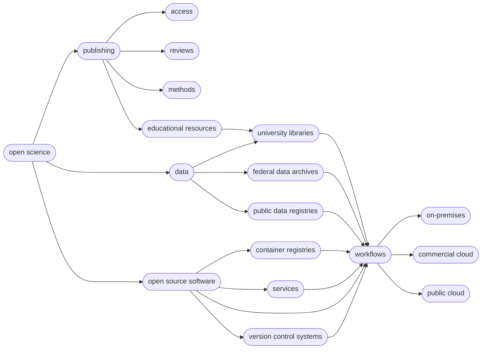

# Tools for Reproducible and Open Science

This page is organized into three distinct segments:

- [Introduction to Open Science](#introduction-to-open-science) (~50 minutes)
- [Documentation & Communication](#documentation-and-communication) (~25 minutes)
- [Repeatability and Reproducibility](#repeatability-and-reproducibility) (~ 45 minutes)

---

## Introduction to Open Science

!!! Success "Objectives"

        After this section, you should be able to:
        
        * Explain what Open Science is
        * Explain the components of Open Science
        * Describe the behaviors of Open Science
        * Explain why Open Science matters in education, research, and society
        * Understand the advantages and the challenges to Open Science
        * Identify who the practitioners of Open Science are
        * Understand the underlying Ethos of Open Science

### *What* is Open Science?

If you ask a dozen researchers this question, you will probably get just as many answers.

This means that Open Science isn't necessarily a set of checkboxes you need to tick, but rather a holistic approach to doing science. In that spirit, it can also be useful to think about Open Science as a spectrum, from less to more open. 

??? Quote "Definitions"

    "Open Science is defined as an inclusive construct that combines various movements and practices aiming to make multilingual scientific knowledge openly  available,  accessible  and  reusable  for  everyone,  to  increase  scientific  collaborations  and  sharing of information for the benefits of science and society, and to open the processes of scientific knowledge creation, evaluation and communication to societal actors beyond the traditional scientific community." - [UNESCO Definition](https://www.unesco.org/en/natural-sciences/open-science){target=_blank}

    - [UNESCO's Recommendation on Open Science](https://unesdoc.unesco.org/ark:/48223/pf0000379949.locale=en){target=_blank}
    
    "Open Science is the movement to make scientific research (including publications, data, physical samples, and software) and its dissemination accessible to all levels of society, amateur or professional..." [ :material-wikipedia: Wikipedia definition](https://en.wikipedia.org/wiki/Open_science){target=_blank}

    Open and Collaborative Science Network's [Open Science Manifesto](https://ocsdnet.org/manifesto/open-science-manifesto/){target=_blank}

    ??? Example "Six Pillars :material-pillar: of Open Science"

        **:material-pillar: Open Access Publications**

        **:material-pillar: Open Data**

        **:material-pillar: Open Educational Resources**

        **:material-pillar: Open Methodology**
      
        **:material-pillar: Open Peer Review**

        **:material-pillar: Open Source Software**

        ??? Question "Wait, how many pillars :material-pillar: of Open Science Really Are There?"

            The number can be from [4 :material-pillar:](https://narratives.insidehighered.com/four-pillars-of-open-science/){target=_blank} to [8 :material-pillar:](https://www.ucl.ac.uk/library/research-support/open-science/8-pillars-open-science){target=_blank}

        ??? Tip "Foster Open Science Diagram"
        
            {target=_blank} 

             Graphic by [Foster Open Science](https://www.fosteropenscience.eu/){target=_blank}

Mermaid Diagram: Conceptual relationships of Open Science and cyberinfrastructure

!!! Tip ":dark_sunglasses: Awesome Lists of Open Science"

    Awesome lists were started on GitHub by [Sindre Sorhus](https://sindresorhus.com/){target=_blank} and typically have a badge associated with them ](https://github.com/sindresorhus/awesome){target=_blank} 
    
    (There is even a [Searchable Index](https://awesomelists.top/#/){target=_blank} of Awesome Lists)

    We have created our own [Awesome Open Science List here](https://tyson-swetnam.github.io/awesome-open-science/){target=_blank} which may be valuable to you.

To help move the scientific community toward open science, NASA has declared [2023 is the year of Open Science!](https://nasa.github.io/Transform-to-Open-Science/year-of-open-science/){target=_blank} 

#### :material-pillar: Open Access Publications

[{width=300}](https://en.wikipedia.org/wiki/Open_access){target=_blank}

??? Quote "Definitions"

    "Open access is a publishing model for scholarly communication that makes research information available to readers at no cost, as opposed to the traditional subscription model in which readers have access to scholarly information by paying a subscription (usually via libraries)." -- [OpenAccess.nl](https://www.openaccess.nl/en/what-is-open-access){target=_blank}

??? Tip "New Open Access Mandates in US"

    The White House Office of Science and Technology (OSTP) has recently released a [policy](https://www.whitehouse.gov/ostp/news-updates/2022/08/25/ostp-issues-guidance-to-make-federally-funded-research-freely-available-without-delay/){target=_blank} stating that tax-payer funded research must by open access by 2026.

??? Example "Open Access Publishing"

    Major publishers have provided access points for publishing your work 

    [AAAS](https://www.science.org/content/page/open-access-aaas){target=_blank}

    [Nature](https://www.nature.com/nature-portfolio/open-access){target=_blank}

    [American Geophysical Union](https://www.agu.org/Publish-with-AGU/Publish/Open-Access){target=_blank}

    [Commonwealth Scientific and Industrial Research Organisation (CSIRO)](https://acsopenscience.org/australia-csiro/){target=_blank}

    [Open Research Europe](https://open-research-europe.ec.europa.eu/){target=_blank}
    
    [PLOS](https://plos.org/){target=_blank}
    
    [MDPI](https://www.mdpi.com/){target=_blank}
    
    [Ecosphere](https://esajournals.onlinelibrary.wiley.com/journal/21508925){target=_blank}

??? Example "Financial Support for Open Access Publishing Fees"

    There are mechanisms for helping to pay for the additional costs of publishing research as open access:

    [SciDevNet](https://www.scidev.net/global/){target=_blank}

    [Health InterNetwork Access to Research Initiative (HINARI)](http://www.emro.who.int/information-resources/hinari/){target=_blank}

    Some institutions offer support for managing publishing costs (check to see if your institution has such support):
    
    [University of Arizona Open Access Investment Fund](https://new.library.arizona.edu/about/awards/oa-fund){target=_blank}
    
    [Colorado University at Boulder Open Access Fund](https://www.colorado.edu/libraries/research/open-access/open-access-fund){target=_blank}

    [Max Planck Digital Library](https://group.springernature.com/gb/group/media/press-releases/landmark-agreement-between-springer-nature-and-mpdl/18498782){target=_blank} - German authors can have OA fees in Springer Nature research journals paid for.

    [Bibsam Consortium](https://www.springernature.com/gp/open-research/institutional-agreements/oaforsweden){target=_blank} - Swedish authors can have OA fees in Springer Nature research journals paid for.

??? Example "Pre-print Services"

    [ASAPbio Pre-Print Server List](https://asapbio.org/preprint-servers){target=_blank} - ASAPbio is a scientist-driven non-profit promoting transparency and innovation comprehensive list of pre-print servers inthe field of life science communication.

    [ESSOar](https://www.essoar.org/){target=_blank} - Earth and Space Science Open Archive hosted by the American Geophysical Union.

    [Peer Community In (PCI)](https://peercommunityin.org/) a free recommendation process of scientific preprints based on peer reviews

    [OSF.io Preprints](https://osf.io/preprints/){target=_blank} are partnered with numerous projects under the "-rXivs"

    ??? Tip "The rXivs"

        [AfricArXiv](https://osf.io/preprints/africarxiv/){target=_blank}

        [AgrirXiv](https://cabidigitallibrary.org/journal/agrirxiv){target=_blank}

        [Arabixiv](https://arabixiv.org/discover){target=_blank}

        [arXiv](https://arxiv.org/){target=_blank} - is a free distribution service and an open-access archive for 2,086,431 scholarly articles in the fields of physics, mathematics, computer science, quantitative biology, quantitative finance, statistics, electrical engineering and systems science, and economics.

        [BioHackrXiv](https://biohackrxiv.org/){target=_blank}

        [BioRxiv](https://www.biorxiv.org/){target=_blank} -  is an open access preprint repository for the biological sciences.

        [BodorXiv](https://bodoarxiv.wordpress.com/){target=_blank}

        [EarthArXiv](https://eartharxiv.org/){target=_blank} - is an open access preprint repository for the Earth sciences.

        [EcsArXiv](https://ecsarxiv.org/){target=_blank} - a free preprint service for electrochemistry and solid state science and technology

        [EdArXiv](https://edarxiv.org/){target=_blank} - for the education research community

        [EngrXiv](https://engrxiv.org/){target=_blank} for the engineering community

        [EvoEcoRxiv](https://www.ecoevorxiv.com/){target=_blank} - is an open acccess preprint repository for Evolutionary and Ecological sciences.

        [MediArXiv](https://mediarxiv.com/){target=_blank} for Media, Film, & Communication Studies

        [MedRxiv](https://www.medrxiv.org/){target=_blank} - is an open access preprint repository for Medical sciences.

        [PaleorXiv](https://paleorxiv.org/){target=_blank} - is an open access preprint repository for Paleo Sciences

        [PsyrXiv](https://psyarxiv.com/){target=_blank} - is an open access preprint repository for Psychological sciences.

        [SocArXiv](https://socopen.org/){target=_blank} - is an open access preprint repository for Social sciences.

        [SportrXiv](https://sportrxiv.org/){target=_blank} - is an open access preprint for Sports sciences.

        [ThesisCommons](https://thesiscommons.org/) - open Theses
        
#### :material-pillar: Open Data

Open Data are a critical aspect of open science. There are three key attributes of Open Data:

- Availability and accessibility
- Reusability
- Inclusivity

??? Quote "Definitions"

    “Open data and content can be freely used, modified, and shared by anyone for any purpose” - [The Open Definition](https://opendefinition.org/){target=_blank}

    "Open data is data that can be freely used, re-used and redistributed by anyone - subject only, at most, to the requirement to attribute and sharealike." - [Open Data Handbook](https://opendatahandbook.org/guide/en/what-is-open-data/){target=_blank}

    [:material-wikipedia: Wikipedia definition](https://en.wikipedia.org/wiki/Open_data){target=_blank}

??? Tip "DIKW Pyramid"
    
    Data are the basis of our understanding the natural world. The Data-Information-Knowledge-Wisdom (DIKW) pyramid describes for us how data are refined into information and knowledge.

    {target=_blank}

??? Tip "FAIR & CARE Principles"

    **FAIR Principles**

    In 2016, the [FAIR Guiding Principles](https://www.nature.com/articles/sdata201618) for scientific data management and stewardship were
    published in Scientific Data. Read it.

    *Findable*

    -   F1. (meta)data are assigned a globally unique and persistent identifier
    -   F2. data are described with rich metadata (defined by R1 below)
    -   F3. metadata clearly and explicitly include the identifier of the data it describes
    -   F4. (meta)data are registered or indexed in a searchable resource

    *Accessible*

    -   A1. (meta)data are retrievable by their identifier using a
        standardized communications protocol
    -   A1.1 the protocol is open, free, and universally implementable
    -   A1.2 the protocol allows for an authentication and authorization
        procedure, where necessary
    -   A2. metadata are accessible, even when the data are no longer
        available

    *Interoperable*

    -   I1. (meta)data use a formal, accessible, shared, and broadly
        applicable language for knowledge representation.
    -   I2. (meta)data use vocabularies that follow FAIR principles
    -   I3. (meta)data include qualified references to other (meta)data

    *Reusable*

    -   R1. meta(data) are richly described with a plurality of accurate
        and relevant attributes
    -   R1.1. (meta)data are released with a clear and accessible data
        usage license
    -   R1.2. (meta)data are associated with detailed provenance
    -   R1.3. (meta)data meet domain-relevant community standard

    !!! Tip "Open vs. Public vs. FAIR"

            FAIR does not demand that data be open: See one definition of open:
            http://opendefinition.org/

    !!! Question "Why Principles?"

            FAIR is a collection of principles. Ultimately, different
            communities within different scientific disciplines must work to
            interpret and implement these principles. Because technologies
            change quickly, focusing on the desired end result allows FAIR to be
            applied to a variety of situations now and in the foreseeable
            future.

    **CARE Principles**

    The [CARE Principles](https://www.gida-global.org/care) for Indigenous Data Governance were drafted at the International Data Week and Research Data Alliance Plenary co-hosted event "Indigenous Data Sovereignty Principles for the Governance of Indigenous Data Workshop," 8 November 2018, Gaborone, Botswana.

    *Collective Benefit*

    -   C1. For inclusive development and innovation
    -   C2. For improved governance and citizen engagement
    -   C3. For equitable outcomes

    **Authority to Control*

    -   A1. Recognizing rights and interests
    -   A2. Data for governance
    -   A3. Governance of data

    *Responsibility*

    -   R1. For positive relationships
    -   R2. For expanding capability and capacity
    -   R3. For Indigenous languages and worldviews

    *Ethics*

    -   E1. For minimizing harm and maximizing benefit
    -   E2. For justice
    -   E3. For future use

    **FAIR - TLC**

    *Traceable, Licensed, and Connected*

    -   The need for metrics: https://zenodo.org/record/203295#.XkrzTxNKjzI

    **How to get to FAIR?**

    This is a question that only you can answer, that is because it depends
    on (among other things)

    1.  Your scientific discipline: Your datatypes and existing standards
        for what constitutes acceptable data management will vary.
    2.  The extent to which your scientific community has implemented
        FAIR: Some disciplines have significant guidelines on FAIR, while
        others have not addressed the subject in any concerted way.
    3.  Your level of technical skills: Some approaches to implementing
        FAIR may require technical skills you may not yet feel comfortable
        with.

    While a lot is up to you, the first step is to evaluate how FAIR you
    think your data are:

    ??? Question "Exercise"
        Thinking about a dataset you work with, complete the ARDC [FAIR assessment](https://ardc.edu.au/resource/fair-data-self-assessment-tool/).

    ??? Note "Resources"

        - [The FAIR Guiding Principles for scientific data management and stewardship](<https://www.nature.com/articles/sdata201618>)
        - [Wilkinson et al. (2016)](https://doi.org/10.1038/sdata.2016.18){target=_blank} established the guidelines to improve the Findability, Accessibility, Interoperability, and Reuse (FAIR) of digital assets for research. 
        - [Go-FAIR website](https://www.go-fair.org/fair-principles/){target=_blank}
        - [Carroll et al. (2020)](http://doi.org/10.5334/dsj-2020-043){target=_blank} established the CARE Principles for Indigenous Data Governance. [full document :fontawesome-solid-file-pdf:](https://static1.squarespace.com/static/5d3799de845604000199cd24/t/5da9f4479ecab221ce848fb2/1571419335217/CARE+Principles_One+Pagers+FINAL_Oct_17_2019.pdf){target=_blank}
        - [Indigenous Data Sovereignty Networks](https://indigenousdatalab.org/networks/){target=_blank}

??? Tip "LOD Cloud"
    
    [The Linked Open Data Cloud](https://lod-cloud.net/){target=_blank} shows how data are [linked to one another](https://www.w3.org/standards/semanticweb/data){target=_blank} forming the basis of the [semantic web :material-wikipedia:](https://en.wikipedia.org/wiki/Semantic_Web){target=_blank}.

    {target=_blank}

#### :material-pillar: Open Educational Resources

[{width=240}](https://www.unesco.org/en/communication-information/open-solutions/open-educational-resources)

??? Quote "Definitions"

    "Open Educational Resources (OER) are learning, teaching and research materials in any format and medium that reside in the public domain or are under copyright that have been released under an open license, that permit no-cost access, re-use, re-purpose, adaptation and redistribution by others." - [UNESCO](https://www.unesco.org/en/communication-information/open-solutions/open-educational-resources){target=_blank}

    [:material-wikipedia: Wikipedia definition](https://en.wikipedia.org/wiki/Open_educational_resources){target=_blank}

??? Example "Digital Literacy Organizations"

    [The Carpentries](https://carpentries.org/){target=_blank} - teaches foundational coding and data science skills to researchers worldwide  

    [EdX](https://www.edx.org/){target=_blank} - Massively Online Online Courses (not all open) hosted through University of California Berkeley

    [EveryoneOn](https://www.everyoneon.org/ ){target=_blank} - mission is to unlock opportunity by connecting families in underserved communities to affordable internet service and computers, and delivering digital skills trainings 

    [ConnectHomeUSA](https://connecthomeusa.org/){target=_blank} - is a movement to bridge the digital divide for HUD-assisted housing residents in the United States under the leadership of national nonprofit EveryoneOn

    [Global Digital Literacy Council](https://www.gdlcouncil.org/){target=_blank} -  has dedicated more than 15 years of hard work to the creation and maintenance of worldwide standards in digital literacy

    [IndigiData](https://indigidata.nativebio.org/){target=_blank} - training and engaging tribal undergraduate and graduate students in informatics

    [National Digital Equity Center](https://digitalequitycenter.org/about-us/){target=_blank} a 501c3 non-profit, is a nationally recognized organization with a mission to close the digital divide across the United States

    [National Digital Inclusion Allaince](https://www.digitalinclusion.org/){target=_blank} - advances digital equity by supporting community programs and equipping policymakers to act

    [Net Literacy](https://www.netliteracy.org/){target=_blank}

    [Open Educational Resources Commons](https://www.oercommons.org/){target=_blank}

    [Project Pythia](https://projectpythia.org/){target=_blank} is the education working group for Pangeo and is an educational resource for the entire geoscience community

    [Research Bazaar](https://resbaz.github.io/resbaz2021/){target=_blank} - is a worldwide festival promoting the digital literacy emerging at the centre of modern research

    [TechBoomers](https://techboomers.com/){target=_blank} - is an education and discovery website that provides free tutorials of popular websites and Internet-based services in a manner that is accessible to older adults and other digital technology newcomers

??? Example "Educational Materials"

    [Teach Together](https://teachtogether.tech/en/index.html#){target=_blank} by Greg Wilson

    [DigitalLearn](https://www.digitallearn.org/){target=_blank}

#### :material-pillar: Open Methodology

{target=_blank}

The use of version control systems like [GitHub](https://github.com/search?q=open+science){target=_blank} and [GitLab](https://gitlab.com/explore/projects/topics/Open%20Science){target=_blank} present one of the foremost platforms for sharing open methods for digital research.

??? Quote "Definitions"

    "An open methodology is simply one which has been described in sufficient detail to allow other researchers to repeat the work and apply it elsewhere." - [Watson (2015)](https://doi.org/10.1186/s13059-015-0669-2){target=_blank}

    "Open Methodology refers to opening up methods that are used by researchers to achieve scientific results and making them publicly available." - [Open Science Network Austria](https://www.oana.at/en/about-open-science){target=_blank}

??? Example "Protocols and Bench Techniques"

    [BioProtocol](https://bio-protocol.org/Default.aspx){target=_blank}

    [Current Protocols](https://currentprotocols.onlinelibrary.wiley.com/){target=_blank}

    [Gold Biotechnology Protocol list](https://www.goldbio.com/search?q=&type=documentation&documentation_type=protocol){target=_blank}

    [JoVE](https://www.jove.com/){target=_blank} - Journal of Visualized Experiments

    [Nature Protocols](https://www.nature.com/nprot/){target=_blank}

    [OpenWetWare](https://openwetware.org/wiki/Main_Page){target=_blank}

    [Protocol Exchange](https://protocolexchange.researchsquare.com/){target=_blank}

    [Protocols Online](http://www.protocol-online.org/prot/){target=_blank}

    [:material-microscope: Protocols](https://www.protocols.io/){target=_blank}

    [SciGene](http://scigine.com/blog/){target=_blank}

    [Springer Nature Experiments](https://experiments.springernature.com/){target=_blank}
      
??? Tip "Concept of Preregistration"

    In response to the Reproducibility Crisis, many researchers, particularly in fields like psychology, have begun to advocate for **preregistration** of studies. 

    This involves writing out and publishing your entire research plan, from data collection to analysis and publication, for the sake of avoiding practices like [p-hacking](https://en.wikipedia.org/wiki/Data_dredging){target=_blank} or [HARKing](https://en.wikipedia.org/wiki/HARKing){target=_blank}. 

    What preregistration also does is make the process of your work more open, including many of the small decisions and tweaks you make to a project that probably wouldn't make it into a manuscript. 

    To learn more about preregistration, you can check out the [Open Science Foundation](https://osf.io/){target=_blank}, a project that provides a preregistration platform and other Open Science tools. You can also read this [publication](https://www.pnas.org/doi/10.1073/pnas.1708274114){target=_blank}

#### :material-pillar: Open Peer Review

{target=_blank}

[Pros and Cons of Open Peer Review](https://doi.org/10.1038/6295){target=_blank}

??? Quote "Definitions"

    Ross-Hellauer et al. (2017) ask [What is Open Peer Review?](https://doi.org/10.12688%2Ff1000research.11369.2){target=_blank} and state that there is no single agreed upon definition

    [:material-wikipedia: Wikipedia's definition](https://en.wikipedia.org/wiki/Open_peer_review){target=_blank}

    A manuscript review process that includes some combination of Open Identities, Open Reports, Open Participation, and even Open Interaction

??? Tips "Open Peer Review Resources"

    [F1000Research](https://f1000research.com/){target=_blank} the first open research publishing platform. Offering open peer review rapid publication

    [PREreview](https://prereview.org/){target=_blank} provides a space for open peer reviews, targeted toward early career researchers.

    [ASAPbio](https://asapbio.org/){target=_blank} Accelerating Science and Publication in Biology, an open peer review source for biologists and life scientists.

    [PubPeer](https://pubpeer.com/){target=_blank} platform for post-publication of peer reviews.

    [Sciety](https://sciety.org/){target=_blank} platform for evaluating preprints.

#### :material-pillar: Open Source Software

[{width=240}](https://opensource.org/){target=_blank}

??? Quote "Definitions"

    "Open source software is code that is designed to be publicly accessible—anyone can see, modify, and distribute the code as they see fit. Open source software is developed in a decentralized and collaborative way, relying on peer review and community production." - [:material-redhat: Red Hat](https://www.redhat.com/en/topics/open-source/what-is-open-source){target=_blank}

    [:material-open-source-initiative: Open Source Initiative definition](https://opensource.org/osd){target=_blank}

    [:material-wikipedia: Wikipedia definition](https://en.wikipedia.org/wiki/Open-source_software){target=_blank}

[Awesome list](https://tyson-swetnam.github.io/awesome-open-science/software/){target=_blank}

??? Tip "Liceses"

    ??? Quote "Definitions"
        Licensing is a crucial aspect of Open Science, as it helps define the terms under which research outputs, such as data, software, publications, and other digital resources, can be accessed, used, shared, and reused by others. Licensing enables the dissemination of knowledge, fosters collaboration, and ensures that research outputs are properly attributed and protected.

    In the context of Open Science, the most commonly used licese models are the [:material-creative-commons: Creative Commons Licences](https://creativecommons.org/licenses/) and the [:material-open-source-initiative: Open Source Initiative Licenses](https://opensource.org/licenses/). In summary:

    - **Creative Commons** licenses allow content creators to retain certain rights while granting others the freedom to use and distribute their work under specific conditions, including work outside of science.
    - **Open Science Initiative** licenses specifically focus on licensing scientific research outputs, including data, software, publications, and related materials. It is tailored to meet the unique requirements and challenges of the scientific community, taking into account FAIR and CARE priciples.

### *WHY* do Open Science?

There are many reasons to do Open Science, and presumably one or more of them brought you to this workshop. 

Whether you feel an ethical obligation, want to improve the quality of your work, or want to look better to funding agencies, many of the same approaches to Open Science apply.

A paper from [Bartling & Friesike (2014)](https://doi.org/10.1007/978-3-319-00026-8){target=_blank} posits that there are 5 main schools of thought in Open Science, which represent 5 underlying motivations:

1.  **Democratic school**: primarily concerned with making scholarly work freely available to everyone

2.  **Pragmatic school**: primarily concerned with improving the quality of scholarly work by fostering collaboration and improving critiques

3.  **Infrastructure school**: primarily focused on the platforms, tools, and services necessary to conduct efficient research, collaboration, and communication

4.  **Public school**: primarily concerned with societal impact of scholarly work, focusing on engagement with broader public via citizen science, understandable scientific communication, and less formal communication

5.  **Measurement school**: primarily concerned with the existing focus on journal publications as a means of measuring scholarly output, and focused on developing alternative measurements of scientific impact

<figure markdown>
  <a href="https://library.oapen.org/bitstream/handle/20.500.12657/28008/1001989.pdf" target="blank" rel="fecher_friesike">{ width="700" } </a>
    <figcaption> In [Bartling & Friesike (2014)](https://doi.org/10.1007/978-3-319-00026-8){target=_blank} Open Science: One Term, Five Schools of Thought </figcaption>
</figure>

While many researchers may be motivated by one or more of these aspects, we will not necessarily focus on any of them in particular. If anything, FOSS may be slightly more in the Infrastructure school, because we aim to give you the tools to do Open Science based on your own underlying motivations.

### Ethos of Open Science

Doing Open Science requires us to understand the ethics of why working with data which do not belong to us is privileged.

We must also anticipate how these could be re-used [in ways contrary to the interests of humanity](https://www.theverge.com/2022/3/17/22983197/ai-new-possible-chemical-weapons-generative-models-vx){target=_blank}. 

Ensure the use of [Institutional Review Boards (IRB)](https://www.fda.gov/about-fda/center-drug-evaluation-and-research-cder/institutional-review-boards-irbs-and-protection-human-subjects-clinical-trials){target=_blank} or your local ethical committee. 
 
Areas to consider: 

{target=_blank} 

Source: [UK Statistics Authority](https://uksa.statisticsauthority.gov.uk/the-authority-board/committees/national-statisticians-advisory-committees-and-panels/national-statisticians-data-ethics-advisory-committee/ethics-self-assessment-tool/){target=_blank} 

* Geolocation (survey, land ownership, parcel data), see [UK Statistics Authority Ethical Considerations](https://uksa.statisticsauthority.gov.uk/publication/ethical-considerations-in-the-use-of-geospatial-data-for-research-and-statistics/pages/1/){target=_blank} 
* Personal identification information  [US Personal Identifiable Information (PII)](https://www.dol.gov/general/ppii){target=_blank}, [General Data Protection Regulation (GDPR)](https://gdpr.eu/what-is-gdpr){target=_blank}
* Health information [US HIPAA](https://www.hhs.gov/hipaa/index.html){target=_blank} , EU GDPR
* Protected and Endangered Species ([US Endangered Species Act](https://www.epa.gov/laws-regulations/summary-endangered-species-act){target=_blank})
* Indigenous data sovereignty: [CARE Principles for Indigenous Data Governance](http://doi.org/10.5334/dsj-2020-043){target=_blank} , [Global Indigenous Data Alliance (GIDA)](https://www.gida-global.org/care){target=_blank}, [First Nations OCAP® (Ownership Control Access and Possession)](https://fnigc.ca/ocap-training/){target=_blank}, [Circumpolar Inuit Protocols for Equitable and Ethical Engagement](https://www.arcus.org/arctic-info/archive/33236){target=_blank}   
* Artificial intelligence/machine learning [Assessment List Trustworthy AI (ALTAI)](https://futurium.ec.europa.eu/en/european-ai-alliance/pages/welcome-altai-portal){target=_blank} from the European AI Alliance

[:material-wikipedia: "Nothing about us, without us"](https://en.wikipedia.org/wiki/Nothing_About_Us_Without_Us){target=_blank}

- [Funnel et al. (2019)](http://dx.doi.org/10.1017/S0714980819000291){target=_blank}

For more information (training):

Ethics and Data Access (General Information with BioMedical and Life Sciences Data) includes [a legal and ethical checklist lesson for researchers](https://ilias.fraunhofer.de/goto.php?target=fold_15177&client_id=fraunhofer){target=_blank} around "FAIR Plus".

### Recommended Open Science Communities

|The Turing Way|NASA Transform to Open Science|Foster Open Science|The Carpentries|Center of Open Science|
|:---:|:---:|:---:|:---:|:---:|
|[{width=150}](https://the-turing-way.netlify.app/welcome.html)|[{width=150}](https://github.com/nasa/Transform-to-Open-Science)|[{width=150}](https://www.fosteropenscience.eu/)|[{width=150}](https://carpentries.org/)|[{width=150}](https://www.cos.io/)|

[:material-school: Open Scholarship Grassroots Community Networks](https://docs.google.com/spreadsheets/d/1LNF5_bOkRV-RLIF4HYmu-gOemIa4IdfXEer89fM-Vy8/edit#gid=847887324){target=_blank}

??? Info ":fontawesome-solid-earth-europe: International Open Science Networks"

    [Center for Scientific Collaboration and Community Engagement (CSCCE)](https://www.cscce.org/){target=_blank}

    [Center for Open Science (COS)](https://www.cos.io/){target=_blank}

    [Eclipse Science Working Group](https://science.eclipse.org/){target=_blank}

    [eLife](https://elifesciences.org/){target=_blank}

    [NumFocus](https://numfocus.org/){target=_blank}

    [Open Access Working Group](https://sparcopen.org/people/open-access-working-group/){target=_blank}

    [Open Research Funders Group](https://www.orfg.org/)

    [Open Science Foundation](https://osf.io/){target=_blank}

    [Open Science Network](https://www.opensciencenetwork.org/){target=_blank}

    [pyOpenSci](https://www.pyopensci.org/){target=_blank}

    [R OpenSci](https://ropensci.org/){target=_blank}

    [Research Data Alliance (RDA)](https://www.rd-alliance.org/){target=_blank}

    [The Turing Way](https://the-turing-way.netlify.app/welcome){target=_blank}

    [UNESCO Global Open Science Partnership](https://en.unesco.org/science-sustainable-future/open-science/partnership){target=_blank}

    [World Wide Web Consortium (W3C)](https://www.w3.org/){target=_blank}

??? Info ":fontawesome-solid-earth-americas: US-based Open Science Networks"

    [CI Compass](https://ci-compass.org/){target=_blank} - provides expertise and active support to cyberinfrastructure practitioners at USA NSF Major Facilities in order to accelerate the data lifecycle and ensure the integrity and effectiveness of the cyberinfrastructure upon which research and discovery depend.

    [Earth Science Information Partners (ESIP) Federation](https://www.esipfed.org/){target=_blank} -  is a 501(c)(3) nonprofit supported by NASA, NOAA, USGS and 130+ member organizations.

    [Internet2](https://internet2.edu/){target=_blank} - is a community providing cloud solutions, research support, and services tailored for Research and Education. 

    [Minority Serving Cyberinfrastructure Consortium (MS-CC)](https://www.ms-cc.org/){target=_blank} envisions a transformational partnership to promote advanced cyberinfrastructure (CI) capabilities on the campuses of Historically Black Colleges and Universities (HBCUs), Hispanic-Serving Institutions (HSIs), Tribal Colleges and Universities (TCUs), and other Minority Serving Institutions (MSIs). 

    [NASA Transform to Open Science (TOPS)](https://github.com/nasa/Transform-to-Open-Science){target=_blank} - coordinates efforts designed to rapidly transform agencies, organizations, and communities for Earth Science

    [OpenScapes](https://www.openscapes.org/){target=_blank} - is an approach for doing better science for future us

    [The Quilt](https://www.thequilt.net/){target=_blank} - non-profit regional research and education networks collaborate to develop, deploy and operate advanced cyberinfrastructure that enables innovation in research and education.

??? Info ":fontawesome-solid-earth-oceania: Oceania Open Science Networks"

    [New Zealand Open Research Network](https://nzorn.netlify.app/) - New Zealand Open Research Network (NZORN) is a collection of researchers and research-associated workers in New Zealand.

    [Australia & New Zealand Open Research Network](https://www.anzopenresearch.org/) - ANZORN is a network of local networks distributed without Australia and New Zealand.

---

### Self Assessment 1

??? Question "What motivates you to do Open Science?"

??? Question "What characteristics might a paper, project, lab group require to qualify as doing *Open Science*"

??? Question "What are some limitations to you, your lab group, or your domain?"

??? Question "True or False: All research papers published in the top journals, like Science and Nature, are always Open Access?"

    ??? Failure

        False

        Major Research journals like [Science](https://www.science.org/content/page/open-access-aaas){target=_blank} and [Nature](https://www.nature.com/nature-portfolio/open-access){target=_blank} have an "Open Access" option when a manuscript is accepted, but they charge an extra fee to the authors to make those papers Open Access.

        These [high page costs](https://www.science.org/content/article/9500-nature-journals-will-now-make-your-paper-free-read){target=_blank} are exclusionary to the majority of global scientists who cannot afford to front these costs out of pocket.

        This will soon change, at least in the United States. The [Executive Branch of the federal government recently mandated](https://www.nature.com/articles/d41586-022-02351-1){target=_blank} that future federally funded research be made Open Access after 2026.

??? Question "True or False: an article states all of the research data used in the experiments "are available upon request from the corresponding author(s)," meaning the data are "Open""

    ??? Failure

        False

        In order for research to be open, the data need to be freely available from a digital repository, like [Data Dryad](https://datadryad.org){target=_blank}, [Zenodo.org](https://zenodo.org){target=_blank}, or [CyVerse](https://cyverse.org/data-commons){target=_blank}.

        Data that are 'available upon request' do not meet the FAIR data principles. 

??? Question "True or False: Online Universities and Data Science Boot Camps like UArizona Online, Coursera, Udemy, etc. promote digital literacy and are Open Educational Resources?"

    ??? Failure

        False

        These examples are for-profit programs which teach data science and computer programming online. Some may be official through public or private universities and offer credits toward a degree or a certificate. Some of these programs are [known to be predatory](https://www.highereddive.com/news/court-fines-ashford-university-and-zovio-224m-for-misleading-students/620058/){target=_blank}.

        The organizations we have [listed above](#material-pillar-open-educational-resources) are Open Educational Resources - they are free and available to anyone who wants to work with them asynchronously, virtually, or in person.

??? Question "Using a version control system to host the analysis code and computational notebooks, and including these in your Methods section or Supplementary Materials, is an example of an Open Methodology?"

    ??? Success

        Yes!

        Using a VCS like GitHub or GitLab is a great step towards making your research more reproducible. 

        Ways to improve your open methology can include documentation of your physical bench work, and even video recordings and step-by-step guides for every part of your project.

---

---

## Documentation and Communication

!!! Success "Learning Objectives"
        
    After this section, you should be able to:

    *  Identify and explain different types of project documentation (both internal and external)
    *  Describe tools and approaches to creating your own documentation
    *  Describe best practices for maintaining documentation
    *  Identify and explain different communication strategies for working in a team (virtual and in person)
    *  Create your own GitHub Pages website (!)

Peer-reviewed manuscripts or conference preceedings / presentations /posters are one of the primary ways of communicating science, but they are far from the only avenues of communcation available to us as researchers and educators.

As our methods become more complicated and customized, open science means giving people a better understanding of our approaches and tools than may be required in most journals. 

Communicating amongst a team of researchers that may span institutions, time zones, or continents also requires more modern approaches. 

Strong frameworks for internal communication and documentation can make collaboration easier, improve the quality of your science, and reduce the hassle of collaborative work.

---

### :material-file-document-multiple: Project Documentation

**The documentation system**, by Divio, categorizes the different types of documentation into 4 quadrants:

!!! Note "Explaining the documentation system quadrants"

    - **Tutorials**: Lessons! Tutorials are lessons that take the reader by the hand through a series of steps to complete a project of some kind. They are what your project needs in order to show a beginner that they can achieve something with it.
    - **How-to-guides**: Recipes! How-to-guides take the reader through the steps required to solve a real-world problem.
    - **References**: Guides! References offer technical descriptions of the machinery and how to operate it. References have one job only: to describe. They are code-determined, because ultimately that’s what they describe: key classes, functions, APIs, and so they should list things like functions, fields, attributes and methods, and set out how to use them.
    - **Explanation**: Discussions! The aims of explanations are to clarify and illuminate a particular topic by broadening the documentation’s coverage of a topic.

You can read more in depth on this chart by visiting https://documentation.divio.com/introduction/.

#### Public Repositories for Documentation

This website is rendered using [:simple-github: GitHub Pages](https://pages.github.com/){target=_blank} using [:simple-markdown: MkDocs](https://www.mkdocs.org/){target=_blank} and the [Material](https://squidfunk.github.io/mkdocs-material/){target=_blank} theme for MkDocs. 

Other popular website generators for GitHub Pages are [:simple-jekyll: Jekyll Theme](https://jekyllrb.com/){target=_blank} or [:simple-bootstrap: Bootstrap.js](https://getbootstrap.com/){target=_blank}.

[:simple-readthedocs: ReadTheDocs.org](https://readthedocs.org/){target=_blank} has become a popular tool for developing web-based documentation. Think of RTD as "Continuous Documentation".

[:material-book-arrow-down: Bookdown](https://bookdown.org/){target=_blank} is an open-source R package that facilitates writing books and long-form articles/reports with R Markdown.

[:simple-r: Quarto](https://quarto.org/){target=_blank} is an open-source scientific and technical publishing system built on Pandoc

[:simple-confluence: Confluence Wikis (CyVerse)](https://wiki.cyverse.org){target=_blank} are another tool
for documenting your workflow.

!!! Quote "Things to remember about Documentation"

    - Documentation should be written in such a way that people who did not write the documentation can read and then use or read and then teach others in the applications of the material.

    - Documentation is best treated as a living document, but version control is necessary to maintain it

    - Technology changes over time, expect to refresh documentation every 3-5 years as your projects age and progress.

*:simple-github: GitHub Pages*

-   You can pull templates from other GitHub users for your website,
    e.g. [:simple-jekyll: Jekyll themes](http://themes.jekyllrc.org/){target=_blank}
-   GitHub pages are free, fast, and easy to build, but limited in use
    of subdomain or URLs.

*:simple-readthedocs: ReadTheDocs*

-   publishing websites via
    [ReadTheDocs.com](https://readthedocs.com/dashboard/){target=_blank} costs money.
-   You can work in an offline state, where you develop the materials
    and publish them to your localhost using
    [Sphinx](https://docs.readthedocs.io/en/stable/intro/getting-started-with-sphinx.html){target=_blank}
-   You can work on a website template in a GitHub repository, and
    pushes are updated in near real time using ReadTheDocs.com.

*:simple-markdown: Material MkDocs*

- publish via GitHub Actions
- Uses open source Material or ReadTheDocs Themes

*:material-book-arrow-down: Bookdown*

-   Bookdown websites can be hosted by [RStudio
    Connect](https://www.rstudio.com/products/connect/){target=_blank}
-   You can publish a Bookdown website using [Github
    Pages](https://github.blog/2016-08-17-simpler-github-pages-publishing/){target=_blank}

*:simple-r: Quarto*

-   [Build a website](https://quarto.org/docs/websites/) using Quarto's template builder
-   [Build with Github Pages](https://quarto.org/docs/publishing/github-pages.html)

*:simple-jupyter: JupyterBook*

-   [Based on Project Jupyter](https://jupyterbook.org/en/stable/start/overview.html){target=_blank} `ipynb` and MarkDown
-   Uses `conda` package management

*:simple-git: GitBook*

- [GitBook](https://docs.gitbook.com/){target=_blank} websites use MarkDown syntax
- Free for open source projects, paid plans are available

#### Websites to Host Methods & Protocols

[Open Science Framework](https://osf.io/){target=_blank} for free. OSF can be directly linked to your ORCID.

-   Integrated project management tools
-   Uses templates to create a project website
-   Can publish preprints from within project management tools

[Protocols.io](https://www.protocols.io/){target=_blank} - collaborative platform and preprint server for: science methods, computational workflows, clinical trials, operational procedures, safety checklists, and instructions / manuals.

[QUBES](https://qubeshub.org/){target=_blank} - community of math and biology educators who share resources and methods for preparing students to tackle real, complex, biological problems.

#### Other GitHub Pages Website Quickstarts

|[:simple-github: *GitHub Pages*](https://pages.github.com/){target=_blank}|[:simple-readthedocs: *ReadTheDocs.org*](https://readthedocs.org/){target=_blank}| [:simple-markdown: *Material MkDocs*](https://squidfunk.github.io/mkdocs-material/getting-started/){target=_blank} | [:material-book-arrow-down: *Bookdown*](https://bookdown.org/){target=_blank} |
|---|---|---|---|
|1.  Create a GitHub account   2.  Clone the repo   3.  Create an `index.html`   4.  Push it back to GitHub| 1.  [Install](https://docs.readthedocs.io/en/stable/install.html){target=_blank}   2.  [Use Github](https://github.com/rtfd/readthedocs.org){target=_blank}   3.  [Create a ReadTheDocs account](https://readthedocs.org/accounts/signup/){target=_blank} | 1. [Install Material](https://squidfunk.github.io/mkdocs-material/getting-started/#installation)   2. Clone a repository with an existing template or create a new repo with `mkdocs new .`   3. Run `python -m mkdocs serve` to build and serve locally   4. Open your browser to preview the build at https://localhost:8000 | 1.  [Install R and RStudio](https://www.rstudio.com/products/rstudio/download/){target=_blank}   2.  Install Bookdown package with `install.packages("bookdown", dependencies=TRUE)`   3.  Open the Bookdown demo and get started | 
|[:simple-r: ***Quarto***](https://quarto.org/docs/publishing/github-pages.html){target=_blank} | [:simple-jupyter: ***JupyterBook***](https://jupyterbook.org/en/stable/intro.html) | [:simple-git: ***GitBook***](https://docs.gitbook.com/){target=_blank} | 
| 1. Build locally   2. Push to GitHub (or use Actions) | 1. [Create your first book](https://jupyterbook.org/en/stable/start/your-first-book.html) | 1. [Follow Template builder](https://app.gitbook.com/join) (requires account)|

---

### :material-antenna: Communication

#### Internal Project 

Choosing which software to use for your internal lab communication can be complicated by the cost of setting up, the cost of maintaining, and simply by the sheer number of platforms that are out there.

For this workshop, we use [:simple-slack: SLACK](https://slack.com/){target=_blank} (Searchable Log of All Conversation & Knowledge). Microsoft's competitor to SLACK is [:material-microsoft-teams: Microsoft Teams](https://teams.microsoft.com/start){target=_blank}.

Remember, the intention of these platforms are to **improve productivity** & not become a distraction.

**:simple-slack: SLACK**

-   Slack has [plenty of apps](https://slack.com/apps){target=_blank} for coordinating
    multiple services, i.e. Calendars, Github, GoogleDrive, Box, etc.
-   Slack is limiting unless you're willing to pay for the professional
    support.

**:material-microsoft-teams: Microsoft Teams**

-   Teams is used by many R1 research universities as part of their
    campus wide license agreement for Office 365 Business and Education.

*Other popular alternatives*

-   [:fontawesome-brands-bandcamp: BaseCamp](https://basecamp.com/){target=_blank}
-   [:simple-discord: Discord](https://discordapp.com/){target=_blank}
-   [:simple-mastodon: Mastodon](https://joinmastodon.org/){target=_blank}
-   [:simple-mattermost: Mattermost](https://mattermost.com/){target=_blank}

!!! Info "Useful links for creating a SLACK workspace"
        1.  [Create a new Workspace](https://get.slack.help/hc/en-us/articles/206845317-Create-a-Slack-workspace){target=_blank}
        2.  [Create channels, add apps & tools](https://get.slack.help/hc/en-us/articles/217626298-tips-for-team-creators-and-admins){target=_blank}

#### External (Public)

Although we didn't cover it explicitly in the announcement for the workshop, communicating with the public and other members of your science community is one of the most important parts of your science!

There are many ways scientists use social media and the web to share their data science ideas:

1.  [:simple-twitter: "Science Twitter"](https://www.sciencemag.org/news/2018/08/scientists-do-you-want-succeed-twitter-here-s-how-many-followers-you-need){target=_blank} -
    is really just regular [Twitter](https://twitter.com/hashtag/science?lang=en){target=_blank}, but with a
    focus on following other scientists and organizations, and tweeting
    about research you're interested in. By building up a significant
    following, more people will know you, know about your work, and
    you'll have a higher likelihood of meeting other new collaborators.
2.  [:fontawesome-solid-blog: Blogs](https://blogging.org/blog/top-science-blogs/){target=_blank} - there are
    numerous platforms for blogging about research, the older platforms
    tend to dominate this space. Other platforms like,
    [:simple-medium:Medium](https://medium.com/topic/data-science){target=_blank} offer a place for
    reseachers to create personalized reading spaces and self publish.
3.  Community groups - There are lists (and lists of lists) of
    [nationals research organizations](https://www.google.com/search?q=list+of+professional+science+organizations){target=_blank},
    in which a researcher can become involved. These older organziations
    still rely on official websites, science journal blogs, and email
    lists to communicate with their members. In the earth sciences there
    are open groups which focus on communication like the [Earth Science
    Information Partners (ESIP)](https://www.esipfed.org/){target=_blank} with
    progressive ideas about how data and science can be done. Other
    groups, like [The Carpentries](https://carpentries.org/){target=_blank} and
    [Research Bazaar](https://resbazblog.wordpress.com/about/){target=_blank} are
    focused on data science training and digital literacy.

!!! Warning "Important"
        **Remember** Personal and Professional Accounts are Not Isolated

        You decide what you post on the internet. Your scientist identity may be
        a part of your personal identity on social media, it might be separate.
        A future employer or current employer can see your old posts. What you
        post in your personal accounts can be considered a reflection of the
        organization you work for and may be used in decisions about hiring or
        dismissal.

### Self-Paced Material

- [15 Data Science Communities to Join](https://towardsdatascience.com/15-data-science-slack-communities-to-join-8fac301bd6ce){target=_blank}
- [Python & Slack](https://towardsdatascience.com/python-and-slack-a-natural-match-60b136883d4d){target=_blank}
- [Slack CLI notifications](https://samapriya.github.io/projects/slack_notifier_cli_addon/){target=_blank}
- [Meetups](https://www.meetup.com/){target=_blank}

---

### Self Assessment 2

??? Question "True or False: Tutorials and How-to-Guides are the same"

    !!! Failure "False"

        Tutorials are in general introductory and longer than How-to-Guides and are intended for teaching learners a new concept by describing applications and providing justifications. 

        How-to-Guides are more like cooking recipes which include step-by-step instructions for a specific task.

??? Question "True or False: Teams should communicate over a single messaging platform."

    !!! Failure "False"

        While it may be advisable to push informal communication toward a platform like SLACK or Microsoft Teams, there is no one-platform-fits-all solution for managing a diverse science team.

??? Question "What is the best communication platform for team science?"

    !!! Info "There is no best platform, but there are some best practices"

        In general, communications amongst team members may be best suited for messaging services like SLACK, Teams, or Chat.

        For software development, GitHub Issues are one of the primary means of documenting changes and interactions on the web.

        Formal communication over email is preferred, and is necessary for legal, budgetary, and institutional interactions.

---

---

## Repeatability and Reproducibility

!!! Success "Objectives"
        
    After this section, you should be able to:

    - Describe what reproducibility is
    - Discriminate between reproducibility, replicability, and repeatability
    - Explain why reproducible research is valuable 
    - Set up a software project with an environment

The so-called reproducibility crisis (see [1](https://www.nature.com/articles/533452a) , [2](https://www.nature.com/collections/prbfkwmwvz) , [3](https://blogs.scientificamerican.com/observations/to-fix-the-reproducibility-crisis-rethink-how-we-do-experiments/)) is something you have
probably heard about (and maybe one of the reasons you have come to FOSS).
Headlines in the media (such as [Most scientists can't replicate studies by their peers](https://www.bbc.com/news/science-environment-39054778))
definitely give pause to researchers and ordinary citizens who hope
that the science used to recommend a course of medical treatment or design
self-driving cars is sound.

Before we go further, it's actually important to ask what is reproducibility?

!!! Question

        How do you define reproducible science?
        
    ??? success "Answer"
        In [Reproducibility vs. Replicability](https://www.ncbi.nlm.nih.gov/pmc/articles/PMC5778115/), Hans Plesser gives the following useful definitions:

        - **Repeatability** (Same team, same experimental setup): The measurement
            can be obtained with stated precision by the same team using the same
            measurement procedure, the same measuring system, under the same operating
            conditions, in the same location on multiple trials. For computational
            experiments, this means that a researcher can reliably repeat her own
            computation.
        - **Replicability** (Different team, same experimental setup): The
            measurement can be obtained with stated precision by a different team
            using the same measurement procedure, the same measuring system, under the
            same operating conditions, in the same or a different location on multiple
            trials. For computational experiments, this means that an independent group
            can obtain the same result using the author's own artifacts.
        - **Reproducibility** (Different team, different experimental setup): The
            measurement can be obtained with stated precision by a different team,
            a different measuring system, in a different location on multiple trials.
            For computational experiments, this means that an independent group can
            obtain the same result using artifacts which they develop completely
            independently.

        The paper goes on to further simplify:

        - **Methods reproducibility**: provide sufficient detail about procedures
            and data so that the same procedures could be exactly repeated.
        - **Results reproducibility**: obtain the same results from an independent
            study with procedures as closely matched to the original study as
            possible.
        - **Inferential reproducibility**: draw the same conclusions from either an
            independent replication of a study or a reanalysis of the original study.

### Defining Reproducibility

!!! Question "Discussion Question"
        How do these definitions apply to your research/teaching?

        Work with your fellow learners to develop a shortlist of ways reproducibility
        relates to your work. Try to identify challenges and even successes you'd
        like to share.

Often, when we say "reproducibility" we mean all or at least several of the
concepts the proceeding discussion encompasses. Really, reproducibility can be
thought of as set values such as some laboratories express in a code of conduct,
see for example [Ross-Ibarra Lab code of conduct](https://rilab.ucdavis.edu/expectations.html) or [Bahlai Lab Policies](https://github.com/BahlaiLab/Policies/blob/master/Project_completion.md).
Reproducibility comes from our obligations and desires to work ethically,
honestly, and with confidence that the data and knowledge we produce is done
has integrity. Reproducibility is also a "spectrum of practices", not a
single step. (See figure below from [Peng, 2011](https://science.sciencemag.org/content/334/6060/1226)).

Assuming you have taken in the potentially anxiety inducing information above,
the most important thing to know is that there is a lot of help to make
reproducibility a foundation of all of your research.

### Repeatability: a first step

A big first step on the road to reproducibility is **repeatability**. In the context of computation, this means that you should be able to reliably generate the same results.

In many ways, this is the biggest hurdle to reproducibility, as it often requires the biggest leap in skills. You can think of repeatability in a few ways.

### Software Management

Have you ever tried to run a script, only to realize you had updated a package without knowing, and now the script doesn't work? 

Package managers can be extremely helpful in keeping software versions aligned with projects.

In Python, it is common to use `pip` and a `requirements.txt` file, and in R, the `renv` package can be used to keep package versions stable within individual projects.

### Automation

In the process of making your work more repeatable, you will often be trying to reduce the amount of work you're doing "by hand". Reducing the human input necessary at each step of a project is a key to reliably reproducing the same results, but it can also help save you a lot of time in the long run.

Have you ever manually edited a figure for a manuscript, only to be asked to change something that negated all your manual edits? Well, in the short run, it may have been quicker to just tinker with the graph by hand, but in the long run, figuring out how to use code to generate the whole thing would have saved you time. 

Automating tasks often comes with an up-front cost, but it is important for the eventual reproducibility of the work, and will often save you time in the short run. 

Automation also tends to make tasks scale more easily (editing 10 rows of data by hand is fine, editing 10,000 is much harder), adapt to new scenarios, and extend to future projects.

While we often think about writing scripts to clean data, run analyses, and generate figures, there are even more parts of a research project that can be automated. Here are a few examples:

- data validation
- model checking/validation
- software installation
- report/manuscript generation
- citation management
- email/GitHub/Slack notifications
- workflow itself (using things like make, Snakemake, Nextflow, targets)

Code can be thought of as a set of machine-actionable instructions, or instructions that we write for a computer to follow. What other sets of instructions do you have, either written down or in your head? How can you turn them into something machine-actionable?

### Disposability

A great approach to repeatability/reproducbility is to ask "could I generate my results if I lost X?"

What might happen to your work if:

- you changed some code and your script broke?
- you couldn't find a figure when a journal asked for it?
- some software got uninstalled from your computer?
- your laptop got stolen?
- some software or computing provider stopped being maintained?

### Get off your own machine

More and more work is being done somewhere other than a personal computer. This could be an HPC cluster at a university or a cloud computing provider. "Cloud" just means somebody else is handling the computers, and you get to use them when you need to, typically for a price.

Non-local computing resources have varying levels of complexity, flexibility, cost, and scale. Some services like Binder, Colab, and VICE try to abstract more of the computational details away, letting you focus on your code (ideally). Others, like Gitpod, Codespaces, or GitHub Actions, have more limited uses (in a good way).

### Dependency Hell

Think for a moment about all the branching possibilities for how a computer could be set up:

- hardware: CPUs, GPUs, RAM
- Operating system: many flavors of Linux, MacOS, Windows
- Software versions: R, Python, etc.
- Package versions: specific R or Python packages, etc.

Simply trying to get the same setup as anyone else is difficult enough, but you can also run into all sorts of dependencies. Let's say you try to update a package to match the version someone else used for a project. However, after updating it, you realize you need to update 3 other packages. After that, you realize you need a newer version of R. You finally manage to get everything set up, but when you go back to a different project the next week, nothing works! All those updates made your code for your other project break. You spend a week fixing your code to work with the newer software, and you're finally done... but now your advisor gives you a dataset 10x the size and says you'll need to run it on the cloud. You throw your laptop out the window and move to the woods to live the life of a hermit.

All jokes aside, dealing with software dependencies can be extremely frustrating, and so can setting stuff up on a remote location. It can be even more frustrating if you're trying to reproduce results but you don't actually know the entire software stack used to generate them.

There is a way to handle all of these frustrations at once:

### Containers

Ok, to be fair, working with containers will also be frustrating. But the beautiful thing about working with containers is that you can handle all of the hard stuff at the start of a project, and you won't have to worry about things changing later on. 

What **are** containers?

Containers are reproducible computing environments that contain an operating system (OS), software, and even code needed to run analyses. Containers are similar to virtual machines (VMs), but are smaller and easier to share. A big distinction between Containers and VMs is what is within each environment: VMs require the OS to be present within the image, whilst containers rely solemnly on the host OS (and the container engine). 

Source: [Microsoft Cloudblogs](https://cloudblogs.microsoft.com/opensource/2019/07/15/how-to-get-started-containers-docker-kubernetes/)

A popular container platform is [Docker](https://www.docker.com/):material-docker:([wikipedia](https://en.wikipedia.org/wiki/Docker_(software)), ["what is a Docker container?"](https://www.docker.com/resources/what-container/)), hosting user created containers on [DockerHub](https://hub.docker.com/), and providing a cross-OS user-friendly toolset for container creation and deployment.

RStudio has a number of [available Docker containers](https://rocker-project.org/images/versioned/rstudio.html), each for different use cases and maintained by the [Rocker Project](https://rocker-project.org/). 

[Apptainer](https://apptainer.org/docs/user/main/) (formerly, Singularity), is another popular container engine, which allows you to deploy containers on HPC clusters.

---

### Self Assessment 3

!!! question "What methods have you employed to ensure repeatablility?"
???+ question "Has anyone been able to successfully reproduce your work?"

    !!! Failure "If not, what could have you done to make your come more reproducible?"
